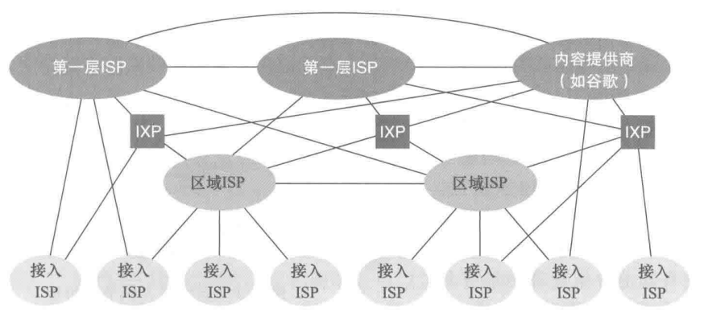
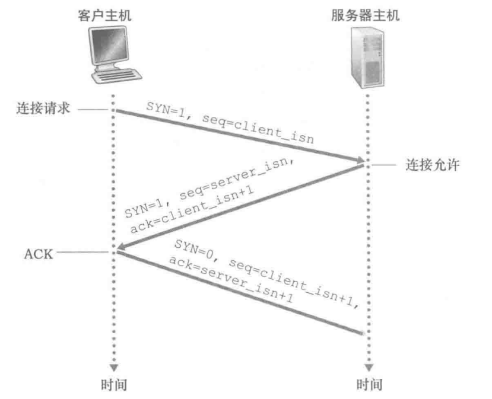
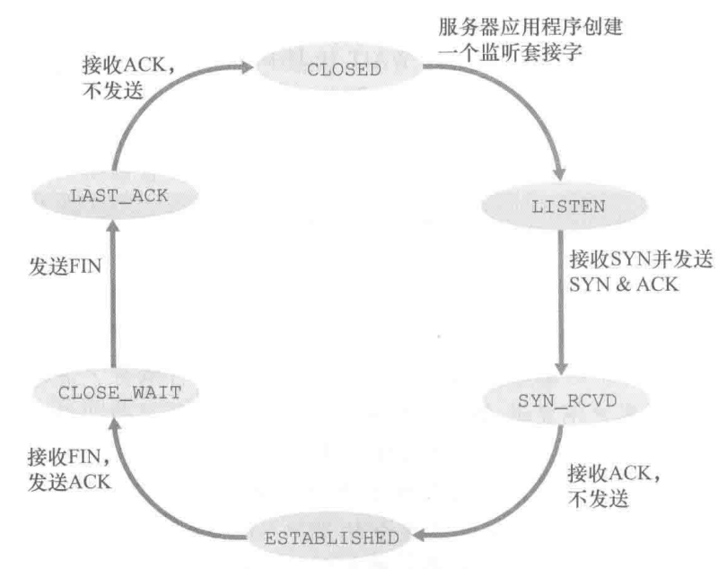
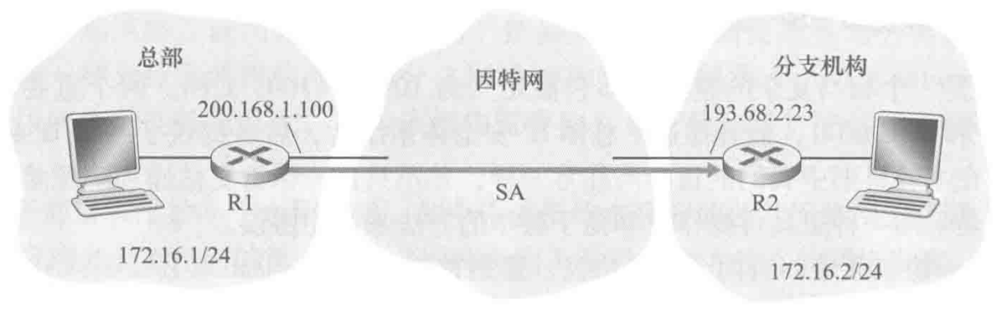

# 计算机网络：自顶向下方法
## 第一章 计算机网络和因特网
### 1.1 什么是因特网
#### 具体构成
端系统通过通信链路(communication link)和分组交换机(packet switch)的网络连接到一起。  

分组交换机中两种常见的类型是路由器（router）和链路层交换机（link-layerswitch）。  

端系统通过因特网服务提供商(Internet Service Provider,ISP)接入因特网。  

端系统、分组交换机和其他因特网部件都要运行多个协议(protocol)，这些协议控制因特网中信息的接收和发送。  

TCP(Transmission Control Protocol,传输控制协议)和IP (Internet Protocol,网际协议)是因特网中两个最为重要的协议。IP协议定义了在路由器和端系统之间发送和接收的分组格式。因特网的主要协议统称为TCP/IP。  
#### 服务描述
分布式应用（distributedapplication）是涉及多个相互交换数据的端系统的应用。  

套接字接口(socket interface)规定了运行在一个端系统上的程序请求因特网基础设施向运行在另一个端系统上的特定目的地程序交付数据的方式。  
#### 协议
协议（protocol）定义了在两个或多个通信实体之间交换的报文的格式和顺序，以及报文的发送/接收或其他事件所采取的操作。
### 1.2 网络边缘
因特网的端系统包括
- 桌面计算机（例如桌面PC、Mac和Linux设备）
- 服务器（例如Web和电子邮件服务器）
- 移动计算机（例如，便携机、智能手机和平板电脑

端系统也被称为主机。  
主机可以被划分为两类：客户(client)和服务器(server)。  
#### 接入网
接入网是指将端系统物理连接到其边缘路由器(edge router)的网络。  

使用接入网的几种环境：  
1.家庭接入：DSL、电缆、FTTH和5G固定式无线
- 数字用户线(Digital Subscriber Line,DSL)
    - 住户通常从提供本地电话接入的本地电话公司处获得DSL因特网接入。因此，在使用DSL时，用户的本地电话公司也是它的ISP。
    - 每个用户的DSL 调制解调器使用现有的电话线与位于电话公司的本地中心局（CO）中的数字用户线接入复用器（DSLAM）交换数据。
    - 住宅电话线同时承载了数据和传统的电话信号，它们用不同的频率进行编码
      - 高速下行信道，位于50kHz~1MHz频段
      - 中速上行信道，位于4kHz~50kHz频段
      - 普通的双向电话信道，位于0~4kHz频段
- 电缆因特网接入(cable Internet access)
    - 住宅从提供有线电视的公司获得了电缆因特网接入。光缆将电缆头端连接到地区枢纽，从这里通过传统的同轴电缆到达各个家庭和各个公寓。
    - 在这个系统中既应用了光纤也应用了同轴电缆，所以它经常被称为混合光纤同轴（HybridFiber Coax，HFC）系统。
    - 电缆因特网接人需要特殊的调制解调器，这种调制解调器称为电缆调制解调器（cable modem）。
- 光纤到户(Fiber To The Home,FTTH)
    - FTTH提供了一条从本地中心局直接到家庭的光纤路径。FTTH能够提供大约每秒千兆比特的因特网接入速率。
    - 两种光纤分布体系结构
      - 有源光纤网络（ActiveOpticalNetwork，AON）
      - 无源光纤网络（PassiveOpticalNetwork，PON）
- 5G固定式无线
    - 采用5G固定式无线，使用波束成形技术，数据以无线方式从供应商的基站发送到家中的调制解调器。一个无线路由器与该调制解调器相连(可能是捆绑在一起),类似于WFi无线路由器与电缆或DSL调制解调器相连的方式。

2.企业(和家庭)接入：以太网和WiFi
- 以太网
    - 以太网用户使用双绞铜线与一台以太网交换机相连。以太网交换机或以这种方式相连的交换机网络再与更大的因特网相连。
- Wifi
    - 在无线LAN环境中，无线用户从/到一个接入点发送/接收分组，该接入点与企业网连接(很可能使用有线以太网)，企业网再与有线因特网相连。无线LAN用户通常必须位于距离接入点几十米的范围内。

3.广域无线接入：3G、LTE 4G和5G
#### 物理媒介
比特从源到目的地传输时，通过一系列传输器-接收器对进行传递。对于每个传输器-接收器对，该比特通过传播电磁波或光脉冲的方式跨越某种物理媒介(physicalmedium)进行发送。  

物理媒介：
- 导引型媒介（guidedmedia）
    - 电波沿着固体媒介前行，如光缆、双绞铜线或同轴电缆。
- 非导引型媒介(unguidedmedia)
    - 电波在空气或外层空间中传播，例如在无线局域网或数字卫星频道中传播

各种物理媒介的比较： 
1.双绞铜线
- 双绞线由两根绝缘的铜线组成，每根大约1mm粗，以规则的螺旋状排列着。这两根线被绞合起来，以减少邻近类似的双绞线的电气干扰。
- 通常许多双绞线捆扎在一起形成一根电缆，并在这些双绞线外面覆盖上保护性防护层。一对电线构成了一条通信链路。
- 无屏蔽双绞线（UnshieldedTwistedPair，UTP）常用在建筑物内的计算机网络中，即用于局域网中。
- 现代的双绞线技术例如6a类电缆能够达到10Gbps的数据传输速率，距离长达100m。双绞线最终成为高速LAN联网的主导性解决方案。

2.同轴电缆
- 与双绞线类似，同轴电缆由两根铜导体组成，但是这两根导体是同心的而不是并行的。借助于这种结构及特殊的绝缘体和保护层，同轴电缆能够达到较高的数据传输速率。
- 同轴电缆能被用作导引型共享媒介（sharedmedium）。

3.光纤
- 一根光纤能够支持极高的比特速率，高达数十甚至数百Gbps。它们不受电磁干扰，对长达100km 的光缆信号衰减极低，并且很难窃听。这些特征使得光纤成为长途导引型传输媒介，特别是跨海链路。
- 光纤广泛用于因特网的主干。

4.陆地无线电信道
- 无线电信道用电磁频谱承载信号。它不需要安装物理线路，并具有穿透墙壁、提供与移动用户的连接以及长距离承载信号的能力。
- 陆地无线电信道可划分为三类
    - 运行在很短距离（如1m或2m）
    - 运行在局域，通常跨越数十到几百米
    - 运行在广域，跨越数万米。

5.卫星无线电信道
- 一颗通信卫星连接地球上的两个或多个微波发射器/接收器，它们被称为地面站。该卫星在一个频段上接收传输，使用一个转发器再生信号，并在另一个频率上发射信号。
- 分类
    - 同步卫星（geostationarysatellite）
    - 近地轨道（Low-Earth Orbiting，LEO）卫星。
### 1.3 网络核心
通过网络链路和交换机移动数据有两种基本方法：电路交换（circuitswitching）和分组交换（packetswitching）。
#### 分组交换
在某种网络应用中，端系统彼此交换报文（message）。  

为了从源端系统向目的端系统发送一个报文，源将长报文划分为较小的数据块，称为分组（packet）。  

在源和目的地之间，每个分组都通过通信链路和分组交换机（packetswitch）传送。  

交换机主要有路由器（router）和链路层交换机（link-layerswitch）两类。  

1.存储转发传输
- 多数分组交换机在链路的输入端使用存储转发传输（store-and-forwardtransmission）机制。
- 存储转发传输是指在交换机开始向输出链路传输该分组的第一个比特之前，必须接收到整个分组。

2.排队时延
- 输出缓存（outputbuffer，也称为输出队列（outputqueue））用于存储路由器准备发往某条链路的分组。
- 分组要承受在输出缓存中等待而产生的排队时延（queuingdelay）。
- 到达的分组发现输出缓存已被其他等待传输的分组完全充满了。在此情况下，将出现分组丢失（丢包）（packetloss），到达的分组或已经排队的分组之一将被丢弃。

3.转发表和路由选择协议
- 当一个分组到达网络中的路由器时，路由器检查该分组的目的地址的一部分，并向一台相邻的路由器转发该分组。
- 每台路由器具有一个转发表（forwardingtable），用于将目的地址（或目的地址的一部分）映射为输出链路。
- 当某分组到达一台路由器时，路由器检查该地址，并用这个目的地址搜索其转发表，以发现适当的出链路。路由器再将分组导向该出链路。
#### 电路交换
在发送方能够发送信息之前，必须在发送方和接收方之间建立一条连接，该连接被称为一条电路（circuit）。  
1.电路交换网络中的复用
- 链路中的电路是通过频分复用（Frequency-DivisionMultiplexing，FDM）或时分复用（Time-DivisionMultiplexing，TDM）来实现的。
- 对于FDM
    - 链路的频谱由跨越链路创建的所有连接共享。特别是在连接期间链路为每条连接专设一个频段。
    - 该频段的宽度称为带宽（band-width）。
- 对于TDM
    - 时间被划分为固定时段的帧，并且每个帧又被划分为固定数量的时隙。
    - 当网络跨越一条链路创建一条连接时，网络在每个帧中为该连接指定一个时隙。这些时隙专门由该连接单独使用，一个时隙（在每个帧内）可用于传输该连接的数据。

2.分组交换与电路交换的对比
- 电路交换不考虑需求，而预先分配了传输链路，这使得已分配而并不需要的链路时间未被利用。
- 分组交换按需分配链路，链路传输能力将在所有需要在链路上传输分组的用户之间逐分组地被共享。
- 网络的趋势是朝着分组交换方向发展。
#### 网络的网络
网络结构1
- 用单一的全球传输ISP互联所有接入ISP。
- 全球传输ISP是一个由路由器和通信链路构成的网络，该网络不仅跨越全球，而且至少具有一台路由器靠近数十万接人ISP中的每一个。

接入ISP向全球传输ISP付费，故接入ISP被认为是客户（customer），而全球传输ISP被认为是提供商（provider）。

网络结构2
- 由数十万接入ISP和多个全球传输ISP组成。
- 全球传输ISP之间必须是互联的。

现实中，在任何给定的区域，可能有一个区域ISP（regionalISP），区域中的接入ISP与之连接。每个区域ISP则与第一层 ISP（tier-1ISP）连接。

网络结构3
- 不仅有多个竞争的第一层ISP，而且在一个区域可能有多个竞争的区域ISP。
- 每个接入ISP向其连接的区域ISP支付费用，并且每个区域ISP向它连接的第一层ISP支付费用。
- 一个接入ISP也能直接与第一层ISP 连接，这样它就向第一层ISP付费。
- 第一层ISP不向任何人付费，因为它们位于该等级结构的顶部。

一个PoP（存在点（Point of Presence，PoP））只是提供商网络中的一台或多台路由器（在相同位置）群组。对于要与提供商PoP连接的客户网络，它能从第三方电信提供商租用高速链路并将它的路由器之一直接连接到位于该PoP的一台路由器。  
任何ISP（除了第一层ISP）都可以选择多宿（multi-home），即可以与两个或更多提供商ISP连接。

网络结构4
- 由接人ISP、区域ISP、第一层ISP、PoP、多宿、对等和IXP组成。
- 位于相同等级结构层次的邻近的一对ISP能够对等（peer），也就是说，能够直接将它们的网络连到一起，使它们之间的所有流量经直接连接而不是通过上游的中间 ISP传输。
- 当两个ISP对等时，通常不进行结算，即任何一个ISP都不向其对等付费。
- 第三方公司能够创建一个因特网交换点（InternetExchangePoint，IXP），IXP是一个汇合点，多个ISP能够在这里一起对等。

网络结构5
- 如今的因特网
- 通过在网络结构4顶部增加内容提供商网络（content provider network）构建而成。

### 1.4 分组交换网中的时延、丢包和吞吐量
#### 分组交换网中的时延
分组在传输沿途的每个节点都经受几种不同类型的时延。
- 节点处理时延（nodalprocessingdelay）
- 排队时延（queuingdelay）
- 传输时延（transmissiondelay）
- 传播时延（propagationdelay）
- 以上时延累加起来为节点总时延（totalnodaldelay）

1.处理时延
- 检查分组首部和决定将该分组导向何处所需要的时间
- 检查比特级别的差错所需要的时间
- 高速路由器的处理时延通常是微秒或更低的数量级。

2.排队时延
- 分组在链路上等待传输的时延
- 实际的排队时延可以是毫秒到微秒量级。

3.传输时延
- 用L表示该分组的长度，用R表示从路由器A到路由器B的链路传输速率。传输时延是L/R。
- 实际的传输时延通常在毫秒到微秒量级。

4.传播时延
- 一个比特从某链路的起点到路由器传播所需要的时间是传播时延。
- 该传播时延等于两台路由器之间的距离除以传播速率。
- 即传播时延是d/s，其中 d是路由器A和路由器B之间的距离，s是该链路的传播速率。
- 在广域网中，传播时延为毫秒量级。

5.传输时延和传播时延的比较
- 传输时延是路由器推出分组所需要的时间，它是分组长度和链路传输速率的函数，而与两台路由器之间的距离无关。
- 传播时延是一个比特从一台路由器传播到另一台路由器所需要的时间，它是两台路由器之间距离的函数，与分组长度或链路传输速率无关。
#### 排队时延和丢包
排队时延
- a表示分组到达队列的平均速率（单位是分组秒，即pkt/s）。R是传输速率，即从队列中推出比特的速率（以bps为单位）。所有分组都是由Lbit组成的。则比特到达队列的平均速率是Ld bps。则比率La/R被称为流量强度（trafficintensity）。
- 如果流量强度大于1，则比特的传输速率小于到达速率，因此设计系统时流量强度不能大于1。
- 当流量强度小于1时，随着流量强度接近1，平均排队时延迅速增加。

丢包
- 当到达的分组发现一个满的队列时，由于没有地方存储这个分组，路由器将丢弃（drop）该分组，即该分组将会丢失（lost）。
- 分组丢失的比例随着流量强度增加而增加。

#### 端到端时延
- 节点时延累加起来得到端到端时延
- $d_{end-end}=N(d_{proc}+d_{trans}+d_{prop})$
  - 在每台路由器和源主机上的处理时延是$d_{proc}$
  - 每条链路的传播时延是$d_{prop}$
  - $d_{trans}=L/R$,其中L是分组长度，R是传输速率
- 端系统、应用程序和其他时延
  - 端系统向共享媒介（例如在WiFi或电缆调制解调器情况下）传输分组时有意延迟以遵循与其他端系统共享媒介的协议
  - 媒介分组化时延。发送方在向因特网传递分组之前必须首先用编码的数字化语音填充一个分组而产生的时延。
#### 计算机网络中的吞吐量
- 瞬时吞吐量（instantaneous through-put）是主机接收到文件的速率（以bps计）。  
- 如果某文件由Fbit组成，主机接收到所有Fbit用去Ts，则文件传送的平均吞吐量（average throughput）是F/Tbps。  
- 令$R_s$表示服务器与路由器之间的链路速率，$R_c$表示路由器与客户之间的链路速率。则此链路的吞吐量是$min\{R_c,R_s\}$，也就是瓶颈链路（botlenecklink）的传输速率。  
- 在今天因特网中对吞吐量的限制因素通常是接入网。
### 1.5 协议层次及其服务模型
#### 分层的体系结构
为了给网络协议的设计提供一个结构，网络设计者以分层（layer）的方式组织协议并实现这些协议的网络硬件和软件。  
某层向它的上一层提供服务（service），即所谓一层的服务模型（servicemodel）。  
每层通过在该层中执行某些操作或使用直接下层的服务来提供服务。  

分层的潜在缺点：
- 一层可能冗余较低层的功能。
- 某层的功能可能需要仅在其他某层才出现的信息（如时间戳值），这违反了层次分离的目标。

各层的协议被称为协议栈。  

因特网的协议栈由 5个层次组成：物理层、链路层、网络层、运输层和应用层。
1.应用层
- 应用层是网络应用程序及它们的应用层协议存留的地方。
- 因特网的应用层包括许多协议，例如HTTP（它提供了Web文档的请求和传送）、SMTP（它提供了电子邮件报文的传输）和FTP（它提供两个端系统之间的文件传送）。
- 应用层协议分布在多个端系统上，而一个端系统中的应用程序使用协议与另一个端系统中的应用程序交换报文（message）。

2.运输层
- 因特网的运输层在应用程序端点之间传送应用层报文。
- 在因特网中有两种运输协议，TCP和UDP。
  - TCP向它的应用程序提供面向连接的服务。
  - UDP协议向它的应用程序提供无连接服务。
- 运输层的分组称为报文段（segment）。

3.网络层
- 因特网的网络层负责将称为数据报（datagram）的网络层分组从一台主机移动到另一台主机。
- 网络层包括著名的网际协议（IP），该协议定义了在数据报中的各个字段以及端系统和路由器如何作用于这些字段。
- 网络层也包括决定路由的路由选择协议，它根据该路由将数据报从源传输到目的地。
- 也被称为IP层。

4.链路层
- 在每个节点，网络层将数据报下传给链路层，链路层沿着路径将数据报传递给下一个节点。在下一个节点，链路层将数据报上传给网络层。
- 由链路层提供的服务取决于应用于该链路的特定链路层协议。包括以太网、WiFi和电缆接人网的DOCSIS协议。
- 链路层分组称为帧(frame)。

5.物理层
- 物理层的任务是将该帧中的一个个比特从一个节点移动到下一个节点。
#### 封装
封装（encapsulation）
- 应用层将应用层报文（application-layermessage）传送给运输层。
- 运输层增加了运输层首部信息并生成运输层报文段（transport layersegment）。
- 网络层增加了如源和目的端系统地址等网络层首部信息，生成网络层数据报（network-layerdatagram）。
- 链路层增加它自己的链路层首部信息并生成链路层帧（link-layerframe）。

在每一层，一个分组具有两种类型的字段：首部字段和有效载荷字段（payloadfield）。而有效载荷通常是来自上一层的分组。
### 1.6 面对攻击的网络
拒绝服务攻击[Denial-of-Service（DoS）attack]  
- DoS攻击使得网络、主机或其他基础设施部分不能由合法用户使用。  
- Dos攻击类型：
  - 弱点攻击
  - 带宽泛洪
  - 连接泛洪

分布式DoS（DistributedDoS，DDoS）
- 攻击者控制多个源并让每个源向目标猛烈发送流量。
- DDoS攻击充分利用由数以千计的受害主机组成的僵尸网络。  

记录每个流经的分组副本的被动接收机被称为分组嗅探器（packetsniffer）。  

将具有虚假源地址的分组注人因特网的能力被称为IP哄骗（IPspoofing）。
### 1.7 计算机网络和因特网的历史
## 第二章 应用层
### 2.1网络应用原理
#### 网络应用体系结构
应用体系结构（application architecture）由应用程序研发者设计，规定了如何在各种端系统上组织该应用程序。  
现代网络应用程序中所使用的两种主流体系结构：
- 客户-服务器体系结构
- 对等（P2P）体系结构

客户-服务器体系结构（client-server architecture）
- 服务器是一个总是打开的主机，它服务于来自许多其他称为客户的主机的请求。
- 客户-服务器体系结构下，客户相互之间不直接通信。
- 服务器具有固定的、周知的地址，该地址称为IP地址。
- 托管大量主机的数据中心（datacenter）常被用于创建强大的虚拟服务器。

P2P体系结构（P2P architecture）
- 应用程序在间断连接的主机对之间使用直接通信，这些主机对被称为对等方。
- 在一个P2P文件共享应用中，尽管每个对等方都由于请求文件产生工作负载，但每个对等方通过向其他对等方分发文件也为系统增加服务能力。这被称为自扩展性（self-scalability）。
#### 进程通信
在两个不同端系统上的进程（process），通过跨越计算机网络交换报文（message）而相互通信。  
1.客户与服务器进程
- 在一对进程之间的通信会话场景中，发起通信（即在该会话开始时发起与其
他进程的联系）的进程被标识为客户（client），在会话开始时等待联系的进程是服务器（server）。

2.进程与计算机网络之间的接口
- 进程通过一个称为套接字（socket）的软件接口向网络发送报文和从网络接收报文。
- 套接字是同一台主机内应用层与运输层之间的接口。
- 套接字也称为应用程序和网络之间的应用编程接口（Application Programming Interface，API）。
- 应用程序开发者可以控制套接字在应用层端的一切，但是对该套接字的运输层端几乎没有控制权。

3.进程寻址
- 发送进程必须知道报文发送目的地的主机地址以及指定运行在接收主机上的接收进程（更具体地说，接收套接字）。
- 在因特网中，主机由其IP地址（IP address）标识。
- 目的地端口号（portnumber）用于标识进程。

#### 可供应用程序使用的运输服务
运输层提供的应用程序服务要求可以分为：
- 可靠数据传输
- 吞吐量
- 定时
- 安全性

1.可靠服务传输
- 能够确保由应用程序的一端发送的数据正确并完全地交付给该应用程序的另一端的服务被称为可靠数据传输（reliable data transfer）。
- 使用可靠数据传输的应用，如电子邮件、文件传输、远程主机访问、Web文档传输以及金融应用。
- 容忍丢失的应用（loss-tolerant application）能够接受不提供可靠数据传输的运输层协议，即由发送进程发送的某些数据可能到达不了接收进程。如交谈式音频/视频。

2.吞吐量
- 具有吞吐量要求的应用程序被称为带宽敏感的应用（bandwidth-sensitive application）。如因特网电话应用程序。
- 弹性应用（elastic application）能够根据
当时可用的带宽或多或少地利用可供使用的吞吐量。电子邮件、文件传输以及Web传送

3.定时
- 有些服务为了有效性而要求数据交付有严格的时间限制。如因特网电话、虚拟环境、视频会议和多方游戏。

4.安全性
- 运输协议提供的服务将在发送和接收进程之间提供机密性，以防数据以某种方式在这两个进程之间被观察到。

#### 因特网提供的运输服务
因特网（更一般的是TCP/IP网络）为应用程序提供两个运输层协议，即UDP和TCP。  
1.TCP服务
- 面向连接的服务
  - 客户和服务器相互交换运输层控制信息（握手）
  - 建立两个进程的套接字之间的TCP连接（TCP connection）。
  - 全双工连接。
- 可靠的数据传输服务
  - 通信进程能够依靠TCP，无差错、按适当顺序交付所有发送的数据。
- 拥塞控制机制
  - 当发送方和接收方之间的网络出现拥塞时，TCP的拥塞控制机制会抑制发送进程（客户或服务器）。

2.UDP服务
- UDP 是无连接的。
- UDP提供一种不可靠数据传输服务。
- UDP不包括拥塞控制机制。

3.因特网运输协议所不提供的服务
- 因特网运输协议不提供对吞吐量或定时保证的服务。
- 今天的因特网通常能够为时间敏感应用提供满意的服务，但它不能提供任何定时或吞吐量保证。
#### 应用层协议
应用层协议（application-layer protocol）定义了运行在不同端系统上的应用程序进程如何相互传递报文。

应用层协议定义了以下内容：
- 交换的报文类型，例如请求报文和响应报文。
- 各种报文类型的语法，如报文中的各个字段及这些字段是如何描述的。
- 字段的语义，即这些字段中信息的含义。
- 确定一个进程何时以及如何发送报文，对报文进行响应的规则。

应用层协议只是网络应用的一部分。  
举例，Web应用的组成
- 文档格式的标准（即HTML）
- Web浏览器（如Chrome和MicrosoftInternet Explorer）
- Web服务器（如Apache、Microsoft服务器程序）
- 应用层协议（HTTP协议）
### 2.2 Web和HTTP
#### HTTP概述
Web的应用层协议是超文本传输协议（HyperText Transfer Protocol，HTTP），它是 Web的核心。  

Web页面（Webpage）（也叫文档）是由对象组成的。如：
- 一个HTML文件
- 一个JPEG图形
- 一个JavaScript文件
- 一个CCS样式表文件
- 一个视频片段

多数Web页面含有一个HTML基本文件（base HTMLfile）以及几个引I用对象。

Web浏览器（Web browser）（例如Internet Explorer和Chrome）实现了HTTP的客户端，Web服务器（Web server）实现了HTTP的服务器端。

HTTP定义了Web客户向Web服务器请求Web页面的方式，以及服务器向客户传送Web页面的方式。

HTTP使用TCP作为它的支撑运输协议。

因为HTTP服务器并不保存关于客户的任何信息，所以我们说HTTP是一个无状态协议（stateless protocol）。
#### 非持续连接和持续连接
非持续连接（non-persistent connection）：每个请求/响应对是经一个单独的TCP连接发送。  
持续连接（persistent connection）：所有的请求及其响应经相同的TCP连接发送。

1.采用非持续连接的HTTP
- 假设某HTML文件的URL为http://www.someSchool.edu/someDepartment/home.index
  - HTTP客户进程在端口号80发起一个到服务器www.someSchool.edu的TCP连接，该端口号是HTTP的默认端口。在客户和服务器上分别有一个套接字与该连接相关联。
  - HTTP客户经它的套接字向该服务器发送一个HTTP请求报文。请求报文中包含了路径名/someDepartment/home.index。
  - HTTP服务器进程经它的套接字接收该请求报文，从其存储器（RAM或磁盘）中检索出对象someDepartment/home.index，在一个HTTP响应报文中封装对象，并通过其套接字向客户发送响应报文。
  - HTTP服务器进程通知TCP断开该TCP连接。（但是直到TCP确认客户已经完整地收到响应报文为止，它才会实际中断连接。）
  - HTTP客户接收响应报文，TCP连接关闭。该报文指出封装的对象是一个HTML文件，客户从响应报文中提取出该文件，检查该HTML文件，得到对10个JPEG图形的引用。
  - 对每个引用的JPEG图形对象重复前4个步骤。
- 使用并行的TCP连接可以缩短响应时间
- 一个短分组从客户到服务器然后再返回客户所花费的时间被称为往返时间（Round-Trip Time，RTT），包括：
  - 分组传播时延
  - 分组在中间路由器和交换机上的排队时延
  - 分组处理时延

2.采用持续连接的HTTP
- 非持续连接的缺点
  - 必须为每一个请求的对象建立和维护一个全新的连接。对于每个这样的连接，在客户和服务器中都要分配TCP的缓冲区和保持TCP变量，这给Web服务器带来了严重的负担。
  - 每一个对象经受两倍RTT的交付时延，即一个RTT用于创建TCP，另一个RTT用于请求和接收一个对象。
- 一个完整的Web页面可以用单个持续 TCP连接进行传送。
- HTTP的默认模式是使用带流水线的持续连接。
#### HTTP报文格式
1.HTTP请求报文
- HTTP请求报文的第一行叫作请求行（request line），其后继的行叫作首部行（header line）。
- 请求行的3个字段
  - 方法字段，可以取几种不同的值，包括GET、POST、HEAD、PUT和DELETE。
  - URL字段
  - HTTP版本字段
- 首部行
  

2.HTTP响应报文
- 初始状态行（status line），6个首部行（header line），然后是实体体（entity body）。
- 状态行
  - 协议版本字段
  - 状态码
  - 相应状态信息
- 实体体部分包含了所请求的对象本身。
- 首部行

#### 用户与服务器的交互：cookie
cookie的4个组件
- 在HTTP响应报文中的一个cookie首部行。
- 在HTTP请求报文中的一个cookie首部行。
- 在用户端系统中保留的一个cookie文件，并由用户的浏览器进行管理。
- 位于Web站点的一个后端数据库。

cookie可以在无状态的HTTP之上建立一个用户会话层。

用户首次访问一个站点时，可能需要提供一个用户标识（可能是名字）。在后继会话中，浏览器向服务器传递一个cookie 首部，从而向该服务器标识了用户。
#### Web缓存
Web缓存器（Web cache）也叫代理服务器（proxy server），它是能够代表初始Web 服务器来满足HTTP请求的网络实体。

假设浏览器正在请求对象http://www.someschool.edu/campus.gif
- 浏览器创建一个到Web缓存器的TCP连接，并向Web缓存器中的对象发送一个HTTP请求。
- Web缓存器进行检查，看看本地是否存储了该对象副本。如果有，Web缓存器就向客户浏览器用HTTP响应报文返回该对象。
- 如果Web缓存器中没有该对象，它就打开一个与该对象的初始服务器（即 www.someschool.edu）的TCP连接。Web缓存器则在这个缓存器到服务器的TCP连接上发送一个对该对象的HTTP请求。在收到该请求后，初始服务器向该Web缓存器发送具有该对象的HTTP响应。
- 当Web缓存器接收到该对象时，它在本地存储空间存储一份副本，并向客户的浏览器用HTTP响应报文发送该副本（通过客户浏览器和Web缓存器之间现有的TCP连接）。

Web缓存器的优点：
- Web缓存器可以大大减少对客户请求的响应时间，特别是当客户与初始服务器之间的瓶颈带宽远低于客户与Web缓存器之间的瓶颈带宽时更是如此。
- Web缓存器能够大大减少一个机构的接入链路到因特网的通信量。

相对于提高链路速率，使用Web缓存器的效果更好且成本也更低。

通过使用内容分发网络（Content Distribution Network，CDN），Web缓存器正在因特网中发挥着越来越重要的作用。

条件GET（conditional GET）可以保证缓存器证实它的对象是最新的。
#### HTTP/2
HTTP/2的主要目标是减小感知时延，其手段是经单一TCP连接使请求与响应多路复用，提供请求优先次序和服务器推，并提供HTTP首部字段的有效压缩。

经单一TCP连接发送一个Web页面中的所有对象存在队首阻塞[Head Of Line（HOL）blocking]问题。
- 使用一条TCP连接，大对象将花费很长时间来通过瓶颈链路，与此同时，那些小对象将被延迟，因为它们在大对象之后等待。也就是说，链路前面的大对象阻塞了后面的小对象。

1.HTTP/2成帧
- 用于HOL阻塞的HTTP/2解决方案是将每个报文分成小帧，并且在相同TCP连接上交错发送请求和响应报文。
- 这一成帧过程是通过HTTP/2协议的成帧子层来完成的。

2.响应报文的优先次序和服务器推
- 当某客户向服务器发送并发请求时，成帧子层能够为正在请求的响应确定优先次序，方法是为每个报文分配1到256之间的权重。较大的数字表明较高的优先权。
- 允许服务器为一个客户请求而发送多个响应。即除了对初始请求的响应外，服务器能够向该客户推额外的对象，而无须客户再进行任何请求。

3.HTTP/3
### 2.3 因特网中的电子邮件
因特网电子邮件系统3个主要组成部分：
- 用户代理（user agent）
- 邮件服务器（mail server）
- 简单邮件传输协议（Simple Mail Transfer Protocol，SMTP）

SMTP是因特网电子邮件中主要的应用层协议。使用TCP可靠数据传输服务。
#### SMTP
SMTP是因特网电子邮件的核心。
- 限制所有邮件报文的体部分（不只是其首部）只能采用简单的7比特ASCII表示。
- SMTP一般不使用中间邮件服务器发送邮件。
- SMTP使用持续连接。

#### 邮件报文格式
#### 邮件访问协议
用户代理从邮件服务器取回邮件的两种方法：
- 用户代理使用HTTP来取回电子邮件。这种情况要求电子邮件服务器具有HTTP接口和SMTP接口。
- 使用由RFC3501定义的因特网邮件访问协议（Internet Mail Access Protocol，IMAP），这通常用于微软的Outlook等。
### 2.4 DNS：因特网的目录服务
主机的标识：
- 主机名（hostname），如www.facebook.com、www.google.com、gaia.cs.umass.edu 等。
- IP地址（IP address）
#### DNS提供的服务
域名系统（DomainNameSystem，DNS）
- 一个由分层的DNS服务器（DNS server）实现的分布式数据库
- 一个使得主机能够查询分布式数据库的应用层协议。

当一个主机上的浏览器请求URL:www.someschool.edu/index.html时：
- 同一台用户主机上运行着DNS应用的客户端。
- 浏览器从上述URL中抽取出主机名www.someschool.edu，并将主机名传给DNS应用的客户端。
- DNS客户向DNS服务器发送一个包含主机名的请求。
- DNS客户最终会收到一份回答报文，其中含有对应于该主机名的IP地址。
- 一旦浏览器接收到来自DNS的该IP地址，它就向位于该IP地址80端口的 HTTP服务器进程发起一个TCP连接。

DNS提供的其他服务:
- 主机别名（hostaliasing）:应用程序可以调用DNS来获得主机别名对应的规范主机名以及主机的IP地址。
- 邮件服务器别名（mail server aliasing）:电子邮件应用程序可以调用DNS对提供的主机别名进行解析，以获得该主机的规范主机名应用层以及其IP地址。
- 负载分配：当客户对映射到某IP地址集合的服务器发出一个DNS请求时，该服务器用IP地址的整个集合进行响应，但在每个回答中循环这些地址次序。DNS就在所有这些冗余的Web服务器之间循环分配了负载。
#### DNS工作机理概述
只使用一个DNS服务器
- 单点故障（single point offailure）：如果该DNS服务器崩溃，整个因特网随之瘫痪。
- 单个DNS服务器不得不处理所有的DNS查询。
  - 远距离的集中式数据库（distant centralized database）：单个DNS服务器不可能“邻近”所有查询客户。
  - 维护（maintenance）：单个DNS服务器将不得不为所有的因特网主机保留记录。

1.分布式、层次数据库

3种类型的DNS服务器：
- 根DNS服务器
  - 根名字服务器提供TLD服务器的IP地址。
- 顶级域（Top-Level Domain，TLD）DNS服务器
  - TLD 服务器提供了权威DNS服务器的IP地址。
- 权威DNS服务器。
  - 在因特网上具有公共可访问主机（如Web服务器和邮件服务器）的每个组织机构必须提供公共可访问的DNS记录，这些记录将这些主机的名字映射为IP地址。换句话说，权威DNS服务器提供的想要访问的主机的IP地址。

本地DNS服务器（localDNSserver）
- 当主机发出DNS请求时，该请求被发往本地DNS服务器，它起着代理的作用，并将该请求转发到DNS服务器层次结构中。

递归查询（recursivequery）和迭代查询（iterativequery）
- 从cse.nyu.edu到dns.nyu.edu发出的查询是递归查询。因为本地DNS服务器将查询结果的总结果返回给请求主机。
- 后继的3个查询是选代查询。因为每个DNS服务器只将单次查询的结果返回给本地DNS服务器。

2.DNS缓存

DNS缓存（DNS caching）
- 在一个请求链中，当某DNS服务器接收一个DNS回答时，它就能将映射缓存在本地存储器中。如果在DNS服务器中缓存了一个主机名/IP地址对，另一个对相同主机名的查询到达该DNS服务器时，该DNS服务器就能够直接提供所要求的IP地址，即使它不是该主机名的权威服务器。
#### DNS记录和报文
共同实现DNS分布式数据库的所有DNS服务器存储了资源记录（Resource Record， RR），RR提供了主机名到IP地址的映射。  
RR是一个包含下列字段的4元组：
- (Name,Value,Type,TTL)
- TTL是该记录的生存时间，它决定了资源记录应当从缓存中删除的时间。
- Name和Value的意义取决于Type。
  - 如果Type=A，则对该主机名而言Name是主机名，Value是该主机名对应的IP地址。
  - 如果Type=NS，则对该域中的主机而言Name是域（如foo.com），而Value是一个知道如何获得该域中主机IP地址的权威DNS服务器的主机名。
  - 如果Type=CNAME，则Value是主机别名Name对应的规范主机名。
  - 如果Type=MX，则Value是一个别名为Name的邮件服务器的规范主机名。

1.DNS报文  
各字段的语义
- 首部区域
  - 16比特的标识符用于标识该查询。
  - 标志字段中含有若干标志。
    - 1比特的“查询/回答”标志位指出报文是查询报文（0）还是回答报文（1）。
    - 1比特的“权威的”标志位指出某DNS服务器是所请求名字的权威DNS服务器。
    - 1比特的“希望递归”标志位指出客户（主机或者DNS服务器）在该DNS服务器没有某记录时希望它执行递归查询。
    - 1比特的“递归可用”标志位指出DNS服务器支持递归查询。
    - 还有4个有关数量的字段，这些字段指出了在首部后的4类数据区域出现的数量。
- 问题区域
  - 名字字段，包含正在被查询的主机名字。
  - 类型字段，指出有关该名字的正被询问的问题类型。
- 回答区域
  - 包含了对最初请求的名字的资源记录。
- 权威区域
  - 包含了其他权威服务器的记录。
- 附加信息区域
  - 包含了其他有帮助的记录。

2.在DNS数据库中插入记录
- 在注册登记机构注册域名。注册登记机构（registrar）是一个商业实体，它验证该域名的唯一性，将该域名输入DNS数据库，对提供的服务收取少量费用。
- 当向某些注册登记机构注册域名时，需要向该机构提供你的基本、辅助权威DNS服务器的名字和IP地址。
- 确保将一个类型NS和一个类型A的记录输入TLD com服务器。
- 确保用于Web服务器的类型A资源记录和用于邮件服务器的类型MX资源记录被输入你的权威DNS服务器中。
### 2.5 P2P文件分发
1.P2P体系结构的扩展性  
在客户-服务器体系中：
  - $u_s$表示服务器接入链路的上载速率。
  - $u_i$表示第$i$对等方接入链路的上载速率。
  - $d_i$表示第$i$对等方接人链路的下载速率。
  - 用$F$表示被分发的文件长度（以比特计）。
  - $N$表示要获得该文件副本的对等方的数量。
  - $D_{cs}$表示分发时间

则$D_{cs}= max\{\frac{NF}{u_s},\frac{F}{d_{min}}\}$

对足够大的N，客户-服务器分发时间由$NF/u_s$确定。所以，该分发时间随着对等方$N$的数量线性地增加。

在P2P体系中：  
每个对等方能够帮助服务器分发文件。  

则$D_{cs}= max\{\frac{F}{u_s},\frac{F}{d_{min}},\frac{NF}{u_s+\displaystyle\sum_{i=1}^nu_i}\}$  
对于P2P体系结构，最小分发时间总是小于客户-服务器体系结构的分发时间。

2.BitTorrent
- BitTorrent是一种用于文件分发的流行P2P协议。
- 参与一个特定文件分发的所有对等方的集合被称为一个洪流（torrent）。
- 在一个洪流中的对等方彼此下载等长度的文件块（chunk），典型的块长度为256KB。
- 每个洪流具有一个基础设施节点，称为追踪器（tracker）。当一个对等方加人某洪流时，它向追踪器注册自已，并周期性地通知追踪器它仍在该洪流中。
- BitTorrent分发文件的过程（一报还一报模型（tit-for-tat））
  - 当一个新的对等方Alice加人该洪流时，追踪器随机地从参与对等方的集合中选择对等方的一个子集（为了具体起见，设有50个对等方），并将这50个对等方的IP地址发送给Alice。
  - Alice持有对等方的这张列表，试图与该列表上的所有对等方创建并行的TCP连接。
  - 在任何给定的时间，每个对等方将具有来自该文件的块的子集，并且不同的对等方具有不同的子集。Alice周期性地（经TCP连接）询问每个邻近对等方它们所具有的块列表。有了这个信息，Alice将对她当前还没有的块发出请求（仍通过TCP连接）。
  - 在决定请求哪些块的过程中，Alice使用一种称为最稀缺优先（rarest first）的技术。这种技术的思路是，针对她没有的块在她的邻居中决定最稀缺的块（最稀缺的块就是那些在她的邻居中副本数量最少的块），并首先请求那些最稀缺的块。这样，最稀缺块得到更为迅速的重新分发，其目标是（大致地）均衡每个块在洪流中的副本数量。
  -在决定响应哪个请求时，Alice根据当前能够以最高速率向她提供数据的邻居，给出其优先权。

### 2.6 视频流和内容分发网
#### HTTP流和DASH
经HTTP的动态适应性流（Dynamic Adaptive Streaming over HTTP，DASH）
- 视频编码为几个不同的版本，其中每个版本具有不同的比特率，对应于不同的质量水平。客户动态地请求来自不同版本且长度为几秒的视频段数据块。当可用带宽量较高时，客户自然地选择来自高速率版本的块；当可用带宽量较低时，客户自然地选择来自低速率版本的块。
#### 内容分发网
内容分发网（Content Distribution Network，CDN）
- 专用CDN（private CDN），即由内容提供商自己所拥有。
- 第三方CDN（third-party CDN），它代表多个内容提供商分发内容，Akamai、Limelight和Level-3都运行第三方CDN。

CDN的两种服务器安置原则
- 通过在遍及全球的接人ISP中部署服务器集群来深入到ISP的接人网中。目标是靠近端用户，通过减少端用户和CDN集群之间链路和路由器的数量，从而改善了用户感受的时延和吞吐量。
- 邀请做客。通过在少量（例如10个）关键位置建造大集群来邀请到ISP做客。邀请做客设计通常产生较低的维护和管理开销。

1.CDN操作  
CDN操作的目的：
- 确定此时适合用于该客户的CDN服务器集群。
- 将客户的请求重定向到该集群的某台服务器。

举例，访问http://video.netcinema.com/6Y7B23V
- 用户访问位于NetCinema的Web网页。
- 当用户点击链接http://video.netcinema.com/6Y7B23V时，该用户主机发送了一个对于video.netcinema.com的DNS请求。
- 用户的本地DNS服务器（LDNS）将该DNS请求中继到一台用于NetCinema的权威DNS服务器，NetCinema权威DNS服务器并不返回一个IP地址，而是向LDNS返回一个KingCDN域的主机名，如a1105.kingcdn.com。
- 从这时起，DNS请求进人了KingCDN专用DNS基础设施。用户的LDNS则发送第二个请求，此时是对a1105.kingcdn.com的DNS请求，KingCDN的DNS系统最终向LDNS 返回KingCDN内容服务器的IP地址。
- LDNS向用户主机转发内容服务CDN节点的IP地址。
- 一旦客户收到KingCDN内容服务器的IP地址，它与具有该IP地址的服务器创建了一条直接的TCP连接，并且发出对该视频的 HTTP GET请求。

2.集群选择策略
集群选择策略（cluster selection strategy）
- 动态地将客户定向到CDN中的某个服务器集群或数据中心的机制。

一种简单的集群选择策略是指派客户到地理上最为邻近（geographically closest）的集群。
- 就网络路径的长度或跳数而言，地理最邻近的集群可能并不是最近的集群。
- 忽略了时延和可用带宽随因特网路径时间而变化，总是为特定的客户指派相同的集群。
### 2.7 套接字编程：生成网络应用
两类网络应用程序:
- 由协议标准（如一个RFC或某种其他标准文档）中所定义的操作的网络应用程序；这样的应用程序有时称为“开放”的，因为定义其操作的这些规则为人们所共知。
- 专用的网络应用程序。由客户和服务器程序部署的应用层协议没有公开发布在某RFC中或其他地方。
#### UDP套接字编程
- 先将目的地址附在数据分组之上。目的地址是由目的主机的IP地址和目的地套接字的端口号组成的。
- 因特网使用目的地址通过因特网为该分组选路到接收进程的套接字。
- 接收进程通过该套接字取回分组，然后检查分组的内容并采取适当的动作。
#### TCP套接字编程
- 无需附上目的地址，只需通过套接字将数据丢进TCP连接。
- TCP服务器在客户试图发起接触前必须作为进程运行起来。
- TCP产生欢迎套接字（serverSocket），专门用于处理来自运行在任意主机上的客户进程的某种初始接触。
- TCP产生连接套接字（connectionSocket），专门用于与客户连接。
- TCP在客户和服务器进程之间提供可靠服务。
## 第三章 运输层
### 3.1 概述和运输层服务
运输层协议为运行在不同主机上的应用进程之间提供了逻辑通信（logic communication）功能。
#### 运输层和网络层的关系
在协议栈中，运输层刚好位于网络层之上。网络层提供了主机之间的逻辑通信，而运输层为运行在不同主机上的进程之间提供了逻辑通信。
#### 因特网运输层概述
运输层分组称为报文段（segment）。

IP协议的服务模型是尽力而为交付服务（best-effort delivery service）。这意味着IP尽它“最大的努力”在通信的主机之间交付报文段，但它并不做任何确保。因此IP被称为不可靠服务（unreliable service）。

UDP和TCP所提供的服务模型
- UDP和TCP最基本的责任是，将两个端系统间IP的交付服务扩展为运行在端系统上的两个进程之间的交付服务。
- UDP和TCP还可以通过在其报文段首部中包括差错检查字段而提供完整性检查。
- UDP是一种不可靠的服务，即不能保证一个进程所发送的数据能够完整无缺地（或全部）到达目的进程。
- TCP能够提供附加服务
  - 提供可靠数据传输（reliable data transfer）。通过使用流量控制、序号、确认和定时器， TCP确保正确地、按序地将数据从发送进程交付给接收进程。
  - 提供拥塞控制（congestion control）。TCP拥塞控制防止任何一条TCP连接用过多流量来淹没通信主机之间的链路和交换设备。TCP力求为每个通过一条拥塞网络链路的连接平等地共享网络链路带宽。

### 3.2 多路复用与多路分解
在接收端，运输层检查报文段中的字段，标识出接收套接字，进而将报文段定向到该套接字。将运输层报文段中的数据交付到正确的套接字的工作称为多路分解（demultiplexing）。

在源主机从不同套接字中收集数据块，并为每个数据块封装上首部信息（这将在以后用于分解）从而生成报文段，然后将报文段传递到网络层，所有这些工作称为多路复用（multiplexing）。

源端口号字段（source port number field）和目的端口号字段（destination port number field）指出了报文段所要交付到的套接字。

端口号是一个16比特的数，其大小在0~65535之间。0~1023范围的端口号称为周知端口号（well-known port number），是受限制的，这是指它们保留给诸如HTTP（它使用端口号80）和FTP（它使用端口号21）之类的周知应用层协议来使用。

1.无连接的多路复用与多路分解（UDP）
- UDP套接字是由一个二元组全面标识的，该二元组包含一个目的IP地址和一个目的端口号。
- 如果两个UDP报文段有不同的源IP地址和/或源端口号，但具有相同的目的IP地址和目的端口号，那么这两个报文段将通过相同的目的套接字被定向到相同的目的进程。
- 源端口号用作“返回地址”的一部分，即当B需要回发一个报文段给A时，B到A的报文段中的目的端口号便从A到B的报文段中的源端口号中取值。

2.面向连接的多路复用与多路分解（TCP）
- TCP套接字是由一个四元组（源IP地址，源端口号，目的IP地址，目的端口号）来标识的。
- 两个具有不同源IP地址或源端口号，但具有相同的目的IP地址和目的端口号的到达TCP报文段将被定向到两个不同的套接字，除非TCP报文段携带了初始创建连接的请求。
- 服务器主机可以支持很多并行的TCP套接字，每个套接字与一个进程相联系，并由其四元组来标识每个套接字。当一个TCP报文段到达主机时，所有4个字段（源IP地址，源端口，目的IP地址，目的端口）被用来将报文段定向（分解）到相应的套接字。

3.Web服务器与TCP
- 服务器能够根据源IP地址和源端口号来区分来自不同客户的报文段。一台Web服务器为每条连接生成一个新进程。每个进程都有自己的连接套接字，通过这些套接字可以收到HTTP请求和发送HTTP响应。
- 连接套接字与进程之间并非总是有着一一对应的关系。事实上，当今的高性能Web服务器通常只使用一个进程，但是为每个新的客户连接创建一个具有新连接套接字的新线程。
### 3.3 无连接运输：UDP
使用UDP时，在发送报文段之前，发送方和接收方的运输层实体之间没有握手。正因为如此，UDP被称为无连接的。

相对于提供可靠数据传输服务的TCP，某些应用更适合用UDP：
- 关于发送什么数据以及何时发送的应用层控制更为精细。
- 无须连接建立。
- 无连接状态。
- 分组首部开销小。

UDP没有拥塞控制。但是，需要拥塞控制来预防网络进入一种拥塞状态。

使用UDP的应用是可能实现可靠数据传输的。这可通过在应用程序自身中建立可靠性机制来完成。
#### UDP报文段结构

UDP首部只有4个字段，每个字段由2个字节组成。

长度字段指示了在UDP报文段中的字节数（首部加数据）。

接收方使用检验和来检查在该报文段中是否出现了差错。
#### UDP校验和
UDP提供检验和的原因：
- 不能保证源和目的之间的所有链路都提供差错检测；这就是说，也许这些链路中的一条可能使用没有差错检测的协议。
- 即使报文段经链路正确地传输，当报文段存储在某台路由器的内存中时，也可能引人比特差错。
### 3.4 可靠数据传输原理
#### 构造可靠数据传输协议
1.经完全可靠信道的可靠数据传输：rdt1.0

2.经具有比特差错信道的可靠数据传输：rdt2.0

在计算机网络环境中，基于重传机制的可靠数据传输协议称为自动重传请求（AutomaticRepeatreQuest，ARQ）协议。

ARQ协议还需要三种协议功能来处理存在比特差错的情况：
- 差错检测。需要一种机制以使接收方检测到何时出现了比特差错。
- 接收方反馈。因为发送方和接收方通常在不同端系统上执行，发送方要了解接收方情况（此时为分组是否被正确接收）的唯一途径就是让接收方提供明确的反馈信息。在口述报文情况下回答的“肯定确认”（ACK）和“否定确认”（NAK）就是这种反馈的例子。
- 重传。接收方收到有差错的分组时，发送方将重传该分组文。

发送方将不会发送一块新数据，除非发送方确信接收方已正确接收当前分组。由于这种行为，rdt2.0这样的协议被称为停等（stop-and-wait）协议。

如果一个ACK或NAK分组受损，发送方无法知道接收方是否正确接收了上一块发送的数据。对于这种情况，处理的方法有三种：
- 对于ACK或NAK分组进行回应，但是接受者可能分不清回应是口述内容的一部分还是一个要求重复上次回答的请求。
- 增加足够的检验和比特，使发送方不仅可以检测差错，还可恢复差错。
- 当发送方收到含糊不清的ACK或NAK分组时，只需重传当前数据分组即可。这种方法在发送方到接收方的信道中引入了余分组（duplicatepacket）。余分组的根本困难在于接收方不知道接收到的分组是新的还是一次重传。

在数据分组中添加一新字段，让发送方对其数据分组编号，即将发送数据分组的序号（sequence number）放在该字段。于是，接收方只需要检查序号即可确定收到的分组是否为重传。

3.经具有比特差错的丢包信道的可靠数据传输：rdt3.0

除了比特受损外，底层信道还会丢包。

发送方明智地选择一个时间值，以判定可能发生了丢包（尽管不能确保）。如果在这个时间内没有收到ACK，则重传该分组。如果一个分组经历了一个特别大的时延，发送方可能会重传该分组，即使该数据分组及其ACK都没有丢失。这就在发送方到接收方的信道中引入了冗余数据分组（duplicate data packet）的可能性。

无论是数据分组丢失，还是ACK丢失，还是只是该分组或ACK过度延时，发送方都会采取重传。为了实现基于时间的重传机制，需要一个倒计数定时器（countdown timer），在一个给定的时间量过期后，可中断发送方。

因为分组序号在0和1之间交替，因此rdt3.0有时被称为比特交替协议（alternating-bit protocol）。

#### 流水线可靠数据传输协议
rdt3.0是一个功能正确的协议，但是它的性能并不高。因为它是一个停等协议。发送方的信道利用率过低。

因此可以不以停等方式运行，允许发送方发送多个分组而无须等待确认。因为许多从发送方向接收方输送的分组可以被看成是填充到一条流水线中，故这种技术被称为流水线（pipelining）。

流水线技术会带来以下影响：
- 必须增加序号范围，因为每个输送中的分组（不计算重传的）必须有一个唯一的序号，而且也许有多个在输送中的未确认报文。
- 协议的发送方和接收方两端也许不得不缓存多个分组。发送方最低限度应当能缓冲那些已发送但没有确认的分组。接收方或许也需要缓存那些已正确接收的分组。
- 所需序号范围和对缓冲的要求取决于数据传输协议如何处理丢失、损坏及延时过大的分组。解决流水线的差错恢复有两种基本方法是：回退N步（Go-Back-N，GBN）和选择重传（Selective Repeat，SR）。

#### 回退N步
在回退N步（GBN）协议中，允许发送方发送多个分组（当有多个分组可用时）而不需等待确认，但它也受限于在流水线中未确认的分组数不能超过某个最大允许数N。

已被发送但还未被确认的分组的许可序号范围可以被看成是一个在序号范围内长度为N的窗口。随着协议的运行，该窗口在序号空间向前滑动。因此，N常被称为窗口长度（windowsize），GBN协议也常被称为滑动窗口协议（sliding-window protocol）。

GBN发送方必须响应三种类型的事件：
- 上层的调用。当上层调用rdt_send时，发送方首先检查发送窗口是否已满，即是否有N个已发送但未被确认的分组。如果窗口未满，则产生一个分组并将其发送，并相应地更新变量。如果窗口已满，发送方只需将数据返回给上层，隐式地指示上层该窗口已满。然后上层可能会过一会儿再试。
- 收到一个ACK。在CBN协议中，对序号为n的分组的确认采取累积确认（cumula-tive acknowledgment）的方式，表明接收方已正确接收到序号为n的以前且包括n在内的所有分组。
- 超时事件。就像在停等协议中那样，定时器将再次用于恢复数据或确认分组的丢失。如果出现超时，发送方重传所有已发送但还未被确认过的分组。

在GBN中，接收方的操作也很简单。如果一个序号为n的分组被正确接收到，并且按序（即上次交付给上层的数据是序号为n-1的分组），则接收方为分组n发送一个ACK，并将该分组中的数据部分交付到上层。在所有其他情况下，接收方丢弃该分组，并为最近按序接收的分组重新发送ACK。

#### 选择重传
选择重传（SR）协议通过让发送方仅重传那些它怀疑在接收方出错（即丢失或受损）的分组而避免了不必要的重传。SR接收方将确认一个正确接收的分组而不管其是否按序。失序的分组将被缓存直到所有丢失分组（即序号更小的分组）皆被收到为止，这时才可以将一批分组按序交付给上层。

可靠数据传输机制及其用途的总结
- 检验和：用于检测在一个传输分组中的比特错误。
- 定时器：用于超时/重传一个分组，可能因为该分组（或其ACK）在信道中丢失了。由于当一个分组延时但未丢失（过早超时），或当一个分组已被接收方收到但从接收方到发送方的ACK丢失时，可能产生超时事件，所以接收方可能会收到一个分组的多个冗余副本。
- 序号：用于为从发送方流向接收方的数据分组按顺序编号。所接收分组的序号间的空隙可使接收方检测出丢失的分组。具有相同序号的分组可使接收方检测出一个分组的冗余副本。
- 确认：接收方用于告诉发送方一个分组或一组分组已被正确地接收到了。确认报文通常携带着被确认的分组或多个分组的序号。确认可以是逐个的或累积的，这取决于协议。
- 否定确认：接收方用于告诉发送方某个分组未被正确地接收。否定确认报文通常携带着未被正确接收的分组的序号
- 窗口、流水线：发送方也许被限制仅发送那些序号落在一个指定范围内的分组。通过允许一次发送多个分组但未被确认，发送方的利用率可在停等操作模式的基础上得到增加。我们很快将会看到，窗口长度可根据接收方接收和缓存报文的能力、网络中的拥塞程度或两者情况来进行设置。

### 3.5 面向连接的运输：TCP
#### TCP连接
- TCP被称为是面向连接的（connection-oriented），这是因为在一个应用进程可以开始向另一个应用进程发送数据之前，这两个进程必须先相互“握手”，即它们必须相互发送某些预备报文段，以建立确保数据传输的参数。
- TCP连接提供的是全双工服务（full-duplex service）：如果一台主机上的进程A与另一台主机上的进程B存在一条TCP连接，那么应用层数据就可在从进程B流向进程A的同时，也从进程A流向进程B。
- TCP连接也总是点对点（point-to-point）的，即在单个发送方与单个接收方之间的连接。
- TCP将想要发送的数据引导到该连接的发送缓存（send buffer）里，发送缓存是发起三次握手期间设置的缓存之一。
- TCP可从缓存中取出并放入报文段中的数据数量受限于最大报文段长度（Maximum Segment Size， MSS）。MSS通常根据最初确定的由本地发送主机发送的最大链路层帧长度[即所谓的最大传输单元（Maximum Transmission Unit，MTU）]来设置。
- 设置MSS要保证一个TCP 报文段（当封装在一个IP数据报中）加上TCP/IP首部长度（通常40字节）将适合单个链路层帧。以太网和PPP链路层协议都具有1500字节的MTU，因此MSS的典型值为1460 字节。
- TCP为每块客户数据配上一个TCP首部，从而形成多个TCP报文段（TCP segment）。
#### TCP报文段结构

TCP首部包括：
- 分别为16比特的源端口号和目的端口号，它被用于多路复用/分解来自或送到上层应用的数据。
- 16比特的检验和。
- 32比特的序号字段（sequence number field）和32比特的确认号字段（acknowledgment number field）。这些字段被TCP发送方和接收方用来实现可靠数据传输服务。
- 16比特的接收窗口字段（receive window field），该字段用于流量控制。
- 4比特的首部长度字段（headerlengthfield），该字段指示了以32比特的字为单位的 TCP首部长度。
- 可选与变长的选项字段（options field），该字段用于发送方与接收方协商最大报文段长度（MSS）时，或在高速网络环境下用作窗口调节因子时使用。
- 6比特的标志字段（flag field）。ACK比特用于指示确认字段中的值是有效的，即该报文段包括一个对已被成功接收报文段的确认。RST、SYN和FIN比特用于连接建立和拆除。当PSH比特被置位时，就指示接收方应立即将数据交给上层。URG比特用来指示报文段里存在着被发送端的上层实体置为“紧急”的数据。紧急数据的最后一个字节由16比特的紧急数据指针字段（urgent data pointer field）指出。当紧急数据存在并给出指向紧急数据尾指针的时候，TCP必须通知接收端的上层实体。

序号和确认号
- 一个报文段的序号（sequence number for a segment）因此是该报文段首字节的字节流编号。也就是说，序号是报文段首字节在整个报文段的所有字节中的编号。
- 主机A填充进报文段的确认号是主机A期望从主机B收到的下一字节的序号。

#### 往返时间的估计与超时
1.估计往返时间

报文段的样本RTT（表示为SampleRTT）就是从某报文段被发出（即交给IP）到对该报文段的确认被收到之间的时间量。大多数 TCP的实现仅在某个时刻做一次SampleRTT测量，而不是为每个发送的报文段测量一个SampleRTT。这就是说，在任意时刻，仅为一个已发送的但目前尚未被确认的报文段估计SampleRTT，从而产生一个接近每个RTT的新SampleRTT值。

一旦获得一个新SampleRTT时，TCP就会根据下列公式来更新EstimatedRTT:

EstimatedRTT=（1-α）·EstimatedRTT+α·SampleRTT

其中，α的推荐值是0.125。

除了估算RTT外，测量RTT的变化也是有价值的。RTT偏差 DevRTT用于估算SampleRTT一般会偏离EstimatedRTT的程度：  

DevRTT=（1-β）·DevRTT+β·|SampleRTT-EstimatedRTT|  

如果SampleRTT值波动较小，那么DevRTT的值就会很小；另一方面，如果波动很大，那么DevRTT的值就会很大。β的推荐值为0.25。

2.设置和管理重传超时间隔

超时间隔应该大于等于EstimatedRTT，否则，将造成不必要的重传。但是超时间隔也不应该比EstimatedRTT大太多，否则当报文段丢失时，TCP不能很快地重传该报文段，导致数据传输时延大。因此要求将超时间隔设为EstimatedRTT加上一定余量。

Timeoutlnterval=EstimatedRTT+4·DevRTT

推荐的初始TimeoutInterval值为1秒。同时，当出现超时后，TimeoutInterval值将加倍，以免即将被确认的后继报文段过早出现超时。

#### 可靠数据传输
TCP在IP不可靠的尽力而为服务之上创建了一种可靠数据传输服务（reliable data
transfer service）。TCP的可靠数据传输服务确保一个进程从其接收缓存中读出的数据流是无损坏、无间隙、非余和按序的数据流；即该字节流与连接的另一方端系统发送出的字节流是完全相同。

3个与发送和重传有关的主要事件：
- 从上层应用程序接收数据
- 定时器超时
- 收到ACK。

当从上层应用程序接收到数据时，TCP从应用程序接收数据，将数据封装在一个报文段中，并把该报文段交给IP。

当定时器超时时，TCP通过重传引起超时的报文段来响应超时事件。然后TCP重启定时器。

到达一个来自接收方的确认报文段（ACK）时，TCP将ACK的值y与它的变量SendBase进行比较。TCP状态变量SendBase是最早未被确认的字节的序号。y确认了字节编号在y之前的所有字节都已经收到。如果y>SendBase，则该ACK是在确认一个或多个先前未被确认的报文段。因此发送方更新它的SendBase变量；如果当前有未被确认的报文段，TCP还要重新启动定时器。

1.一些有趣的情况
- A主机向B主机发送报文段，B成功接收，但是向A发送的确认报文段丢失了。超时事件发生，A重传报文段，B收到了重传的报文段，它将通过序号发现该报文段包含了早已收到的数据。因此，B中的TCP将丢弃该重传的报文段中的这些字节。
- A主机向B主机发送两个报文段，B成功接收，并向A发送两个确认。第一个确认丢失，超时事件发生，A重传第一个报文段。假如第二个报文段的ACK在新的超时发生以前到达，则第二个报文段将不会被重传。
- A主机向B主机发送两个报文段，B成功接收，并向A发送两个确认。A主机成功接收到了第二个确认，那么A主机不会重传任何一个报文段。

2.超时间隔加倍
- 每当超时事件发生时，TCP重传具有最小序号的还未被确认的报文段。只是每次TCP重传时都会将下一次的超时间隔设为先前值的两倍，而不是用从EstimatedRTT和DevRTT推算出的值。
- 定时器过期很可能是由网络拥塞引起的，即太多的分组到达源与目的地之间路径上的一台（或多台）路由器的队列中，造成分组丢失或长时间的排队时延。在拥塞的时候，如果源持续重传分组，会使拥塞更加严重。相反，TCP使用更文雅的方式，每个发送方的重传都是经过越来越长的时间间隔后进行的。

3.快速重传
- 冗余ACK（duplicate ACK）就是再次确认某个报文段的ACK，而发送方先前已经收到对该报文段的确认。
- 产生TCP ACK的建议
  - 如果具有所期望序号的按序报文段到达。所有在期望序号及以前的数据都已经被确认。TCP接收方产生延迟的ACK。对另一个按序报文段的到达最多等待500ms。如果下一个按序报文段在这个时间间隔内没有到达，则发送一个ACK。
  - 如果具有所期望序号的按序报文段到达。另一个按序报文段等待ACK传输。TCP接收方立即发送单个累积ACK，以确认两个按序报文段。
  - 如果比期望序号大的失序报文段到达，检测出间隔。TCP接收方立即发送冗余ACK，指示下一个期待字节的序号（其为间隔的低端的序号）。
  - 如果能部分或完全填充接收数据间隔的报文段到达。倘若该报文段起始于间隔的低端，则立即发送ACK。
- 如果TCP发送方接收到对相同数据的3个冗余ACK，它把这当作一种指示，说明跟在这个已被确认过3次的报文段之后的报文段已经丢失。一旦收到3个冗余ACK，TCP就执行快速重传（fast retransmit）。

4.回退N步还是选择重传
- 对TCP提出的一种修改意见是所谓的选择确认（selective acknowledgment），它允许TCP接收方有选择地确认失序报文段，而不是累积地确认最后一个正确接收的有序报文段。
- 许多TCP实现会将正确接收但失序的报文段缓存起来。
- TCP重传至多一个报文段。
- TCP的差错恢复机制也许最好被分类为GBN协议与SR协议的混合体。
#### 流量控制
TCP为它的应用程序提供了流量控制服务（flow-control service）以消除发送方使接收方缓存溢出的可能性。流量控制因此是一个速度匹配服务，即发送方的发送速率与接收方应用程序的读取速率相匹配。

TCP通过让发送方维护一个称为接收窗口（receive window）的变量来提供流量控制。通俗地说，接收窗口用于给发送方一个指示一一该接收方还有多少可用的缓存空间。

定义以下变量：
- LastByteRead：接收方主机上的应用进程从缓存读出的数据流的最后一个字节的编号。
- LastByteRcvd：从网络中到达的并且已放入接收方主机接收缓存中的数据流的最后一个字节的编号。

由于TCP不允许已分配的缓存溢出，下式必须成立：

LastByteRcvd-LastByteRead≤RcvBuffer

接收窗口用rwnd表示，根据缓存可用空间的数量来设置：

rwnd=RcvBuffer-[LastByteRcvd-LastByteRead]

当主机B的接收窗口为0时，主机A继续发送只有一个字节数据的报文段。这些报文段将会被接收方确认。最终缓存将开始清空，并且确认报文里将包含一个非0的rwnd值。
#### TCP连接管理
客户方TCP与服务器TCP建立连接的过程
- 客户端的TCP首先向服务器端的TCP发送一个特殊的TCP报文段。该报文段中不包含应用层数据。但是在报文段的首部中的一个标志位（即SYN比特）被置为1。因此，这个特殊报文段被称为SYN报文段。另外，客户会随机地选择一个初始序号（client_isn），并将此编号放置于该起始的TCP SYN报文段的序号字段中。该报文段会被封装在一个IP数据报中，并发送给服务器。
- 一旦包含TCPSYN报文段的IP数据报到达服务器主机，服务器会从该数据报中提取出TCP SYN报文段，为该TCP连接分配TCP缓存和变量，并向该客户TCP发送允许连接的报文段。在报文段的首部包含3个重要的信息。首先，SYN比特被置为1。其次，该TCP报文段首部的确认号字段被置为client_isn+1。最后，服务器选择自己的初始序号（server_ isn），并将其放置到TCP报文段首部的序号字段中。该允许连接的报文段被称为SYNACK报文段（SYNACK segment）。
- 在收到SYNACK报文段后，客户也要给该连接分配缓存和变量。客户主机则向服务器发送另外一个报文段，这最后一个报文段对服务器充许连接的报文段进行了确认。因为连接已经建立了，所以该SYN比特被置为0。

一旦完成这3个步骤，客户和服务器主机就可以相互发送包括数据的报文段了。在以后每一个报文段中，SYN比特都将被置为0。

客户方TCP与服务器TCP终止连接的过程
- 客户应用进程发出一个关闭连接命令。这会引起客户TCP向服务器进程发送一个特殊的 TCP报文段。这个特殊的报文段让其首部中的一个标志位即FIN比特被设置为1。
- 当服务器接收到该报文段后，就向发送方回送一个确认报文段。
- 然后，服务器发送它自己的终止报文段，其FIN比特被置为1。
- 最后，该客户对这个服务器的终止报文段进行确认。

客户TCP经历的典型TCP状态序列

服务器TCP经历的典型TCP状态序列

### 3.6 拥塞控制原理
#### 拥塞原因与代价
1.情况1：两个发送方和一台具有无穷大缓存的路由器
- 拥塞网络的代价：当分组的到达速率接近链路容量时，分组经历巨大的排队时延。

2.情况2：两个发送方和一台具有有限缓存的路由器
- 拥塞网络的代价2：发送方必须执行重传以补偿因为缓存溢出而丢弃（丢失）的分组。

3.情况3：4个发送方和具有有限缓存的多台路由器及多跳路径
- 拥塞网络的代价3：当一个分组沿一条路径被丢弃时，每个上游路由器用于转发该分组到丢弃该分组而使用的传输容量最终被浪费掉了。

#### 拥塞控制方法
拥塞控制方法：
- 端到端拥塞控制。在端到端拥塞控制方法中，网络层没有为运输层拥塞控制提供显式支持。即使网络中存在拥塞，端系统也必须通过对网络行为的观察（如分组丢失与时延）来推断之。TCP采用端到端的方法解决拥塞控制，因为IP层不会向端系统提供有关网络拥塞的反馈信息。TCP报文段的丢失（通过超时或3次余确认而得知）被认为是网络拥塞的一个迹象，TCP会相应地减小其窗口长度。
- 网络辅助的拥塞控制。在网络辅助的拥塞控制中，路由器向发送方提供关于网络中拥塞状态的显式反馈信息。这种反馈可以简单地用一个比特来指示链路中的拥塞情况。在ATM可用比特率（Available Bite Rate，ABR）拥塞控制中，路由器显式地通知发送方它（路由器）能在输出链路上支持的最大主机发送速率。
  - 直接反馈信息可以由网络路由器发给发送方。这种方式的通知通常采用了一种阻塞分组（chokepacket）的形式.
  - 路由器标记或更新从发送方流向接收方的分组中的某个字段来指示拥塞的产生。一旦收到一个标记的分组后，接收方就会向发送方通知该网络拥塞指示。
### 3.7 TCP拥塞控制
#### 经典的TCP拥塞控制
TCP发送方如何限制发送流量
- 运行在发送方的TCP拥塞控制机制跟踪一个额外的变量，即拥塞窗口（congestion window）。拥塞窗口表示为cwnd，它对一个TCP发送方能向网络中发送流量的速率进行了限制。特别是，在一个发送方中未被确认的数据量不会超过cwnd与rwnd中的最小值。
  - LastByteSent-LastByteAcked ≤ min{mincwnd,rwnd}

TCP发送方是如何感知在它与目的地之间的路径上出现了拥塞的
- 当出现过度的拥塞时，在沿着这条路径上的一台（或多台）路由器的缓存会溢出，引起一个数据报（包含一个TCP报文段）被丢弃。丢弃的数据报接着会引起发送方的丢包事件（要么超时或收到3个冗余ACK），发送方就认为在发送方到接收方的路径上出现了拥塞的指示。
- TCP发送方收到了之前报文段的确认，即在网络上传输的报文段正被成功地交付给目的地，并使用确认来增加窗口的长度（及其传输速率）。注意到如果确认以相当慢的速率到达（例如，如果该端到端路径具有高时延或包含一段低带宽链路），则该拥塞窗口将以相当慢的速率增加。在另一方面，如果确认以高速率到达，则该拥塞窗口将会更为迅速地增大。
  - TCP使用确认来触发（或计时）增大它的拥塞窗口长度，TCP被说成是自计时（self-clocking）的。

TCP发送方怎样确定它应当发送的速率呢？
- 如果众多TCP发送方总体上发送太快，它们能够拥塞网络，导致拥塞崩溃。如果TCP 发送方过于谨慎，发送太慢，它们不能充分利用网络的带宽。
- 一个丢失的报文段表意味着拥塞，因此当丢失报文段时应当降低TCP发送方的速率。一个超时事件或四个确认（一个初始ACK和其后的三个余ACK）被解释为跟随该四个ACK的报文段的“丢包事件”的一种隐含的指示。
- 一个确认报文段指示该网络正在向接收方交付发送方的报文段，因此，当对先前未确认报文段的确认到达时，能够增加发送方的速率。
- 带宽探测。给定ACK指示源到目的地路径无拥塞，而丢包事件指示路径拥塞， TCP调节其传输速率的策略是增加其速率以响应到达的ACK，除非出现丢包事件，此时才减小传输速率。

TCP拥塞控制算法（TCP congestion control algorithm）
- 慢启动
- 拥塞避免
- 快速回复

1.慢启动（slow-start）
- TCP发送速率起始慢，但在慢启动阶段以指数增长。
- 结束慢启动
  - 如果存在一个由超时指示的丢包事件（即拥塞），TCP发送方将cwnd设置为1并重新开始慢启动过程。它还将第二个状态变量的值ssthresh（“慢启动阈值”的速记）设置为cwnd/2，即当检测到拥塞时将ssthresh置为拥塞窗口值的一半。
  - 当cwnd的值等于ssthresh时，结束慢启动并且TCP转移到拥塞避免模式。
  - 如果检测到3个余ACK，这时TCP执行一种快速重传并进人快速恢复状态。

2.拥塞避免
- 一旦进入拥塞避免状态，cwnd的值大约是上次遇到拥塞时的值的一半，即距离拥塞可能并不遥远。因此，TCP无法每过一个RTT再将cwnd的值翻番，而是采用了一种较为保守的方法，每个RTT只将cwnd的值增加一个MSS。
- 结束拥塞避免的线性增长
  - 当出现超时时，cwnd的值被设置为1个MSS，当丢包事件出现时，ssthresh的值被更新为cwnd值的一半。。
  - 当3个冗余ACK导致丢包时，TCP将cwnd的值减半（为使测量结果更好，已收到的3个余的ACK要加上3个MSS），并且当收到3个冗余ACK时，将ssthresh的值记录为cwnd的值的一半。接下来进入快速恢复状态。

3.快速回复
  - 在快速恢复中，对于引起TCP进入快速恢复状态的缺失报文段，每当收到冗余的 ACK，cwnd的值增加一个MSS。最终，当对丢失报文段的一个ACK到达时，TCP在降低cwnd后进入拥塞避免状态。
  - 如果出现超时事件，快速恢复在执行如同在慢启动和拥塞避免中相同的操作后，迁移到慢启动状态
  - 当丢包事件出现时，cwnd的值被设置为1个MSS，并且ssthresh的值设置为cwnd值的一半。

TCP的早期版本TCP Tahoe，不管是发生超时指示的丢包事件，还是发生3个余ACK指示的丢包事件，都无条件地将其拥塞窗口减至1个MSS，并进人慢启动阶段。而较新版的TCP Reno有快恢复功能。

TCP Tahoe版和TCP Reno版拥塞窗口演化情况：  
阈值初始等于8个MSS。在前8个传输回合，Tahoe和Reno采取了相同的操作。拥塞窗口在慢启动阶段以指数速度快速爬升，在第4轮传输时到达了阈值。然后拥塞窗口以线性速度爬升，直到在第8轮传输后出现3个冗余ACK。注意到当该丢包事件发生时，拥塞窗口值为12MSS。于是ssthresh的值被设置为0.5 × cwnd=6MSS。在TCPReno下，拥塞窗口被设置为cwnd=9MSS，然后线性地增长。在TCPTahoe下，拥塞窗口被设置为1个MSS，然后呈指数增长，直至到达ssthresh值为止，在这个点它开始线性增长。

4.TCP拥塞控制：回顾

假定丢包由3个冗余ACK而不是超时指示，TCP的拥塞控制是：每个RTT内cwnd线性（加性）增加1MSS，然后出现3个余ACK事件时cwnd减半（乘性减）。因此，TCP拥塞控制常常被称为加性增、乘性减（Additive-Increase， Multiplicative-Decrease，AIMD）拥塞控制方式。

5.TCP CUBIC

6.对TCP吞吐量的宏观描述

当速率增长至W/RTT时，
网络丢弃来自连接的分组：然后发送速率就会减半，进而每过一个RTT就发送速率增加MSS/RTT，直到再次达到W/RTT为止。这一过程不断地自我重复。

一条连接的平均吞吐量 = $\frac{0.75 \times W}{RTT}$

#### 网络辅助明确拥塞通告和基于时延的拥塞控制
1.明确拥塞通告
- 明确拥塞通告（Explicit Congestion Notification，ECN）是一种网络辅助的拥塞控制形式，该控制在因特网中执行。
- 路由器使用的一种ECN比特设置指示该路由器正在历经拥塞。该拥塞指示由被标记
的IP数据报携带，送给目的主机，再由目的主机通知发送主机。
- 接收主机中的TCP通过接收到的数据报得到ECN拥塞指示时，它将接收方到发送方的TCPACK报文段中的ECE（明确拥塞通告回显）比特置位，从而通知发送主机中的TCP拥塞指示已收到。接下来，TCP发送方通过减半拥塞窗口对一个具有ECN拥塞指示的ACK做出反应，就像它对丢失报文段使用快速重传做出反应一样，并且在下一个传输的TCP发送方到接收方的报文段首部中对CWR（拥塞窗口缩减）比特进行置位。

2.基于时延的拥塞控制
- 在TCP Vegas中，发送方对所有应答分组测量源到目的地路径的RTT。令RTT是在发送方测量到的最小值，这些值出现在该路径没有拥塞且这些分组经历最小排队时延之时。如果TCPVegas的拥塞窗口长度是cwnd，则未拥塞吞吐量速率将是 cwnd/RTTmin。
- TCP Vegas的设计初衷是，如果实际在发送方测量的吞吐量接近这个值，则 TCP的发送速率能够增加，因为（按照定义和根据测量）该路径还不会发生拥塞。然而，如果实际在发送方测量的吞吐量比未拥塞时的吞吐量速率大得多，则该路径拥塞并且TCP Vegas发送方将减小发送速率。

#### 公平性
- 考虑K条TCP连接，每条都有不同的端到端路径，但是都经过一段传输速率为Rbps的
瓶颈链路。假设每条连接都在传输一个大文件，而且无UDP流量通过该段瓶颈链路。如果每条连接的平均传输速率接近 R/K，即每条连接都得到相同份额的链路带宽，则认为该拥塞控制机制是公平的。
- 实践中，客户—服务器应用获得非常不平等的链路带宽份额。特别是，已经表明当多条连接共享一个共同的瓶颈链路时，那些具有较小RTT的连接能够在链路空闲时更快地抢到可用带宽（即较快地打开其拥塞窗口），因而将比那些具有较大RTT的连接享用更高的吞吐量。

1，公平性和UDP
- 从TCP的观点来看，运行在 UDP上的多媒体应用是不公平的，因为它们不与其他连接合作，也不适时地调整其传输速率。
- UDP源有可能压制TCP流量。

2.公平性和并行TCP连接
- 当一个应用使用多条并行连接时，它占用了一条拥塞链路中较大比例的带宽。
### 3.8 运输层功能的演化
QUIC（快速UDP互联网连接）

某应用需要的运输服务既不完全适合UDP也不完全适合TCP服务模式，例如也许需要比UDP更多的服务，同时并不需要TCP的所有特定所能。
- 面向连接和安全。像TCP一样，QUIC是两个端点之间面向连接的协议。这要求断点之间进行一次握手来建立QUIC连接状态。两个连接状态分别是源连接ID和目标连接 ID。
- 数据流。QUIC允许几个不同的应用程序级“数据流”在一个QUIC连接上复用，并且一旦创建了一条QUIC连接，便能迅速添加新数据流。流是对两个QUIC端点之间可靠、按序的双向数据交付的抽象。
- 可靠的、TCP友好的拥塞控制数传输。QUIC为每个QUIC数据流分别提供可靠的数据传输。因为QUIC基于每数据流提供一个可靠、按序的交付，所以丢失的UDP 报文段仅影响其数据正由该报文段承载的那些数据流，而在其他数据流中的HTTP 报文能够继续为该应用程序所接收和交付。
## 第四章 网络层：数据平面
### 4.1 网络层概述
#### 转发和路由选择：数据平面和控制平面
两种重要的网络层功能：
- 转发。当一个分组到达某路由器的一条输人链路时，该路由器必须将该分组移动
到适当的输出链路。
- 路由选择。当分组从发送方流向接收方时，网络层必须决定这些分组所采用的路由或路径。计算这些路径的算法被称为路由选择算法（routing algorithm）。

更精确的定义：
- 转发（forwarding）是指将分组从一个输人链路接口转移到适当的输出链路接口的路由器本地操作。
- 路由选择（routing）是指确定分组从源到目的地所采取的端到端路径的网络范围处理过程。

每台网络路由器中有一个关键元素是它的转发表（forwarding table）。路由器检查到达分组首部的一个或多个字段值，进而使用这些首部值在其转发表中索引，通过这种方法来转发分组。这些值对应存储在转发表项中的值，指出了该分组将被转发的路由器的输出链路接口。

1.控制平面：传统的方法
- 路由器中物理上存在的所有转发表的内容是由人类网络操作员直接配置的。但是人工配置更容易出错，并且对于网络拓扑变化的响应比路由选择协议更慢。

2.控制平面：SDN方法
- 软件定义网络（Software-Defined Networking，SDN）
- 远程控制器计算和分发转发表以供每台路由器所使用。控制平面路由选择功能与物理的路由器是分离的，即路由选择设备仅执行转发，而远程控制器计算并分发转发表。
#### 网络服务模型
网络服务模型（network service model）定义了分组在发送与接收主机之间的端到端传输特性。

网络层能够提供的服务：
- 确保交付。该服务确保分组将最终到达目的地。
- 具有时延上界的确保交付。该服务不仅确保分组的交付，而且在特定的主机到主机时延上界（例如100ms）内交付。
- 有序分组交付。该服务确保分组以发送的顺序到达目的地。
- 确保最小带宽。这种网络层服务模仿在发送和接收主机之间一条特定比特率（例如 1Mbps）的传输链路的行为。只要发送主机以低于特定比特率的速率传输比特（作为分组的组成部分），则所有分组最终会交付到目的主机。
- 安全性。网络层能够在源加密所有数据报并在目的地解密它们，从而对所有运输层报文段提供机密性。

因特网的网络层提供了单一的服务，称为尽力而为服务（best-effort service）。  
使用尽力而为服务，传送的分组既不能保证以它们发送的顺序被接收，也不能保证它们最终交付；既不能保证端到端时延，也不能保证有最小的带宽。

分组交换机：指一台通用分组交换设备，它根据分组首部字段中的值，从输入链路接口到输出链路接口转移分组。
- 某些分组交换机称为链路层交换机（link-layer switch），基于链路层帧中的字段值做出转发决定。
- 其他分组交换机称为路由器（router），基于网络层数据报中的首部字段值做出转发决定。
### 4.2 路由器工作原理
路由器的4个组件：
- 输入端口。输入端口（input port）执行几项重要功能。它在路由器中执行终结入物理链路的物理层功能。它还要与位于人链路远端的数据链路层交互操作来执行数据链路层功能。在输入端口还要执行查找功能，通过查询转发表决定路由器的输出端口，到达的分组通过路由器的交换结构转发到输出端口。
- 交换结构。交换结构将路由器的输入端口连接到它的输出端口。这种交换结构完全包含在路由器之中，即它是一个网络路由器中的网络。
- 输出端口。输出端口（output port）存储从交换结构接收的分组，并通过执行必要的链路层和物理层功能在输出链路上传输这些分组。
- 路由选择处理器。路由选择处理器执行控制平面功能。在传统的路由器中，它执行路由选择协议，维护路由选择表与关联链路状态信息，并为该路由器计算转发表。在SDN路由器中，路由选择处理器负责与远程控制器通信，目的是接收由远程控制器计算的转发表项，并在该路由器的输入端口安装这些表项。

路由器的输入端口、输出端口和交换结构几乎总是用硬件实现。
#### 输入端口处理和基于目的地转发

路由器用分组目的地址的前缀（prefix）与该表中的表项进行匹配，如果存在一个匹配项，则路由器向与该匹配项相关联的链路转发分组。当有多个匹配时，该路由器使用最长前缀匹配规则（longest prefix matching rule），即在该表中寻找最长的匹配项，并向与最长前缀匹配相关联的链路接口转发分组。

使用硬件执行查找转发表，采用嵌入式片上DRAM和更快的SRAM内存设计。实践中也经常使用三态内容可寻址存储器（Tenary Content Address Memory，TCAM）来查找。

除了查找还需进行其他重要操作：
- 必须出现物理层和链路层处理。
- 必须检查分组的版本号、检验和以及寿命字段，并且重写后两个字段。
- 必须更新用于网络管理的计数器（如接收到的IP数据报的数目）。
#### 交换
3种交换方式：
- 经内存交换。一个分组到达一个输入端口时，该端口会先通过中断方式向路由选择处理器发出信号。于是，该分组从输入端口处被复制到处理器内存中。路由选择处理器则从其首部提取目的地址，在转发表中查找适当的输出端口，并将该分组复制到输出端口的缓存中。
- 经总线交换。让输入端口为分组预先计划一个交换机内部标签（首部），指示本地输出端口，使分组在总线上传送和传输到输出端口。该分组能由所有输出端口收到，但只有与该标签匹配的端口才能保存该分组。然后标签在输出端口被去除，因为其仅用于交换机内部来跨越总线。
- 经互联网络交换。纵横式交换机是一种由2N条总线组成的互联网络，它连接N个输人端口与N个输出端口。当某分组到达端口A，需要转发到端口Y时，交换机控制器闭合总线A和Y交叉部位的交叉点，然后端口A在其总线上发送该分组，该分组仅由总线Y接收。注意到来自端口B的一个分组在同一时间能够转发到端口X，因为A到Y和B到X的分组使用不同的输入和输出总线。纵横式网络能够并行转发多个分组。纵横式交换机是非阻塞的（non-blocking），即只要没有其他分组当前被转发到该输出端口，转发到输出端口的分组就不会被到达输出端口的分组阻塞。

#### 输出端口处理
输出端口处理取出已经存放在输出端口内存中的分组并将其发送到输出链路上。
#### 何处出现排队
在输入端口和输出端口处都可以形成分组队列，随着这些队列的增长，路由器的缓存空间最终将会耗尽，并且当无内存可用于存储到达的分组时将会出现丢包（packet loss）。

1.输入排队
- 如果交换结构不能快得（相对于输入线路速度而言）使所有到达分组无时延地通过它传送，在输入端口也将出现分组排队，因为到达的分组必须加入输入端口队列中，以等待通过交换结构传送到输出端口。
- 输入排队交换机中的队列首部（Head-Of-the-Line，HOL）阻塞，是指在一个输入队列中排队的分组必须等待通过交换结构发送（即使输出端口是空闲的），因为它被位于队列首部的另一个分组所阻塞。

2.输出排队
- 当没有足够的内存来缓存一个人分组时，就必须做出决定：要么丢弃到达的分组，采用一种称为弃尾（drop-tail）的策略，要么删除一个或多个已排队的分组为新来的分组腾出空间。
- 分组丢弃与标记策略统称为主动队列管理（Active Queue Management，AQM）算法。
  - 随机早期检测（Random Early Detection，RED）算法
  - PIE（比例积分控制器增强）

3.多少缓存才够用
- 用于缓存大小的经验方法是缓存数量（B）应当等于平均往返时延（RTT）乘以链路的容量（C）。例如，对于一条RTT为250ms的10Gbps链路，需要B=RTT·C=2.5Gb的缓存。
- 当有大量的TCP流（比如N条）流过一条链路时，所需要的缓存数量是$B=RTT·C/\sqrt{N}$。
- 缓存是一把双刃剑，即缓存可用于承受流量中的短期统计波动，但也可能导致时延增加和随之而来的问题。
- 当分组到达缓存的速率等于缓存发送分组的速率时，排队时延的数量时恒定的，这个因持续缓冲而导致长时延的场景被称为缓存膨胀（bufferbloat），它说明不仅吞吐量重要，而且最小的时延也重要。
#### 分组调度
1.先进先出

FIFO（First-In-First-Out，FIFO）（也称为先来先服务，FCFS）调度规则按照分组到达输出链路队列的相同次序来选择分组在链路上传输。

2.优先权排队

在优先权排队（priority queuing）规则下，到达输出链路的分组被分类放入输出队列中的优先权类。每个优先权类通常都有自己的队列。当选择一个分组传输时，优先权排队规则将从队列为非空（也就是有分组等待传输）的最高优先权类中选择传输一个分组。在同一优先权类的分组之间的选择通常以FIFO方式完成。在非抢占式优先权排队（non-preemptive priority queuing）规则下，一旦分组开始传输，就不能打断。

1、3、4优先权高于2、5

3.循环和加权公平排队

在循环排队规则（round robin queuing discipline）下，分组像使用优先权排队那样被分类。然而，在类之间不存在严格的服务优先权，循环调度器在这些类之间轮流提供服务。一个所谓的保持工作排队（work-conserving queuing）规则在有（任何类的）分组排队等待传输时，不允许链路保持空闲。

1、2、4属于类1；2、5属于类2

一种通用形式的循环排队已经在路由器中广泛地实现，它就是所谓的加权公平排队
（Weighted Fair Queuing，WFQ）。与使用循环调度一样，WFQ 调度器也以循环的方式为各个类提供服务，

WFQ和循环排队的不同之处在于，每个类在任何时间间隔内可能收到不同数量的服务。具体而言，每个类$i$被分配一个权$w_i$。使用WFQ方式，在类$i$有分组要发送的任何时间间隔中，类$i$将确保接收到的服务部分等于$w_i/\sum w_j$，式中分母中的和是通过计算所有有分组排队等待传输的类别得到的。

### 4.3 网际协议：IPv4、寻址、IPv6及其他
#### IPv4数据报格式
网络层分组被称为数据报。

IPv4数据报关键字段：
- 版本（号）。这4比特规定了数据报的IP协议版本。通过查看版本号，路由器能够确定如何解释IP数据报的剩余部分。
- 首部长度。因为一个IPv4数据报可包含一些可变数量的选项，故需要用这4比特来确定IP数据报中载荷实际开始的地方。大多数IP数据报不包含选项，所以一般的IP数据报具有20字节的首部。
- 服务类型。服务类型（TOS）比特包含在IPv4首部中，以便使不同类型的IP数据报能相互区别开来。
- 数据报长度。这是IP数据报的总长度（首部加上数据），以字节计。因为该字段长为16比特，所以IP数据报的理论最大长度为65535字节。然而，数据报很少有超过1500字节的，该长度使得DP数据报能容纳最大长度以太网帧的载荷字段。
- 标识、标志、片偏移。这三个字段与所谓的IP分片有关：一个大的IP数据报被分解成几个小的IP数据报，然后这些小的IP数据报被独立地转发到目的地，在那里被重新组装，然后其有效载荷数据向上传递到目的主机的运输层。
- 寿命。寿命（Time-To-Live，TTL）字段用来确保数据报不会永远（如由于长时间的路由选择环路）在网络中循环。每当一台路由器处理数据报时，该字段的值就减1。若TTL字段减为0，则该数据报必须丢弃。
- 协议。该字段通常仅当一个IP数据报到达其最终目的地时才会有用。该字段值指示了IP数据报的数据部分应交给哪个特定的运输层协议。
- 首部检验和。首部检验和用于帮助路由器检测收到的IP数据报中的比特错误。首部检验和是这样计算的：将首部中的每2个字节当作一个数，用反码算术对这些数求和。该和的反码（被称为因特网检验和）存放在检验和字段中。路由器要对每个收到的DP数据报计算其首部检验和，如果数据报首部中携带的检验和与计算得到的检验和不一致，则检测出是个差错。路由器一般会丢弃检测出错误的数据报。
- 源和目的IP地址。当某源生成一个数据报时，它在源IP字段中插入它的IP地址，在目的IP地址字段中插入其最终目的地的地址。
- 选项。选项字段允许IP首部被扩展。首部选项意味着很少使用，因此决定对每个数据报首部不包括选项字段中的信息，能够节约开销。
- 数据（有效载荷）。在大多数情况下，IP数据报中的数据字段包含要交付给目的地的运输层报文段（TCP或UDP）。然而，该数据字段也可承载其他类型的数据，如ICMP报文。
#### IPv4编址
主机与物理链路之间的边界叫作接口（interface）。

一个 IP地址与一个接口相关联，而不是与包括该接口的主机或路由器相关联。

IP地址通常按所谓点分十进制记法（dotted-decimal notation）书写，即地址中的每个字节用它的十进制形式书写，各字节间以句点隔开。

为了确定子网，分开主机和路由器的每个接口，产生几个隔离的网络岛，使用接口端接这些隔离的网络的端点。这些隔离的网络中的每一个都叫作一个子网(subnet)。

形式为a.b.c.d/x的地址的x最高比特构成了IP地址的网络部分，并且经常被称为该地址的前缀（prefix）（或网络前缀）。一个组织通常被分配一块连续的地址，即具有相同前缀的一段地址。在这种情况下，该组织内部的设备的IP地址将共享共同的前缀。

因特网的地址分配策略被称为无类别域间路由选择（Classless Interdomain Routing，CIDR）。

在CIDR被采用之前，IP地址的网络部分被限制为长度为8、16或24比特，这是一种称为分类编址（classful addressing）的编址方案，这是因为具有8、16和24比特子网地址的子网分别被称为A、B和C类网络。

1.获取一块地址
- 为了获取一块IP地址用于一个组织的子网内，网络管理员也许首先会与他的ISP联系，该ISP可能会从已分给它的更大地址块中提供一些地址。
- IP地址由因特网名字和编号分配机构（Internet Corporation for Assigned Names and Numbers，ICANN）管理，

2.获取主机地址：动态主机配置协议
- 动态主机配置协议（Dynamic Host Configuration Protocol，DHCP）配置主机IP地址。
- DHCP允许主机自动获取（被分配）一个IP地址。网络管理员能够配置DHCP，以使某给定主机每次与网络连接时能得到一个相同的IP地址，或者某主机将被分配一个临时的IP地址（temporary IP address），每次与网络连接时该地址也许是不同的。
- 由于DHCP具有将主机连接到一个网络的网络相关方面的自动化能力，故它又常被称为即插即用协议（plug-and-playprotocol）或零配置（zeroconf）协议。

DHCP分配IP地址的四个步骤：
- DHCP服务器发现。一台新到达的主机的首要任务是发现一个要与其交互的DHCP 服务器。这可通过使用DHCP发现报文（DHCP discover message）来完成，客户在UDP分组中向端口67发送该发现报文。DHCP客户生成包含DHCP发现报文的IP数据报，其中使用广播目的地址255.255.255.255并且使用“本主机”源IP地址0.0.0.0。DHCP客户将该IP数据报传递给链路层，链路层然后将该帧广播到所有与该子网连接的节点.
- DHCP服务器提供。DHCP服务器收到一个DHCP发现报文时，用DHCP提供报文（DHCP offer message）向客户做出响应，该报文向该子网的所有节点广播，仍然使用IP广播地址255.255.255.255。因为在子网中可能存在几个DHCP服务器，该客户也许会发现它处于能在几个提供者之间进行选择的优越位置。每台服务器提供的报文包含收到的发现报文的事务ID、向客户推荐的IP地址、网络掩码以及IP地址租用期（address leasetime），即IP地址有效的时间量。
- DHCP请求。新到达的客户从一个或多个服务器提供中选择一个，并向选中的服务器提供用DHCP请求报文（DHCP request message）进行响应，回显配置的参数。
- DHCPACK。服务器用DHCPACK报文（DHCP ACK message）对DHCP请求报文进行响应，证实所要求的参数。

#### 网络地址转换
网络地址转换（Network Address Translation,NAT）
- 家庭网络中的主机拥有相同的IP地址，如10.0.0.0/24，这些地址用于家庭网络等专用网络（private network）或具有专用地址的地域（realm with private address）。具有专用地址的地域是指其地址仅对该网络中的设备有意义的网络。
- 专用地址仅在给定的网络才有意义，如何解决地址唯一性。
- NAT路由器对外界的行为如同一个具有单一IP地址的单一设备。
- 路由器从ISP的DHCP服务器得到它的地址，并且路由器运行一个DHCP服务器，为位于NAT-DHCP路由器控制的家庭网络地址空间中的计算机提供地址。
- NAT路由器使用NAT转换表（NAT translation table）以得知它应将某个分组转发给哪个内部主机，在表项中包含了端口号及其IP地址。

NAT路由器转发数据报的过程
- 假设一个用户坐在家庭网络主机10.0.0.1后，请求IP地址为 128.119.40.186的某台Web服务器（端口80）上的一个Web页面。
- 主机10.0.0.1为其指派了（任意）源端口号3345并将该数据报发送到LAN中。
- NAT路由器收到该数据报，为该数据报生成一个新的源端口号5001，将源IP替代为其广域网一侧接口的IP地址 138.76.29.7，且将源端口3345更换为新端口5001。
- 当生成一个新的源端口号时，NAT路由器可选择任意一个当前未在NAT转换表中的源端口号。路由器中的NAT也在它的NAT转换表中增加一表项。
- Web服务器并不知道刚到达的包含 HTTP请求的数据报已被NAT路由器进行了改装，它会发回一个响应报文，其目的地址是 NAT路由器的IP地址，其目的端口是5001。
- 当该报文到达NAT路由器时，路由器使用目的IP地址与目的端口号从NAT转换表中检索出家庭网络浏览器使用的适当IP地址（10.0.0.1）和目的端口号（3345）。
- 于是，路由器重写该数据报的目的IP地址与目的端口号，并向家庭网络转发该数据报。

NAT路由器把内部主机对外隐藏起来，当内部主机对外通信时，路由器把主机的源IP地址改成自己的IP地址，并修改源端口号，当服务器回应内部主机时，路由器把目的IP地址改成主机的IP地址，并修改目的端口号。
#### IPv6
由于新的子网和IP节点以惊人的增长率连到因特网上（并被分配唯一的IP地址），32比特的IP地址空间即将用尽。为了应对这种对大IP地址空间的需求，开发了一种新的IP协议，即IPv6。

1.IPv6数据报格式

IPv6数据报格式的变化：
- 扩大的地址容量。IPv6将IP地址长度从32比特增加到128比特。这就确保全世界将不会用尽卫P地址。除了单播与多播地址以外，IPv6还引入了一种称为任播地址（anycast address）的新型地址，这种地址可以使数据报交付给一组主机中的任意一个。
- 简化高效的40字节首部。如下面讨论的那样，许多IPv4字段已被舍弃或作为选项。因而所形成的40字节定长首部充许路由器更快地处理IP数据报。一种新的选项编码充许进行更灵活的选项处理。
- 流标签。IPv6有一个难以捉摸的流（flow）定义。该字段可用于“给属于特殊流的分组加上标签，这些特殊流是发送方要求进行特殊处理的流，如一种非默认服务质量或需要实时服务的流”。

IPv6定义的字段：
- 版本。该4比特字段用于标识IP版本号。毫不奇怪，IPv6将该字段值设为6。
- 流量类型。该8比特字段与我们在IPv4中看到的TOS字段的含义相似。
- 流标签。该20比特的字段用于标识一条数据报的流，能够对一条流中的某些数据报给出优先权，或者它能够用来对来自某些应用（例如IP 话音）的数据报给出更高的优先权，以优于来自其他应用（例如SMTP电子邮件）的数据报。
- 有效载荷长度。该16比特值作为一个无符号整数，给出了IPv6数据报中跟在定长的40字节数据报首部后面的字节数量。
- 下一个首部。该字段标识数据报中的内容（数据字段）需要交付给哪个协议（如 TCP或UDP）。该字段使用与IPv4首部中协议字段相同的值。
- 跳限制。转发数据报的每台路由器将对该字段的内容减1。如果跳限制计数达到 0，则该数据报将被丢弃。
- 源地址和目的地址。
- 数据。这是IPv6数据报的有效载荷部分。当数据报到达目的地时，该有效载荷就从IP数据报中移出，并交给在下一个首部字段中指定的协议处理。

IPv6取消的字段：
- 分片/重新组装。IPv6不允许在中间路由器上进行分片与重新组装。这种操作只能在源与目的地执行。如果路由器收到的IPv6数据报因太大而不能转发到出链路上的话，则路由器只需丢掉该数据报，并向发送方发回一个“分组太大”的ICMP 差错报文即可。于是发送方能够使用较小长度的IP数据报重发数据。
- 首部检验和。因为因特网层中的运输层（如TCP与UDP）和数据链路层（如以太网）协议执行了检验操作，IP设计者大概觉得在网络层中具有该项功能实属多余，所以将其去除。
- 选项。

2.从IPv4到IPv6的迁移

在实践中已经得到广泛采用的IPv4到IPv6迁移的方法包括建隧道（tunneling）。
- 在隧道发送端的IPv6节点可将整个IPv6数据报放到一个IPv4数据报的数据（有效载荷）字段中。
- 该IPv4数据报的地址设为指向隧道接收端的IPv6节点，再发送给隧道中的第一个节点。
- 隧道中的中间IPv4路由器在它们之间为该数据报提供路由，就像对待其他数据报一样，完全不知道该IPv4数据报自身就含有一个完整的IPv6数据报。
- 隧道接收端的IPv6节点最终收到该IPv4数据报（它是该IPv4数据报的目的地），并确定该IPv4数据报含有一个IPv6数据报（通过观察在IPv4数据报中的协议号字段是41，指示该IPv4有效载荷是IPv6数据报），从中取出IPv6数据报，然后再为该IPv6数据报提供路由。

### 4.4 泛化转发和DSN
基于目的地转发的特征：
- 匹配：查找目的IP地址
- 操作：将分组发送到有特定输出端口的交换结构

使用“匹配加操作”范式。

在泛化转发中，匹配加操作表推广了基于目的地的转发表的概念。每台分组交换机中y有一张匹配加操作表，该表由远程控制器计算、安装和更新。

OpenFlow是一个得到高度认可和成功的标准，它开创并引领了匹配加操作转发抽象、控制器以及更为一般的SDN革命等概念。

匹配加操作转发表在OpenFlow中称为流表（flowtable），它的每个表项包括：
- 首部字段值的集合，入分组将与之匹配。与基于目的地转发的情况一样，基于硬件匹配在TCAM内存中执行得最为迅速（TCAM内存中可能有上百万条地址表项）
- 计数器集合（当分组与流表项匹配时更新计数器）。这些计数器可以包括已经与该表项匹配的分组数量，以及自从该表项上次更新以来的时间。
- 当分组匹配流表项时所采取的操作集合。这些操作可能将分组转发到给定的输出端口，丢弃该分组、复制该分组和将它们发送到多个输出端口，和/或重写所选的首部字段。
#### 匹配
- OpenFlow的匹配抽象允许对来自三个层次的协议首部所选择的字段进行匹配。
- 不是IP首部中的所有字段都可以匹配。
### 4.5 中间盒
中间盒（middlebox）是指在源主机和目的主机之间的数据路径上，执行除了IP路由器的正常标准功能之外的其他功能的任何中间的盒子。

中间盒能够提供的三种服务：
- NAT转换。NAT盒实现了专用网络寻址、重写数据报首部IP地址和端口号。
- 安全服务。防火墙基于首部字段值或重定向分组来阻塞流量，从而进行附加处理，如深度分组检测（DPI）。人侵检测系统（IDS）能够检测预先确定的模式，并相应地过滤分组。
- 性能增强。这些中间盒向能够提供所需服务的服务器集合之一，执行诸如压缩、内容缓存和负载均衡等服务的服务请求（例如，HTTP请求或搜索引擎查询）。

## 第五章 网络层：控制平面
### 5.1 概述
转发表和流表计算、维护和安装的方法
- 每路由器控制。每台路由器中都包含转发和路由选择功能。每台路由器有一个路由选择组件，用于与其他路由器中的路由选择组件通信，以计算其转发表的值。
- 逻辑集中式控制。逻辑集中式控制器计算并分发转发表以供每台路由器使用。泛化的“匹配加操作”抽象允许执行传统的IP转发以及其他功能（负载共享、防火墙功能和NAT）的丰富集合。
### 5.2 路由选择算法
根据该算法是集中式还是分散式来划分路由选择算法
- 集中式路由选择算法（centralized routing algorithm）用完整的、全局性的网络知识计算出从源到目的地之间的最低开销路径。也就是说，该算法以所有节点之间的连通性及所有链路的开销为输入。计算本身可在某个场点进行，或在每台路由器的路由选择组件中重复进行。然而，这里的主要区别在于，集中式算法具有关于连通性和链路开销方面的完整信息。具有全局状态信息的算法常被称作链路状态（LinkState，LS）算法，因为该算法必须知道网络中每条链路的开销。
- 在分散式路由选择算法（decentralized routing algorithm）中，路由器以迭代、分布式的方式计算出最低开销路径。没有节点拥有关于所有网络链路开销的完整信息。相反，每个节点仅有与其直接相连链路的开销知识即可开始工作。然后，通过选代计算过程以及与相邻节点的信息交换，一个节点逐渐计算出到达某目的节点或一组目的节点的最低开销路径。

根据算法是静态的还是动态的来划分路由选择算法
- 在静态路由选择算法（static routing algorithm）中，路由随时间的变化非常缓慢，通常是人工进行调整（如人为手工编辑一条链路开销）。
- 动态路由选择算法（dynamic routing algorithm）随着网络流量负载或拓扑发生变化而改变路由选择路径。一个动态算法可周期性地运行或直接响应拓扑或链路开销的变化而运行。

根据算法是负载敏感的还是负载迟钝的来划分路由选择算法
- 负载敏感算法（load-sensitive algorithm）中，链路开销会动态地变化以反映出底层链路的当前拥塞水平。如果当前拥塞的一条链路与高开销相联系，则路由选择算法趋向于绕开该拥塞链路来选择路由。
- 当今的因特网路由选择算法（如RIP、 OSPF和BGP）都是负载迟钝的（load-insensitive），因为某条链路的开销不明确地反映其当前（或最近）的拥塞水平。
#### 链路状态路由选择算法
一种LS算法——Dijkstra算法：
- Dijkstra算法计算从某节点到网络中所有其他节点的最低开销路径。 Dijkstra算法是迭代算法，其性质是经算法的第k次迭代后，可知道到k个目的节点的最低开销路径，在到所有目的节点的最低开销路径之中，这k条路径具有k个最低开销。
- 在最差情况下复杂性为$O(n^2)$。
- 确保并非所有的路由器都同时运行LS算法。
#### 距离向量路由选择算法
距离向量（Distance-Vector，DV）算法是一种迭代的、异步的和分布式的算法，而LS 算法是一种使用全局信息的算法。
- 每个节点都要从一个或多个直接相连邻居接收某些信息，执行计算，然后将其计算结果分发给邻居。
- 此过程一直要持续到邻居之间无更多信息要交换为止。
- 它不要求所有节点相互之间步伐一致地操作。

令$d_x(y)$是从节点x到节点y的最低开销路径的开销。v是x的邻居，则有Bellman-Ford方程：

$d_x(y) = min\{c(x,y) + d_v(y)\}$

也就是说，从$x$到$v$遍历之后，如果我们接下来取从$v$到$y$的最低开销路径，则该路径开销将是$c(x,y) + d_v(y)$。

DV算法的基本思想是：  
每个节点$x$以$D_x(y)$开始，对在$N$中的所有节点$y$，估计从$x$到$y$的最低开销路径的开销。令$D_x = [D_x(y):y\in N]$是节点x的距离向量，该向量是从$x$到在$N$中的所有其他节点$y$的开销估计向量。使用DV算法，每个节点$x$维护下列路由选择信息：
- 对于每个邻居v，从x到直接相连邻居的开销为c(x,v)。
- 节点x的距离向量，即$D_x = [D_x(y):y\in N]$，包含了x到N中所有目的地y的开销估计值。
- 它的每个邻居的距离向量，即对x的每个邻居v，有$D_x = [D_x(y):y\in N]$。

每个节点不时地向它的每个邻居发送它的距离向量副本。当节点x从它的任何一个邻居v接收到一个新距离向量，它保存v的距离向量，然后使用Bellman-Ford方程更新它自己的距离向量如下：  
$d_x(y) = min\{c(x,y) + d_v(y)\}$

LS算法与DV算法的区别：  
LS算法是一种全局算法，在于它要求每个节点在运行Dijkstra算法之前，首先获得该网络的完整信息。DV算法是分布式的，它不使用这样的全局信息。实际上，节点具有的唯一信息是它到直接相连邻居的链路开销和它从这些邻居接收到的信息。

DV算法的运行：

1.距离向量算法：链路开销改变与链路故障

好消息（某点到另一点的链路开销变小）传得快，（某点到另一点的链路开销变大）坏消息传得慢。
- 好消息传得快
  - 在$t_0$时刻，y检测到链路开销变化（开销从4变为1），更新其距离向量，并通知其邻居这个变化，因为最低开销路径的开销已改变。
  - 在$t_1$时刻，z收到来自y的更新报文并更新了其距离表。它计算出到x的新最低开销（从开销5减为开销2），它向其邻居发送了它的新距离向量。
  - 在$t_2$时刻，y收到来自z的更新并更新其距离表。y的最低开销未变，因此y不发送任何报文给z。该算法进入静止状态。
- 坏消息传的慢
  - 设x与y之间的链路开销从4增加到60，y计算它到x的新的最低开销路径的开销为6，因为$D_z(x)=5$。当然，从网络全局的视角来看，我们能够看出经过z的这个新开销是错误的。但节点y仅有的信息是：它到x的直接开销是60，且z上次已告诉y，z能以开销5到x。因此，为了到达x，y将通过z路由，完全期望z能以开销5到达x。
  - 这样就产生了路由选择环路（routing loop），即为到达x，y通过z路由，z又通过y路由。路由选择环路就像一个黑洞，即目的地为x的分组在t时刻到达y或z后，将在这两个节点之间不停地（或直到转发表发生改变为止）来回反复。

2.距离向量算法：增加毒性逆转

毒性逆转（poisoned reverse）：防止路由选择环路
- 如果z通过y路由选择到目的地x，则z将通告y，它（即z）到x的距离是无穷大，也就是z将向y通告D（x）=∞（。只要z经y路由选择到x，z就持续地向y讲述这个善意的小谎言。因为y相信z没有到x的路径，故只要z继续经y路由选择到x（并这样去撒谎），y将永远不会试图经由z路由选择到x。

3.LS与DV路由选择算法的比较
- 报文复杂性。
  - LS算法：无论何时一条链路的开销改变时，必须向所有节点发送新的链路开销。
  - DV算法：仅当在新的链路开销导致与该链路相连节点的最低开销路径发生改变时，才传播已改变的链路开销。
- 收敛速度。DV算法收敛较慢，且在收敛时会遇到路由选择环路。
- 健壮性。在LS算法下，路由计算在某种程度上是分离的，提供了一定程度的健壮性。在DV算法下，一个节点可向任意或所有目的节点通告其不正确的最低开销路径，一个不正确的节点计算值会扩散到整个网络。
### 5.3 因特网中自治系统内部的路由选择：OSPF
将网络看作是互联路由器的组合有点过于简单
- 规模。随着路由器数目变得很大，涉及路由选择信息的通信、计算和存储的开销将高得不可实现。在如此大量的路由器中选代的距离向量算法将肯定永远无法收敛！
- 管理自治。在理想情况下，一个组织应当能够按自己的愿望运行和管理其网络，还要能将其网络与其他外部网络连接起来。

这两个问题都可以通过将路由器组织进自治系统（Autonomous System，AS）来解决，其中每个AS由一组通常处在相同管理控制下的路由器组成。通常在一个ISP中的路由器以及互联它们的链路构成一个AS。然而，某些ISP将它们的网络划分为多个AS。

在一个自治系统内运行的路由选择算法叫作自治系统内部路由选择协议（intra-autonomous system routing protocol）。
#### 开放最短路优先（OSPF）

OSPF是一种链路状态协议，它使用洪泛链路状态信息和Dijkstra最低开销路径算法。使用OSPF，一台路由器构建了一幅关于整个自治系统的完整拓扑图。于是，每台路由器在本地运行Dijkstra的最短路径算法，以确定一个以自身为根节点到所有子网的最短路径树。

OSPF的优点：
- 安全。能够鉴别OSPF路由器之间的交换（如链路状态更新）。使用鉴别，仅有受信任的路由器能参与一个AS内的OSPF协议，因此可防止恶意入侵者（或正在利用新学的知识到处试探的网络专业的学生）将不正确的信息注入路由器表内。
- 多条相同开销的路径。当到达某目的地的多条路径具有相同的开销时，OSPF充许使用多条路径。
- 对单播与多播路由选择的综合支持。多播OSPF（MOSPF）提供对OSPF 的简单扩展，以便提供多播路由选择。MOSPF使用现有的OSPF链路数据库，并为现有的OSPF链路状态广播机制增加了一种新型的链路状态通告。
- 支持在单个AS中的层次结构。一个OSPF自治系统能够层次化地配置多个区域。每个区域都运行自己的OSPF链路状态路由选择算法，区域内的每台路由器都向该区域内的所有其他路由器广播其链路状态。在AS中只有一个OSPF 区域配置成主干区域。主干区域的主要作用是为该AS中其他区域之间的流量提供路由选择。

### 5.4 ISP之间的路由选择：BGP
在因特网中，所有的AS运行相同的AS间路由选择协议，称为边界网关协议（Broder Gateway Protocol，BGP）。
#### BGP的作用
BGP无疑是所有因特网协议中最为重要的，因为正是这个协议将因特网中数以千计的ISP黏合起来。

BGP为路由器提供的功能：
- 从邻居AS获得前缀的可达性信息。特别是，BGP允许每个子网向因特网的其余部分通告它的存在。
- 确定到该前缀的“最好的”路由。一台路由器可能知道两条或更多条到特定前缀的不同路由。为了确定最好的路由，该路由器将本地运行一个BGP路由选择过程。
#### 通告BGP路由信息
对于每个AS，每台路由器要么是一台网关路由器（gateway router），要么是一台内部路由器（internal router）。

网关路由器是一台位于AS边缘的路由器，它直接连接到在其他AS中的一台或多台路由器。内部路由器仅连接在它自己AS中的主机和路由器。

每条直接连接以及所有通过该连接发送的BGP报文，称为BGP连接（BGP connection）。此外，跨越两个AS的BGP连接称为外部BGP（eBGP）连接，而在相同AS中的两台路由器之间的BGP会话称为内部BGP（iBGP）连接。
#### 确定最好的路由
当路由器通过BGP连接通告前缀时，它在前缀中包括一些BGP属性（BGP attribute）。用BGP术语来说，前缀及其属性称为路由（route）。

两个较为重要的属性是AS-PATH和NEXT-HOP。
- AS-PATH属性包含通告已经通过的AS的列表。为了生成AS-PATH的值，当一个前缀通过某AS时，该AS将其ASN加人AS-PATH中的现有列表。如果一台路由器在路径列表中看到包含了它自已的AS，它将拒绝该通告。
- NEXT-HOP属性具有敏感而重要的作用。NEXT-HOP是AS-PATH起始的路由器接口的IP地址。

1.热土豆路由选择
对于路由器，尽可能快地将分组送出其AS（更明确地说，用可能的最低开销），而不担心其AS外部到目的地的余下部分的开销。就“热土豆路由选择”名称而言，分组被类比为烫手的热土豆。因为它烫手，你要尽可能快地将它传给另一个人（另一个AS）。

在路由器转发表中增加AS外部目的地的步骤
- 从AS间协议学到经多个网关可达子网x
- 使用来自AS内部协议的路由选择信息，以决定到达每个网关的最低开销路径的开销
- 热土豆路由选择：选择具有最小最低开销的网关
- 从转发表确定通往最低开销网关的接口I。在转发表中加入表项（x,I）

土豆路由选择因而是自私的算法，即它试图减小在它自己AS中的开销，而忽略在其AS之外的端到端开销的其他部分。

2.路由器选择算法

对于任何给定的目的地前缀，进入BGP的路由选择算法的输入是到某前缀的所有路由的集合，该前缀是已被路由器学习和接受的。如果仅有一条这样的路由，BGP则显然选择该路由。如果到相同的前缀有两条或多条路由，则顺序地调用下列消除规则直到余下一条路由：
- 路由被指派一个本地偏好（local preference）值作为其属性之一（除了AS-PATH 和NEXT-HOP以外）。一条路由的本地偏好可能由该路由器设置或可能由在相同AS中的另一台路由器学习到。具有最高本地偏好值的路由将被选择。
- 从余下的路由中（所有都具有相同的最高本地偏好值），将选择具有最短AS PATH的路由。
- 从余下的路由中（所有都具有相同的最高本地偏好值和相同的AS-PATH长度），使用热土豆路由选择，即选择具有最靠近NEXT-HOP路由器的路由。
- 如果仍留下多条路由，该路由器使用BGP标识符来选择路由。

BGP不再是一种自私的算法，因为它先查找具有短AS路径的路由（因而很可能减小端到端时延）。
#### IP任播
- 在IP任播配置阶段，CDN公司为它的多台服务器指派相同的IP地址，并且使用标准的BGP从这些服务器中的每台来通告该IP地址。
- 当某台BGP路由器收到对于该IP地址的多个路由通告，它将这些通告处理为对相同的物理位置提供不同的路径（事实上，这时这些通告对不同的物理位置是有不同路径的）。
- 当配置其路由选择表时，每台路由器将本地化地使用 BGP路由选择算法来挑选到该IP地址的“最好的”（例如，由AS跳计数确定的最近的）路由。

实践中CDN通常选择不使用IP任播，因为BGP路由选择变化能够导致相同的TCP连接的不同分组到达Web服务器的不同实例。
#### 路由选择策略
任何穿越某ISP主干网的流量必须是其源或目的（或两者）位于该ISP的某个客户网络中；不然的话这些流量将会免费搭车通过该ISP的网络。各个对等协定（用于解决前面提到的问题）通常都是ISP双方进行协商，而且经常是对外保密的。
#### 拼装在一起：在因特网中呈现
搭建一个小型公司网络
- 需要与本地ISP签订合同并进行连接。
- 需要一台网关路由器，该路由器将与本地ISP的一台路由器相连。
- 你的本地ISP也将为你提供一个IP地址范围，例如由256个地址组成的一个/24地址范围。
- 一旦你有了自已的物理连接和IP地址范围，你将在该地址范围内分配IP地址。
- 还需要与一个因特网注册机构签订合同，以便为你的公司获得一个域名。
- 还需要为注册机构提供你的DNS服务器的IP地址。
- 需要在你的DNS服务器中包括一个将你的Web服务器的主机名映射到它的IP地址的表项。
### 5.5 SDN控制平面
SDN体系的4个关键特征
- 基于流的转发。SDN控制的交换机的分组转发工作，能够基于运输层、网络层或链路层首部中任意数量的首部字段值进行。
- 数据平面与控制平面分离。数据平面由网络交换机组成，交换机是相对简单（但快速）的设备，该设备在它们的流表中执行“匹配加操作”的规则。控制平面由服务器以及决定和管理交换机流表的软件组成。
- 网络控制功能：位于数据平面交换机外部。由软件实现SDN控制平面。与传统的路由器不同，这个软件在服务器上执行，该服务器与网络交换机截然分开且与之远离。控制平面自身由两个组件组成：一个SDN控制器（或网络操作系统），以及若干网络控制应用程序。控制器维护准确的网络状态信息（例如，远程链路、交换机和主机的状态）；为运行在控制平面中的网络控制应用程序提供这些信息；提供方法，这些应用程序通过这些方法能够监视、编程和控制下面的网络设备。
- 可编程的网络。通过运行在控制平面中的网络控制应用程序，该网络是可编程的。

#### SDN控制平面：SDN控制器和SDN网络控制应用程序
SDN控制器的功能可大体组织为3个层次。
- 通信层：SDN控制器和受控网络设备之间的通信。如果SDN控制器要控制远程SDN使能的交换机、主机或其他设备的运行，需要一个协议来传送控制器与这些设备之间的信息。此外，设备必须能够向控制器传递本地观察到的事件。控制器和受控设备之间的通信跨越了一个接口，它现在被称为控制器的“南向”接口。
- 网络范围状态管理层。由SDN控制平面所做出的最终控制决定，将要求控制器具有有关网络的主机、链路、交换机和其他SDN控制设备的最新状态信息。
- 对于网络控制应用程序层的接口。控制器通过它的“北向”接口与网络控制应用程序交互。该API充许网络控制应用程序在状态管理层之间读/写网络状态和流表。

#### OpenFlow协议
OpenFlow协议运行在TCP之上，使用6653的默认端口号。

从控制器流向受控交换机的重要报文如下：
- 配置。该报文允许控制器查询并设置交换机的配置参数。
- 修改状态。该报文由控制器所使用，以增加/删除或修改交换机流表中的表项，并且设置交换机端口特性。
- 读状态。该报文被控制器用于从交换机的流表和端口收集统计数据和计数器值。
- 发送分组。该报文被控制器用于在受控交换机从特定的端口发送出一个特定的报文。

受控交换机流向控制器的重要报文如下：
- 流删除。该报文通知控制器已删除一个流表项，例如由于超时，或作为收到“修改状态”报文的结果。
- 端口状态。交换机用该报文向控制器通知端口状态的变化。
- 一个分组到达交换机端口，并且不能与任何流表项匹配，那么这个分组将被发送给控制器进行额外处理。匹配的分组也可能发送给控制器，作为匹配时所采取的一个操作。分组入报文被用于向控制器发送这样的分组。

#### 数据平面和控制平面交互的例子

假设交换机 s1和s2之间的链路断开，并实现了最短路径路由选择（Dijkstra算法）
- 交换机s1经历了自已与s2之间的链路故障，使用OpenFlow“端口状态”报文向 SDN控制器通报该链路状态的更新。
- SDN控制器接收指示链路状态更新的OpenFlow报文，并且通告链路状态管理器，由管理器更新链路状态库。
- 实现Dijkstra链路状态路由选择的网络控制应用程序先前进行了注册，当链路状态更新时将得到通告。应用程序接收该链路状态更新的通告。
- 链路状态路由选择应用程序与链路状态管理器相互作用，以得到更新的链路状态；它也会参考状态管理层中的其他组件。然后计算新的最低开销路径。
- 链路状态路由选择应用则与流表管理器交互，流表管理器决定更新的流表。
- 流表管理器则使用OpenFlow协议更新位于受影响的交换机s1、s2和s4的流表项，其中s1此时将经s4将分组的目的地指向s2，s2此时将经中间交换机s4开始接收来自s1 的分组，s4此时必须转发来自s1且目的地为s2的分组。
#### SDN的过去与未来
SDN革命导致专用整体式的交换机和路由器（包括数据平面和控制平面）颠覆性地被简单的商品交换硬件和复杂的软件控制平面所取代。

被称为网络功能虚拟化（NFV）的SDN的泛化，其目的类似于用简单的普通服务器、交换和存储来颠覆性地替代复杂的中间盒。

### 5.6 ICMP：因特网控制报文协议
因特网控制报文协议（ICMP），被主机和路由器用来彼此沟通网络层的信息。ICMP最典型的用途是差错报告。

ICMP通常被认为是IP的一部分，但从体系结构上讲它位于IP之上，因为ICMP报文是承载在IP分组中的。

ICMP报文有一个类型字段和一个编码字段，并且包含引起该ICMP报文首次生成的 IP数据报的首部和前8个字节（以便发送方能确定引发该差错的数据报）。

ICMP报文类型如下：

两种ICMP报文：
- ping程序发送一个ICMP类型8编码0的报文到指定主机。看到回显（echo）请求，目的主机发回一个类型0编码0的ICMP回显回答。
- 源抑制报文。这种报文在实践中很少使用。其最初目的是执行拥塞控制，即使得拥塞的路由器向一台主机发送一个ICMP源抑制报文，以强制该主机减小其发送速率。

### 5.7 网络管理、SNMP和NETCONF/YANG
什么是网络管理：
- 网络管理包括了硬件、软件和人类元素的设置、综合和协调，以监视、测试、轮询、配置、分析、评价和控制网络及网元资源，用合理的成本满足实时性、运营性能和服务质量的要求。
#### 网络管理框架

- 管理服务器（managing server）。管理服务器是一个应用程序，运行在网络运营中心（NOC）的集中式网络管理工作站上，并且通常需要网络管理员（人类）在环路中。管理服务器是执行网络管理活动的地方，它控制网络管理信息与命令的收集、处理、分析和/或显示。在这里发起配置、监视和控制网络的被管设备的操作。
- 被管设备（managed device）。被管设备是驻留在被管网络上的某种网络设备（包括它的软件）。被管设备可以是主机、路由器、交换机、中间盒、调制解调器、温度计或其他联网设备。设备本身将有许多可管理的组件，以及这些硬件和软件组件的配置参数。
- 数据（data）。每个被管设备都有与之相关联的数据，也称为“状态”。
  - 配置数据是由网络管理员显式配置的设备信息。
  - 运行数据是指设备在运行过程中获取的信息。
  - 设备统计是设备操作员更新的状态指示器和计数。网络管理员可以查询远程设备数据，并且在某些情况下，可以通过写入设备数据值来控制远程设备。
- 网络管理代理（network management agent）。网络管理代理是运行在被管设备上的一个软件进程，它与管理服务器通信，在管理服务器的命令和控制下在被管设备上执行本地操作。
- 网络管理协议（network management protocol）。该协议运行在管理服务器和被管设备之间，允许管理服务器查询被管设备的状态，并经过其代理间接地在这些设备上执行操作。网络管理协议自己不能管理网络。相反，它为网络管理员提供了一种能力，使他们能够管理（“监视、测试、轮询、配置、分析、评价和控制”）网络。

三种管理网络的方式：
- CLI。网络运营商可以直接向设备发出命令行接口（Command Line Interface，CLI）命令。这些命令可以直接在被管设备的控制台上输入（如果操作员在设备现场），或者通过管理服务器/控制器和被管设备之间的Telnet或安全shell（SSH）连接（可能通过脚本）输入。CLI的使用很容易出错。
- SNMP/MIB。通过这种方式，网络运营商可通过简单网络管理协议（Simple Network Management Protocol，SNMP）查询/设置设备的管理信息库（Management Information Base，MIB）对象中包含的数据。
- NETCONF/YANG。NETCONF/YANG方法对网络管理采取了更抽象、全网络和整体的观点，更加强调配置管理，包括指定正确性约束和在多个受控设备上提供原子管理操作。
  - YANG是一种用于对配置和操作数据进行建模的数据建模语言。
  - NETCONF协议用于向远端设备、从远端设备或在远端设备之间传递YANG兼容的操作和数据。
#### 简单网络管理协议和管理信息库
简单网络管理协议（Simple Network Managemen tProtocol）版本3（SNMPv3）是一个应用层协议，用于在管理服务器和代表管理服务器执行的代理之间传递网络管理控制和信息报文。
- 请求响应模式。其中SNMP管理服务器向SNMP代理发送一个请求，代理接收到该请求后，执行某些操作，然后对该请求发送一个回答。请求通常用于查询（检索）或修改（设置）与某被管设备关联的MIB对象值。
- 代理向管理服务器发送一种非请求报文，该报文称为陷阱报文（trapmessage）。陷阱报文用于通知管理服务器，一个异常情况（例如一个链路接口启动或关闭）已经导致了MIB对象值的改变。

MIB：  
在网络管理的SNMP/MIB方法中，被管设备的运行状态数据（以及在某种程度上它的配置数据）被表示为对象，这些对象被聚集到该设备的MIB中。一个MIB对象可以是一个计数器，例如由于IP数据报首部错误而在路由器上丢弃的IP数据报的数量；或以太网接口卡中载波感知错误的个数；或在DNS服务器上运行的软件版本等描述性信息；或特定设备是否正常工作的状态信息；或到目的地的路由路径中特定于协议的信息。
### NETCONF和YANG
NETCONF协议在管理服务器和被管理网络设备之间运行，提供报文以用于：
- 在被管设备上检索
- 设置和修改配置数据
- 查询被管设备的运行数据和统计
- 订阅由被管设备产生的通知。

NETCONF会话：
- 管理服务器与被管设备建立安全连接。
- 一旦建立了安全连接，管理服务器和被管设备交换\<hello\>报文，声明它们的“能力”。
- 管理服务器和被管设备之间的交互采用远程过程调用的形式，使用 \<rpc\>和\<rpc-response\>报文。这些报文用于检索、设置、查询和修改设备配置、操作数据和统计，以及订阅设备通知。
- 设备通知是使用NETCONF\<notification\>报文从被管设备主动发送到管理服务器的。
- 关闭会话时使用\<close-session\>报文。

YANG

YANG是一种数据建模语言，用于精确定义NETCONF使用的网络管理数据的结构、语法和语义。所有的YANG定义都包含在模块中，描述设备及其功能的XML文档可以从YANG模块生成。
## 第六章 链路层和局域网
两种链路层信道：
- 广播信道，这种信道用于连接无线局域网、卫星网和混合光纤同轴电缆（Hybrid Fiber Coaxial cable，HFC）接入网中的多台主机。
- 链路层信道是点对点通信链路，这经常出现在诸如长距离链路连接的两台路由器之间，或用户办公室计算机与它们所连接的邻近以太网交换机之间等场合。
### 6.1 链路层概述
运行链路层协议（即第2 层）协议的任何设备均称为节点（node）。

沿着通信路径连接相邻节点的通信信道称为链路（link）。

在通过给定的链路时，传输节点将数据报封装在链路层帧中，并将该帧传送到链路中。

#### 链路层提供的服务
链路层提供的服务：
- 成帧（framing）。在每个网络层数据报经链路传送之前，几乎所有的链路层协议都要将其用链路层帧封装起来。一个帧由一个数据字段和若干首部字段组成，其中网络层数据报就插在数据字段中。帧的结构由链路层协议规定。
- 链路接入。介质访问控制（Medium Access Control，MAC）协议规定了帧在链路上传输的规则。
- 可靠交付。当链路层协议提供可靠交付服务时，它保证无差错地经链路层移动每个网络层数据报。链路层的可靠交付服务通常是通过确认和重传取得的。
- 差错检测和纠正。比特差错是由信号衰减和电磁噪声导致的。许多链路层协议提供一种机制来检测这样的比特差错。通过让发送节点在帧中包括差错检测比特，让接收节点进行差错检查，以此来完成这项工作。
#### 链路层在何处实现
在大多数情况下，链路层是在称为网络适配器的芯片上实现的，有时也称为网络接口控制器（NIC）。

在发送端，控制器取得了由协议栈较高层生成并存储在主机内存中的数据报，在链路层帧中封装该数据报（填写该帧的各个字段），然后遵循链路接入协议将该帧传进通信链路中。在接收端，控制器接收了整个帧，抽取出网络层数据报。如果链路层执行差错检测，则需要发送控制器在该帧的首部设置差错检测比特，由接收控制器执行差错检测。

链路层的软件组件实现了高层链路层功能，如组装链路层寻址信息和激活控制器硬件。在接收端，链路层软件响应控制器中断（例如，由于一个或多个帧的到达），处理差错条件和将数据报向上传递给网络层。
### 6.2 差错检测和纠正技术
比特级差错检测和纠正（bit-level error detection and correction），即对从一个节点发送到另一个物理上连接的邻近节点的链路层帧中的比特损伤进行检测和纠正。

在发送节点，为了保护比特免受差错，使用差错检测和纠正比特（Error-Detection and-Correction，EDC）来增强数据D。接收节点接收到比特序列D'和EDC'，D'和EDC'可能与初始的D和EDC不同。

差错检测和纠正技术使接收方有时但并总是检测出已经出现的比特差错。即使采用差错检测比特，也还是可能有未检出比特差错（undetected bit error）；也就是说，接收方可能无法知道接收的信息中包含着比特差错。
#### 奇偶校验
差错检测最简单的方式就是用单个奇偶校验位（parity bit）。

假设要发送的信息有d比特，在偶校验方案中，发送方只需包含一个附加的比特，选择它的值，使得这d+1比特（初始信息加上一个校验比特）中1的总数是偶数。奇校验则是奇数。

不能检测出偶数个比特差错。

使用二维奇偶校验（two-dimensional parity）方案，包含比特值改变的列和行的校验值都将会出现差错。因此接收方不仅可以检测到出现了单个比特差错的事实，而且还可以利用存在奇偶校验差错的列和行的索引来实际识别发生差错的比特并纠正它。二维奇偶校验也能够检测（但不能纠正）一个分组中两个比特差错的任何组合。

接收方检测和纠正差错的能力被称为前向纠错（Forward Error Correction，FEC）。
#### 检验和方法
在检验和技术中，d比特数据被作为一个k比特整数的序列处理。一个简单检验和方法就是将这k比特整数加起来，并且用得到的和作为差错检测比特。因特网检验和（Internet checksum）就基于这种方法，即数据的字节作为16比特的整数对待并求和。这个和的反码形成了携带在报文段首部的因特网检验和。接收方通过对接收的数据（包括检验和）的和取反码，并且检测其结果是否为全1比特来检测检验和。如果这些比特中有任何比特是0，就可以指示出差错。
#### 循环冗余检测
现今的计算机网络中广泛应用的差错检测技术基于循环余检测（Cyclic Redundancy Check，CRC）编码。CRC编码也称为多项式编码（polynomial code），因为该编码能够将要发送的比特串看作为系数是0和1一个多项式，对比特串的操作被解释为多项式算术。

CRC编码操作：
- 考虑d比特的数据D，发送节点要将它发送给接收节点。发送方和接收方首先必须协商一个r+1比特模式，称为生成多项式（generator），我们将其表示为G。要求G的最高有效位的比特（最左边）是1。
- 对于一个给定的数据段D，发送方要选择r个附加比特R，并将它们附加到D上，使得得到的d+r比特模式（被解释为一个二进制数）用模2算术恰好能被C整除（即没有余数）。
- 接收方用G去除接收到的d+r比特。如果余数为非零，接收方知道出现了差错；否则认为数据正确而被接收。
### 6.3多路访问链路和协议
两种类型的网络链路：
- 点对点链路（point-to-point link）由链路一端的单个发送方和链路另一端的单个接收方组成。许多链路层协议都是为点对点链路设计的，如点对点协议（point-to-point protocol，PPP）和高级数据链路控制（high-level data link control，HDLC）。
- 广播链路（broadcast link），它能够让多个发送和接收节点都连接到相同的、单一的、共享的广播信道上。

多路访问协议（multiple access protocol），即节点通过这些协议来规范它们在共享的广播信道上的传输行为。

多个节点可能会同时传输帧，此时所有节点同时接到多个帧。这就是说，传输的帧在所有的接收方处碰撞（collide）了。

三种多路访问协议：
- 信道划分协议（channel partitioning protocol）
- 随机接入协议（random access protocol）
- 轮流协议（taking-turns protocol）

多路访问协议应该具有的特性：
- 当仅有一个节点发送数据时，该节点具有R bps的吞吐量。
- 当有M个节点发送数据时，每个节点吞吐量为R/M bps。这不必要求M个节点中的每一个节点总是有R/M的瞬间速率，而是每个节点在一些适当定义的时间间隔内应该有R/M的平均传输速率。
- 协议是去中心化的；这就是说不会因某主节点故障而使整个系统崩溃。
- 协议是简单的，使实现不昂贵。
#### 信道划分协议
时分多路复用（TDM）和频分多路复用（FDM）是两种能够用于在所有共享信道节点之间划分广播信道带宽的技术。

三种信道划分协议：
- TDM将时间划分为时间帧（time frame），并进一步划分每个时间帧为N个时隙（slot）。无论何时某个节点在有分组要发送的时候，它在循环的TDM帧中指派给它的时隙内传输分组比特。TDM消除了碰撞而且非常公平。然而它有两个主要缺陷。首先，节点被限制于R/N bps的平均速率，即使当它是唯一有分组要发送的节点时。其次，节点必须总是等待它在传输序列中的轮次，即使它是唯一一个有帧要发送的节点。
- FDM将R bps信道划分为不同的频段（每个频段具有R/N带宽），并把每个频率分配给N个节点中的一个。因此FDM在单个较大的R bps信道中创建了N个较小的R/N bps信道。FDM也有和TDM同样的优点和缺点。
- 码分多址（Code Division Multiple Access，CDMA）。CDMA对每个节点分配一种不同的编码。然后每个节点用它唯一的编码来对它发送的数据进行编码。如果精心选择这些编码，CDMA网络具有一种奇妙的特性，即不同的节点能够同时传输，并且它们各自相应的接收方仍能正确接收发送方编码的数据比特，而不在乎其他节点的干扰传输。
#### 随机接入协议
在随机接入协议中，一个传输节点总是以信道的全部速率（即R bps）进行发送。当有碰撞时，涉及碰撞的每个节点反复地重发它的帧（也就是分组），到该帧无碰撞地通过为止。但是当一个节点经历一次碰撞时，它不必立刻重发该帧。相反，它在重发该帧之前等待一个随机时延。涉及碰撞的每个节点独立地选择随机时延。

1.时隙ALOHA
- 时隙ALOHA的假设
  - 所有帧由L比特组成。
  - 时间被划分成长度为L/R秒的时隙（这就是说，一个时隙等于传输一帧的时间）。
  - 节点只在时隙起点开始传输帧。
  - 节点是同步的，每个节点都知道时隙何时开始。
  - 如果在一个时隙中有两个或者更多个帧碰撞，则所有节点在该时隙结束之前检测到该碰撞事件。
- 在每个节点中，时隙ALOHA的操作
  - 当节点有一个新帧要发送时，它等到下一个时隙开始并在该时隙传输整个帧。
  - 如果没有碰撞，该节点成功地传输它的帧，从而不需要考虑重传该帧。（如果该节点有新帧，它能够为传输准备一个新帧。）
  - 如果有碰撞，该节点在时隙结束之前检测到这次碰撞。该节点以概率p在后续的每个时隙中重传它的帧，直到该帧被无碰撞地传输出去。
- 优点
  - 当某节点是唯一活跃的节点时，时隙ALOHA允许该节点以全速R连续传输。
  - 时隙ALOHA也是高度分散的，因为每个节点检测碰撞并独立地决定什么时候重传。
- 当有N个活跃节点时，时隙ALOHA的效率是$Np(1-p)^{N-1}$，对于大量活跃节点，为了获得最大效率，当N趋于无穷时，我们取$Np(1-p)^{N-1}$的极限 = 1/e = 0.37。
- 当有大量节点有很多帧要传输时，则时隙ALOHA（最多）仅有37%的时隙做有用的工作。

2.ALOHA
- 在纯 ALOHA中，当一帧首次到达（即一个网络层数据报在发送节点从网络层传递下来），节点立刻将该帧完整地传输进广播信道。如果一个传输的帧与一个或多个传输经历了碰撞，这个节点将立即（在完全传输完它的碰撞帧之后）以概率p重传该帧。否则，该节点等待一个帧传输时间。在此等待之后，它则以概率p传输该帧，或者以概率1-p在另一个帧时间等待（保持空闲）。
- 纯ALOHA协议的最大效率仅为1/（2e），这刚好是时隙ALOHA的一半。

3.载波侦听多路访问（CSMA）
- 载波侦听（carrier sensing），即一个节点在传输前先听信道。如果来自另一个节点的帧正向信道上发送，节点则等待直到检测到一小段时间没有传输，然后开始传输。
- 碰撞检测（collision detection），即当一个传输节点在传输时一直在侦听此信道。如果它检测到另一个节点正在传输干扰帧，它就停止传输，在重复“侦听-当空闲时传输”循环之前等待一段随机时间。
- 这两个规则包含在载波侦听多路访问（Carrier Sense Multiple Access，CSMA）和具有碰撞检测的CSMA（CSMA with Collision Detection，CSMA/CD）协议族中。
- CSMA能够进行侦听，但是不能检测到碰撞。
- 广播信道的端到端信道传播时延（channel propagation delay）（信号从一个节点传播到另一个节点所花费的时间）在决定其性能方面起着关键的作用。该传播时延越长，载波侦听节点不能侦听到网络中另一个节点已经开始传输的机会就越大。

4.具有碰撞检测的载波侦听多路访问（CSMA/CD）

从与广播信道相连的适配器（在节点中）的角度总结CSMA/CD协议的运行
- 适配器从网络层一条获得数据报，准备链路层帧，并将其放人帧适配器缓存中。 
- 如果适配器侦听到信道空闲（即无信号能量从信道进人适配器），它开始传输帧。
在另一方面，如果适配器侦听到信道正在忙，它将等待，直到侦听到没有信号能量时才开始传输帧。
- 在传输过程中，适配器监视来自其他使用该广播信道的适配器的信号能量的存在。
- 如果适配器传输整个帧而未检测到来自其他适配器的信号能量，该适配器就完成
了该帧。在另一方面，如果适配器在传输时检测到来自其他适配器的信号能量，它中止传输。
- 中止传输后，适配器等待一个随机时间量，然后返回步骤2。

用于以太网以及DOCSIS电缆网络多路访问协议中的二进制指数后退（binary exponential backoff）算法
- 当传输一个给定帧时，在该帧经历了一连串的n次碰撞后，节点随机地从$\{0，1，2，2^n -1\}$中选择一个K值。因此，一个帧经历的碰撞越多，K选择的间隔越大。对于以太网，一个节点等待的实际时间量是K×512比特时间（即发送512比特进人以太网所需时间量的K倍），n能够取的最大值在10以内。在10次或更多次碰撞之后，从$\{0，1，2，···，1023\}$中等概率地选择K。

5.CSMA/CD效率
- 令$d_{drop}$表示信号能量在任意两个适配器之间传播所需的最大时间。
- 令$d_{prop}$表示传输一个最大长度的以太网帧的时间。
- $效率 = \frac{1}{1+5d_{drop}/d_{trans}}$
#### 轮流协议
两种轮流协议（taking-turns protocol）

1.轮询协议（polling protocol）。
- 轮询协议要求这些节点之一要被指定为主节点。主节点以循环的方式轮询（poll）每个节点。特别是，主节点首先向节点1发送一个报文，告诉它（节点1）能够传输的帧的最多数量。在节点1传输了某些帧后，主节点告诉节点2它（节点2）能够传输的帧的最多数量。上述过程以这种方式继续进行，主节点以循环的方式轮询了每个节点。
- 轮询协议消除了困扰随机接人协议的碰撞和空时隙，这使得轮询取得高得多的效率。
- 该协议引人了轮询时延。
- 如果主节点有故障，整个信道都变得不可操作。

2.令牌传递协议（token-passing protocol）
- 一个称为令牌（token）的小的特殊帧在节点之间以某种固定的次序进行交换。当一个节点收到令牌时，如果它确实有帧要传输，它发送最大数目的帧数，然后把令牌转发给下一个节点。
- 一个节点的故障可能会使整个信道崩溃。
- 如果一个节点偶然忘记了释放令牌，则必须调用某些恢复步骤使令牌返回到循环中来。

#### DOCSIS：用于电缆因特网接入的链路层协议
一个电缆接入网通常在电缆网头端将几千个住宅电缆调制解调器与一个电缆调制解调器端接系统（Cable Modem Termination System，CMTS）连接。数据经电缆服务接口（Data-Over-Cable Service Interface）规范（DOCSIS）定义了电缆数据网络体系结构及其协议。

### 6.4 交换局域网
#### 链路层寻址和ARP
1.MAC地址
- 并不是主机或路由器具有链路层地址，而是它们的适配器（即网络接口）具有链路层地址，因此，具有多个网络接口的主机或路由器将具有与之相关联的多个链路层地址。
- 链路层地址有各种不同的称呼：LAN地址（LAN address）、物理地址（physical address）或MAC地址（MAC address）。
- 对于大多数局域网（包括以太网和802.11无线局域网）而言，MAC地址长度为6字节，共有$2^{48}$个可能的MAC地址。
- 适配器的MAC地址具有扁平结构（这与层次结构相反），而且不论适配器到哪里用都不会变化。带有以太网接口的便携机总具有同样的MAC地址，无论该计算机位于何方。
- 当适配器接收到一个帧时，将检查该帧中的目的MAC地址是否与它自己的MAC地址匹配。如果匹配，该适配器提取出封装的数据报，并将该数据报沿协议栈向上传递。如果不匹配，该适配器丢弃该帧，而不会向上传递该网络层数据报。所以，仅当收到该帧时，才会中断目的地。
- 当要广播时，发送适配器在该帧的目的地址字段中插入一个特殊的MAC广播地址（broadcast address）。对于使用6字节地址的局域网（例如以太网和802.11）来说，广播地址是48个连续的1组成的字符串（即以十六进制表示法表示的FF-FF-FF-FF-FF-FF）

2.地址解析协议
- 地址解析协议（Address Resolution Protocol，ARP）转换网络层地址（例如，因特网的IP地址）和链路层地址（即MAC地址）。
- 在发送主机中的ARP模块将取在相同局域网上的任何IP地址作为输入，然后返回相应的MAC地址。
- DNS为在因特网中任何地方的主机解析主机名，而ARP只为在同一个子网上的主机和路由器接口解析IP地址。
- 每台主机或路由器在其内存中具有一个ARP表（ARP table），这张表包含IP地址到MAC地址的映射关系。该ARP表也包含一个寿命（TTL）值，它指示了从表中删除每个映射的时间。
- 如果ARP表中没有目的主机的表项
  - 发送方构造一个称为ARP分组（ARP packet）的特殊分组。一个ARP分组有几个字段，包括发送和接收IP地址及MAC地址。ARP查询分组和响应分组都具有相同的格式。ARP查询分组的目的是询问子网上所有其他主机和路由器，以确定对应于要解析的IP地址的那个MAC 地址。
  - 适配器在链路层帧中封装这个ARP分组，用广播地址作为帧的目的地址，并将该帧传输进子网中。
  - 包含该ARP查询的帧能被子网上的所有其他适配器接收到，并且（由于广播地址）每个适配器都把在该帧中的ARP分组向上传递给ARP模块。这些ARP模块中的每个都检查它的IP地址是否与ARP分组中的目的IP地址相匹配。与之匹配的一个给查询主机发送回一个带有所希望映射的响应ARP分组。
- 把ARP看成是跨越链路层和网络层边界两边的协议。

3.发送数据报到子网以外

当子网中的某主机要向子网之外（也就是跨越路由器的另一个子网）的主机发送网络层数据报的情况
- 假设主机111.111.111.111要向主机222.222.222.222发送一个IP数据报。
- 为了使一个数据报从111.111.111.111到子网2上的主机，该数据报必须首先发送给路由器接口111.111.111.110，它是通往最终目的地路径上的第一跳路由器的IP地址。因此，对于该帧来说，适当的MAC地址是路由器接口111.111.111.110的适配器地址，即E6-E9-00-17-BB-4B。
- 一旦发送适配器有了这个MAC地址，它创建一个帧（包含了寻址到222.222.222.222的数据报），并把该帧发送到子网1中。在子网1上的路由器适配器看到该链路层帧是向它寻址的，因此把这个帧传递给路由器的网络层。
- 路由器现在要把该数据报转发到正确的接口。这是通过查询路由器中的转发表来完成的。转发表告诉这台路由器该数据报要通过路由器接口222.222.222.220转发。然后该接口把这个数据报传递给它的适配器，适配器把该数据报封装到一个新的帧中，并且将帧发送进子网2中。
#### 以太网
集线器（hub）是一种物理层设备，它作用于各个比特而不是作用于帧。当表示一个0或一个1的比特到达一个接口时，集线器只是重新生成这个比特，将其能量强度放大，并将该比特向其他所有接口传输出去。

1.以太网帧结构

- 以太网帧也能够承载其他网络层分组。假设发送适配器的MAC地址是AA-AA-AA-AA-AA-AA，接收适配器的MAC地址是BB-BB-BB-BB-BB-BB。发送适配器在一个以太网帧中封装了一个IP数据报，并把该帧传递到物理层。接收适配器从物理层收到这个帧，提取出IP数据报，并将该IP数据报传递给网络层。

- 以太网帧的字段：
  - 
  - 数据字段（46~1500字节）。这个字段承载了IP数据报。以太网的最大传输单元（MTU）是1500字节。这意味着如果IP数据报超过了1500字节，则主机必须将该数据报分片。数据字段的最小长度是46字节。这意味着如果IP数据报小于46字节，数据报必须被填充到46字节。
  - 目的地址（6字节）。这个字段包含目的适配器的MAC地址，即BB-BB-BB-BB-BB-BB。当适配器B收到一个以太网帧，帧的目的地址无论是BB-BB-BB-BB-BB-BB，还是MAC广播地址，它都将该顿的数据字段的内容传递给网络层；如果它收到了具有任何其他MAC地址的帧，则丢弃之。
  - 源地址（6字节）。这个字段包含了传输该帧到局域网上的适配器的MAC地址，在本例中为AA-AA-AA-AA-AA-AA。
  - 类型字段（2字节）。类型字段允许以太网复用多种网络层协议。当以太网帧到达接收适配器，接收适配器需要知道它应该将数据字段的内容传递给哪个网络层协议（即分解）。
  - CRC（4字节）。CRC（循环余检测）字段的目的是使得接收适配器检测帧中是否引入了差错。
  - 前同步码（8字节）。以太网帧以一个8字节的前同步码（Preamble）字段开始。该前同步码的前7字节的值都是10101010；最后一个字节是10101011。前同步码字段的前7字节用于“唤醒”接收适配器，并且将它们的时钟和发送方的时钟同步。前同步码的第8个字节的最后两个比特（最前面的两个连续的1）警告接收适配器，“重要的内容”就要到来了。
- 所有的以太网技术都向网络层提供无连接服务。
- 以太网技术都向网络层提供不可靠服务。

2.以太网技术
- 一些令人困惑的首字母缩写词，如10BASE-T、10BASE-2、 100BASE-T、1000BASE-LX、10GBASE-T和40GBASE-T。
  - 首字母缩写词的第一部分指该标准的速率：10、100、1000、10G或40G，分别代表10Mbps、100Mbps、1Gbps、 10Gbps和40Gbps以太网。
  - “BASE”指基带以太网，这意味着该物理媒介仅承载以太网流量；
  - 首字母缩写词的最后一部分指物理媒介本身；以太网是链路层也是物理层的规范，并且能够经各种物理媒介（包括同轴电缆、铜线和光纤）承载。一般而言，“T”指双绞铜线。
- 今天广为使用的以太网是基于交换机的星形拓扑，采用的是存储转发分组交换。交换机协调其传输，在任何时候绝不会向相同的接口转发超过一个帧。此外，现代交换机是全双工的，这使得一台交换机和一个节点能够在同时向对方发送帧而没有干扰。换句话说，在基于交换机的以太局域网中，不会有碰撞，因此没有必要使用MAC协议了。
#### 链路层交换机
交换机自身对子网中的主机和路由器是透明的（transparent）；这就是说，某主机/路由器向另一个主机/路由器寻址一个帧（而不是向交换机寻址该帧），顺利地将该帧发送进局域网，并不知道某交换机将会接收该帧并将它转发到另一个节点。

1.转发和过滤
- 过滤（fitering）是决定一个帧应该转发到某个接口还是应当将其丢弃的交换机功能。
- 转发（forwarding）是决定一个帧应该被导向哪个接口，并把该帧移动到那些接口的交换机功能。
- 交换机的过滤和转发借助于交换机表（switchtable）完成。交换机表中的一个表项包含：
  - 一个MAC地址
  - 通向该MAC地址的交换机接口
  - 表项放置在表中的时间。
- 假定目的地址为DD-DD-DD-DD-DD-DD的帧从交换机接口x到达。交换机用MAC地址DD-DD-DD-DD-DD-DD索引它的表。有三种情况：
  - 表中没有对应DD-DD-DD-DD-DD-DD的表项。如果没有对于目的地址的表项，交换机广播该帧。
  - 表中有DD-DD-DD-DD-DD-DD与接口x关联的表项。在这种情况下，该帧从包括适配器DD-DD-DD-DD-DD-DD的局域网网段到来。无须将该帧转发到任何其他接口，交换机通过丢弃该帧执行过滤功能即可。
  - 表中有DD-DD-DD-DD-DD-DD与接口y≠x关联的表项。在这种情况下，该帧需要被转发到与接口y相连的局域网网段。

2.自学习
- 交换机是自学习（self-learning）的
  - 交换机表初始为空。
  - 对于在每个接口接收到的每个入帧，该交换机在其表中存储：
    - 在该帧源地址字段中的MAC地址
    - 该帧到达的接口
    - 当前时间。
  - 如果在一段时间[称为老化期（agingtime）]后，交换机没有接收到以该地址作为源地址的帧，就在表中删除这个地址。
- 交换机是即插即用设备（plug-and-playdevice），因为它们不需要网络管理员或用户的
干预。

3.链路层交换机的性质
- 消除碰撞。在使用交换机（不使用集线器）构建的局域网中，没有因碰撞而浪费的带宽。
- 异质的链路。交换机将链路彼此隔离，因此局域网中的不同链路能够以不同的速率运行并且能够在不同的媒介上运行。
- 管理。除了提供强化的安全性，交换机也易于进行网络管理。

4.交换机和路由器比较
- 交换机优缺点
  - 交换机是即插即用的。
  - 交换机还能够具有相对高的分组过滤和转发速率。
  - 为了防止广播帧的循环，交换网络的活跃拓扑限制为一棵生成树。
  - 交换机对于广播风暴并不提供任何保护措施
- 路由器优缺点
  - 即使当网络中存在冗余路径时，分组通常也不会通过路由器循环。
  - 允许以丰富的拓扑结构构建因特网。
  - 对第二层的广播风暴提供了防火墙保护。
  - 不是即插即用的。
  - 路由器对每个分组的处理时间通常比交换机更长。
#### 虚拟局域网
使用交换机互联网络的缺点
- 缺乏流量隔离。
- 交换机的无效使用
- 管理用户

支持虚拟局域网（Virtula Local Network，VLAN）的交换机允许经一个单一的物理局域网基础设施定义多个虚拟局域网。在一个VLAN内的主机彼此通信，仿佛它们（并且没有其他主机）与交换机连接。

一种更具扩展性互联VLAN交换机的方法称为VLAN干线连接（VLAN trunking）。在VLAN干线方法中，每台交换机上的一个特殊端口被配置为干线端口，以互联这两台VLAN交换机。该干线端口属于所有VLAN，发送到任何VLAN的帧经过干线链路转发到其他交换机。

802.1Q帧由标准以太网帧与加进首部的4字节VLAN标签（VLAN tag）组成，而VLAN 标签承载着该顿所属的VLAN标识符。VLAN标签由在VLAN干线发送侧的交换机加进帧中，解析后并由在VLAN干线接收侧的交换机删除。

VLAN标签自身由一个2字节的标签协议标识符（Tag Protocol Identifier，TPID）字段（具有固定的十六进制值81-00）、一个2 字节的标签控制信息字段（包含一个12比特的VLAN标识符字段）和一个3比特优先权字段（具有类似于IP数据报TOS字段的目的）组成。

### 6.5 链路层虚化：网络作为链路层
#### 多协议标签交换
多协议标签交换（Multiprotocol Label Switching，MPLS）采用来自虚电路网络领域的一个关键概念：固定长度标签。其目标是：对于基于固定长度标签和虚电路的技术，在不放弃基于目的地IP数据报转发的基础设施的前提下，当可能时通过选择性地标识数据报并允许路由器基于固定长度的标签（而不是目的地IP地址）转发数据报来增强其功能。

链路层帧具有MPLS首部，该首部增加到第二层（如以太网）首部和第三层（即IP）首部之间。其组成字段如下
- 标签；预留的3比特实验字段
- 1比特S字段，用于指示一系列“成栈”的MPLS首部的结束
- 寿命字段

一个MPLS使能的路由器常被称为标签交换路由器（label switched router），因为它通过在其转发表中查找MPLS标签，然后立即将数据报传递给适当的输出接口来转发MPLS帧。因此，MPLS使能的路由器不需要提取目的IP地址和在转发表中执行最长前缀匹配的查找。MPLS基于标签执行交换，而不必考虑分组的IP地址。

一组MPLS使能路由器之间的交互过程
- 路由器R1到R4都是MPLS使能的，R5和R6是标准的IP路由器。
- R1向R2和R3通告了它（R1）能够路由到目的地A，并且具有MPLS标签6的接收帧将要转发到目的地A。
- 路由器R3已经向路由器R4通告了它能够路由到目的地A和 D，分别具有MPLS标签10和12的人帧将朝着这些目的地交换。
- 路由器R2也向路由器 R4通告了它（R2）能够到达目的地A，具有MPLS标签8的接收帧将朝着A交换。
- 注意到路由器R4现在处于一个到达A且有两个MPLS路径的位置上，经接口0具有出MPLS标签10，经接口1具有出MPLS标签8。
- 外围设备经过一个MPLS基础设施连接在一起。

MPLS提供了沿着多条路由转发分组的能力，使用标准IP路由选择协议这些路由将是不可能的。这是使用MPLS的一种简单形式的流量工程（traffic engineering）。

MPLS能够并且已经被用于实现所谓虚拟专用网（Virtual Private Network，VPN）。在为用户实现一个VPNR的过程中，ISP使用它的MPLS使能网络将用户的各种网络连接在一起。
### 6.6 数据中心网络
数据中心的三个用途
- 它向用户提供网页、搜索结果、电子邮件或流媒体视频等内容。
- 它是用于特定数据处理任务的大规模并行计算基础设施，比如搜索引擎的分布式索引计算。
- 它们为其他公司提供云计算服务。
#### 数据中心体系结构
数据中心网络支持两种类型的流量：在外部客户与内部主机之间流动的流量，以及内部主机之间流动的流量。

为了处理外部客户与内部主机之间流动的流量，数据中心网络包括了一台或者多台边界路由器（border router），它们将数据中心网络与公共因特网相连。

数据中心网络设计：
- 负载均衡：在数据中心内部，外部请求首先被定向到一个负载均衡器（load balancer）。负载均衡器的任务是向主机分发请求，以主机当前的负载作为函数来在主机之间均衡负载。负载均衡器不仅平衡主机间的工作负载，而且还提供类似NAT的功能，将外部IP地址转换为内部适当主机的IP地址，然后将反方向流向客户的分组按照相反的转换进行处理。
- 等级体系结构：当主机规模扩展到几万至几十万的时候，数据中心通常应用路由器和交换机等级结构（hierarchy of router and switch）。在该等级结构的顶端，边界路由器与接入路由器相连。在每台接入路由器下面，有3层交换机。每台接入路由器与一台第一层交换机相连，每台第一层交换机与多台第二层交换机以及一台负载均衡器相连。每台第二层交换机又通过机架的TOR交换机（第三层交换机）与多个机架相连。所有链路通常使用以太网作为链路层和物理层协议，并混合使用铜缆和光缆。
#### 数据中心网络的发展趋势
1. 成本降低
2. 集中式SDN控制和管理
3. 虚拟化
- 虚拟机（VM）将运行应用程序的软件与物理硬件解耦。
4. 物理约束
- 在数据中心，拥塞控制协议必须快速反应并在极低损失的情况下运行，因为损失恢复和超时会导致极低的效率。
5. 硬件模块化和定制化
### 6.7 回顾：Web页面请求的历程
一名学生Bob将他的便携机与学校的以太网交换机相连，下载一个Web页面（比如www.google.com主页）。

在本例中，学校的路由器与一个ISP连接，本例中ISP为comcast.net。comcast.net为学校提供了DNS服务。

#### 准备：DHCP、UDP、IP和以太网
先从本地DHCP服务器获得一个IP地址以及其他信息。

1. Bob便携机上的操作系统生成一个DHCP请求报文，并将这个报文放入具有目的端口67（DHCP服务器）和源端口68（DHCP客户）的UDP报文段，该UDP报文段则被放置在一个具有广播IP目的地址（255.255.255.255）和源IP地址0.0.0.0的IP数据报中，因为Bob的便携机还没有一个IP地址。
2. 包含DHCP请求报文的IP数据报则被放置在以太网帧中。该以太网顿具有目的MAC地址FF：FF：FF：FF：FF：FF，使该帧将广播到与交换机连接的所有设备（如果顺利的话也包括DHCP服务器）；该帧的源MAC地址是Bob便携机的MAC地址00:16:D3:23:68:8A。
3. 包含DHCP请求的广播以太网帧是第一个由Bob便携机发送到以太网交换机的帧。该交换机在所有的出端口广播入帧，包括连接到路由器的端口。
4. 路由器在它的具有MAC地址00：22：6B：45：1F的接口接收到该广播以太网帧，该帧中包含DHCP请求，并且从该以太网帧中抽取出IP数据报。该数据报的广播IP目的地址指示了这个IP数据报应当由在该节点的高层协议处理，因此该数据报的载荷（一个 UDP报文段）被分解向上到达UDP，DHCP请求报文从此UDP报文段中抽取出来。此时DHCP服务器有了DHCP请求报文。
5. 假设DHCP服务器分配地址68.85.2.101给Bob的便携机。DHCP服务器生成包含这个 IP地址以及DNS服务器的IP地址（68.87.71.226）、默认网关路由器的IP地址（68.85.2.1）和子网块（68.85.2.0/24）（等价为“网络掩码”）的一个DHCP ACK报文。该DHCP报文被放入一个UDP报文段中，UDP报文段被放入一个IP数据报中，IP数据报再被放入一个以太网帧中。这个以太网帧的源MAC地址是路由器连到归属网络时接口的MAC地址（00：22：6B：45：1F：1B），目的MAC地址是Bob便携机的 MAC地址（00:16:D3:23:68：8A）。
6. 包含DHCPACK的以太网帧由路由器发送给交换机。因为交换机是自学习的，并且先前从Bob便携机收到（包含DHCP请求的）以太网帧，所以该交换机知道寻址到00：16：D3：23：68：8A的帧仅从通向Bob便携机的输出端口转发。
7. Bob便携机接收到包含DHCP ACK的以太网帧，从该以太网帧中抽取IP数据报，从IP数据报中抽取UDP报文段，从UDP报文段抽取DHCP ACK报文。Bob的DHCP客户则记录下它的IP地址和它的DNS服务器的IP地址。它还在其IP转发表中安装默认网关的地址）。Bob便携机将向该默认网关发送目的地址为其子网68.85.2.0/24以外的所有数据报。
#### 继续准备：DNS和ARP
Bob的Web浏览器通过生成一个TCP套接字开始了该过程，套接字用于向www.google.com发送HTTP请求。为了生成该套接字，Bob便携机将需要知道www.google.com的IP地址。

8. Bob便携机上的操作系统因此生成一个DNS查询报文，将字符串www.google.com放入DNS报文的问题段中。该DNS报文则放置在一个具有53号（DNS服务器）目的端口的UDP报文段中。该UDP报文段则被放入具有IP目的地址68.87.71.226和源IP地址68.85.2.101的IP数据报中。
9. Bob便携机则将包含DNS请求报文的数据报放入一个以太网帧中。该帧将发送（在链路层寻址）到Bob学校网络中的网关路由器。然而，即使Bob便携机经过上述第5步中的DHCP ACK报文知道了学校网关路由器的IP地址（68.85.2.1），但仍不知道该网关路由器的MAC地址。为了获得该网关路由器的MAC地址，Bob便携机将需要使用ARP协议。
10. Bob便携机生成一个具有目的IP地址68.85.2.1（默认网关）的ARP查询报文，将该ARP报文放置在一个具有广播目的地址（FF：FF：FF：FF：FF：FF）的以太网帧中，并向交换机发送该以太网帧，交换机将该帧交付给所有连接的设备，包括网关路由器。
11. 网关路由器在通往学校网络的接口上接收到包含该ARP查询报文的帧，发现在 ARP报文中目标IP地址68.85.2.1匹配其接口的IP地址。网关路由器因此准备一个ARP回答，指示它的MAC地址00：22：6B：45：1F：1B对应IP地址68.85.2.1。它将ARP 回答放在一个以太网帧中，其目的地址为00：16：D3：23：68：8A（Bob便携机），并向交换机发送该帧，再由交换机将帧交付给Bob便携机。
12. Bob便携机接收包含ARP回答报文的帧，并从ARP回答报文中抽取网关路由器的MAC地址（00:22：6B：45：1F：1B）。
13. Bob便携机现在能够使包含DNS查询的以太网帧寻址到网关路由器的MAC地址。注意到在该帧中的IP数据报具有IP目的地址68.87.71.226（DNS服务器），而该帧具有目的地址00：22：6B：45：1F：1B（网关路由器）。Bob便携机向交换机发送该帧，交换机将该帧交付给网关路由器。
#### 继续准备：域内路由选择到DNS服务器
14.  网关路由器接收该帧并抽取包含DNS查询的IP数据报。路由器查找该数据报的目的地址（68.87.71.226），并根据其转发表决定该数据报应当发送到Comcast网络中最左边的路由器。IP数据报放置在链路层帧中，该链路适合将学校路由器连接到最左边Comcast路由器，并且该帧经这条链路发送。
15.  在Comcast网络中最左边的路由器接收到该帧，抽取IP数据报，检查该数据报的目的地址（68.87.71.226），并根据其转发表确定出接口，经过该接口朝着DNS服务器转发数据报，而转发表已根据Comcast的域内协议（如RIP、OSPF或IS-IS）以及因特网的域间协议BGP所填写。
16.  最终包含DNS查询的IP数据报到达了DNS服务器。DNS服务器抽取出DNS查询报文，在它的DNS数据库中查找名字www.google.com，找到包含对应www.google.com的IP地址（64.233.169.105）的DNS源记录。该DNS服务器形成了一个包含这种主机名到IP地址映射的DNS回答报文，将该DNS回答报文放入UDP报文段中，该报文段放入寻址到Bob便携机（68.85.2.101）的IP数据报中。该数据报将通过Comcast网络反向转发到学校的路由器，并从这里经过以太网交换机到Bob便携机。
17.  Bob便携机从DNS报文抽取出服务器www.google.com的IP地址。
#### Web客户-服务器交互：TCP和HTTP
18.  既然Bob便携机有了www.google.com的IP地址，它能够生成TCP套接字，该套接字将用于向www.google.com发送HTTPGET报文。当Bob生成TCP套接字时，在Bob便携机中的TCP必须首先与www.google.com中的TCP执行三次握手。Bob便携机因此首先生成一个具有目的端口80（针对HTTP的）的TCP SYN 报文段，将该TCP报文段放置在具有目的IP地址64.233.169.105（www.google.com）的IP数据报中，将该数据报放置在MAC地址为00：22：6B：45：1F：1B（网关路由器）的帧中，并向交换机发送该帧。
19.  在学校网络、Comcast网络和谷歌网络中的路由器朝着www.google.com转发包含TCP SYN的数据报，使用每台路由器中的转发表.
20.  最终，包含TCP SYN的数据报到达www.googole.com。从数据报抽取出TCP SYN 报文并分解到与端口80相联系的欢迎套接字。对于谷歌HTTP服务器和Bob便携机之间的TCP连接生成一个连接套接字。产生一个TCP SYNACK（3.5.6节）报文段，将其放入向Bob便携机寻址的一个数据报中，最后放入链路层帧中，该链路适合将www.google.com连接到其第一跳路由器。
21.  包含TCP SYNACK报文段的数据报通过谷歌、Comcast和学校网络，最终到达 Bob便携机的以太网卡。数据报在操作系统中分解到步骤18生成的TCP套接字，从而进入连接状态。
22.  借助于Bob便携机上的套接字，现在准备向www.google.com发送字节了，Bob的浏览器生成包含要获取的URL的HTTP GET报文。HTTP GET报文则写入套接字，其中GET报文成为一个TCP报文段的载荷。该TCP报文段放置进一个数据报中，并交付到www.google.com，如前面步骤18~20所述。
23.  在www.google.com的HTTP服务器从TCP套接字读取HTTP GET报文，生成一个HTTP响应报文，将请求的Web页内容放入HTTP响应体中，并将报文发送进TCP套接字中。
24.  包含HTTP回答报文的数据报通过谷歌、Comcast和学校网络转发，到达Bob便携机。Bob的Web浏览器程序从套接字读取HTTP响应，从HTTP响应体中抽取Web网页的html，并最终显示了Web网页。
## 第七章 无线网络和移动网络
### 7.1 概述
无线网络中的要素：
- 无线主机。如同在有线网络中一样，主机是运行应用程序的端系统设备。
- 无线链路。主机通过无线通信链路（wireless communication link）连接到一个基站或者到另一台无线主机。不同的无线链路技术具有不同的传输速率，能够传输不同的距离。
- 基站。基站（base station）是无线网络基础设施中的一个关键部分。它负责向与之关联的无线主机发送数据（例如分组）并从主机那里接收数据。基站通常负责协调与之相关联的多个无线主机的传输。蜂窝网络中的蜂窝塔（cell tower）和802.11无线局域网中的接入点（access point）都是基站的例子。与基站关联的主机通常被称为以基础设施模式（infrastructure mode）运行，因为所有传统的网络服务（如地址分配和路由选择）都由网络向通过基站相连的主机提供。当一台移动主机超出一个基站的覆盖范围而到达另一个基站的覆盖范围后，它将接入更大网络的连接点（例如，改变与之相关联的基站），这一过程称作切换（handoff或handover）。
- 网络基础设施。这是无线主机希望与之进行通信的更大网络。

对无线网络进行分类：
- 单跳，基于基础设施。这些网络具有与较大的有线网络（如因特网）连接的基站。
- 单跳，无基础设施。在这些网络中，不存在与无线网络相连的基站。然而，在这种单跳网络中的节点之一可以协调其他节点的传输。
- 多跳，基于基础设施。在这些网络中，一个基站表现为以有线方式与较大网络相连。然而，某些无线节点为了经该基站通信，可能不得不通过其他无线节点中继它们的通信。
- 多跳，无基础设施。在这些网络中没有基站，节点为了到达目的地可能必须在几个其他无线节点之间中继报文。节点也可能是移动的，在多个节点中改变连接关系，这类网络被称为移动自组织网络（Mobile Ad hoc NETwork，MANET）。
### 7.2无线链路和网络特征
有线链路与无线链路的区别：
- 递减的信号强度。电磁波在穿过物体（如无线电信号穿过墙壁）时强度将减弱。即使在自由空间中，信号仍将扩散，这使得信号强度随着发送方和接收方距离的增加而减弱[有时称其为路径损耗（pathloss）]。
- 来自其他源的干扰。在同一个频段发送信号的电波源将相互干扰。除了来自发送源的干扰，环境中的电磁噪声（如附近的电动机、微波）也能形成干扰。
- 多路径传播。当电磁波的一部分受物体和地面反射，在发送方和接收方之间走了不同长度的路径时，则会出现多径传播（multipath propagation）。这使得接收方收到的信号变得模糊。

信噪比（Signal-to-Noise Ratio，SNR）是所收到的信号（如被传输的信息）和噪声强度的相对测量。SNR的度量单位通常是分贝（dB）。

比特差错率（BER）是在接收方收到的有错传输比特的概率。

几种物理层的特征：
- 对于给定的调制方案，SNR越高，BER越低。由于发送方通过增加传输功率就能够增加SNR，因此发送方能够通过增加传输功率来降低接收到差错顿的概率。
- 对于给定的SNR，具有较高比特传输率的调制技术（无论差错与否）将具有较高的BER。
- 物理层调制技术的动态选择能用于适配对信道条件的调制技术。SNR（因此也包括 BER）可能作为移动性的结果或由于在环境中的改变而变化。

假设站点A正在向站点B传输，同时假定站点C向站点B传输。由于环境的物理阻挡（例如，一座大山或者一座建筑）可能会妨碍A和C互相听到对方的传输，导致A和C的传输在目的地B发生干扰，这就是所谓的隐藏终端问题（hidden terminal problem）。
#### CDMA
码分多址（Code Division Multiple Access，CDMA）属于信道划分协议的一族协议。

在CDMA协议中，要发送的每个比特都通过乘以一个信号（编码）的比特来进行编码，这个信号的变化速率[通常称为码片速率（chipping rate）]比初始数据比特序列速率快得多。

一个简单的、理想化的CDMA编码/解码情形
- 初始数据比特到达CDMA编码器的速率定义了时间单元，也就是说，每个要发送的初始数据比特需要1比特时隙时间。
- 设$d_i$为第$i$个比特时隙中的数据比特值。
- 把具有0值的数据比特表示为-1。
- 每个比特时隙又进一步细分为M个微时隙。

对于$d_i$比特传输时间的第$m$个微时隙，CDMA编码器的输出$Z_{i,m}$是$d_i$乘以分配的CDMA编码的第$m$个比特$c_m$：
$$Z_{i,m}=d_i \cdot c_m$$

在简单的情况下，对没有干扰的发送方，接收方将收到编码的比特$Z_{i,m}$，并且恢复初始的数据比特$d_i$，计算如下：
$$d_i=\frac{1}{M}\sum_{m=1}^M Z_{i,m}\cdot c_m$$

在存在多个发送方时，发送方$s$计算它编码后的传输$Z_{i,m}^s$。在第$i$个比特时隙的第$m$个微时隙期间，接收方现在收到的值是在那个微时隙中从所有$N$个发送方传输比特的总和：
$$Z_{i,m}^*=\sum_{s=1}^NZ_{i,m}^s$$
每个接收方只通过使用发送方的编码，就能够从聚合的信号中恢复一个给定的发送方发送的数据：
$$d_i=\frac{1}{M}\sum_{m=1}^M Z_{i,m}^*\cdot c_m$$

### 7.3 WiFi：802.11无线局域网
#### 802.11无线局域网体系结构
802.11体系结构的基本构件模块是基本服务集（Basic Service Set，BSS）。BSS包含一个或多个无线站点以及一个在 802.11术语中称为接入点（Access Point，AP）的中央基站（base station）。

部署AP的无线局域网经常被称作基础设施无线局域网（infrastructure wireless LAN），其中的“基础设施”是指AP连同互联AP和一台路由器的有线以太网.

信道与关联
- 当某网络管理员安装一个AP时，该管理员为该接入点分配一个单字或双字的服务集标识符（Service Set Identifier，SSID）。管理员还必须为该AP分配一个信道号。
- WiFi丛林（jungle）是一个任意的物理位置，无线站点能从两个或多个AP中收到很强的信号。
- 为了获得因特网接入，无线站点需要加入一个子网并因此需要与一个AP相关联（associate）。关联意味着这一无线站点在自身和该AP之间创建一条虚拟线路。特别是，仅有关联的AP才向你的无线站点发送数据帧，并且你的无线站点也仅仅通过该关联AP向因特网发送数据帧。
- 802.11标准要求每个AP周期性地发送信标帧，每个信标帧包括该AP的SSID和 MAC地址。
- 扫描信道和监听信标帧的过程被称为被动扫描（passive scanning）。无线主机也能够执行主动扫描（active scanning），这是通过向位于无线主机范围内的所有AP 广播探测帧完成的，
- 选定与之关联的AP后，无线主机向该AP发送一个关联请求帧，并且该AP以一个关
联响应帧进行响应。注意，对于主动扫描需要第二个请求/响应握手，因为一个对初始探测请求的帧进行响应的AP并不知道主机选择哪个（可能多个）响应的AP进行关联。一旦与一个AP关联，该主机便希望加人该AP所属的子网中。因此。该主机通常将通过关联的AP向该子网发送一个DHCP发现报文，以获取在该AP子网中的一个IP地址。一旦获得地址，网络的其他部分将直接视你的主机为该子网中的另一台主机。
#### 802.11 MAC协议
802.11的设计者为802.11无线局域网选择了一种随机接入协议。这个随机接入协议称作带碰撞避免的CSMA（CSMA with collision avoidance），或简称为CSMA/CA。

802.11 MAC协议没有实现碰撞检测：
- 检测碰撞的能力要求站点具有同时发送（站点自已的信号）和接收（检测其他站点是否也在发送）的能力。在802.11适配器上，接收信号的强度通常远远小于发送信号的强度，构建具有检测碰撞能力的硬件代价较大。
- 即使适配器可以同时发送和监听信号（并且假设它一旦侦听到信道忙就放弃发送），适配器也会由于隐藏终端问题和衰减问题而无法检测到所有的碰撞。

802.11使用链路层确认（link-layer acknowledgment）方案：  
当无线局域网中某站点发送一个帧时，该帧会由于多种原因不能无损地到达目的站点。目的站点收到一个通过CRC校验的帧后，等待一个被称作短帧间间隔（Short Inter-frame Spacing，SIFS）的一小段时间，然后发回一个确认帧。如果发送站点在给定的时间内未收到确认帧，它假定出现了错误并重传该帧，使用CSMA/CA协议访问该信道。如果在若干固定次重传后仍未收到确认，传输站将放弃该帧。

CSMA/CA协议实现过程：
- 如果某站点最初监听到信道空闲，它将在一个被称作分布式帧间间隔（Distributed Inter-frame Space，DIFS）的短时间段后发送该帧。
- 否则，该站点选取一个随机回退值并且在侦听到信道空闲时递减该值。当侦听到信道忙时，计数值保持不变。
- 当计数值减为0时（这只可能发生在信道被侦听为空闲时），该站点发送整个数据帧并等待确认。
- 如果收到确认，传输站知道它的帧已被目的站正确接收了。如果该站点要发送另一帧，它将从第二步开始CSMA/CA协议。如果未收到确认，传输站将重新进入第二步中的回退阶段，并从一个更大的范围内选取随机值。

1.处理隐藏终端：RTS和CTS
- 为了避免隐藏终端问题，IEEE 802.11协议允许站点使用短请求发送（Request to Send，RTS）控制帧和允许发送（Clear to Send，CTS）控制帧来预约对信道的访问。
- 过程
  - 在传输DATA帧前，H1首先广播一个RTS帧，该帧能被其覆盖范围内包括AP在内的所有站点听到。
  - 然后AP用一个CTS帧响应，该帧也被在其覆盖范围内包括H1和H2的所有站点听到。
  - 站点H2听到CTS后，在CTS帧中指明的时间内将抑制发送。
- 提高性能的两种方式
  - 隐藏终端问题被缓解了，因为长DATA帧只有在信道预约后才被传输。
  - 因为RTS和CTS帧较短，涉及RTS和CTS帧的碰撞将仅持续短RTS和CTS帧的持续期。一旦RTS和CTS帧被正确传输，后续的DATA和ACK帧应当能无碰撞地发送。

2.使用802.11作为一个点对点链路

如果两个节点每个都具有一个定向天线，它们可以将其定向天线指向对方，并基本上是在一个点对点的链路上运行802.11协议。
#### IEEE 802.11帧

1.有效载荷与CRC字段

帧的核心是有效载荷，它通常由IP数据报或者ARP分组组成。尽管这一字段允许最大长度为2312字节，但它通常小于1500字节，可放置一个IP数据报或一个ARP分组。

2.地址字段

使用4个地址字段，当AP在自组织模式中互相转发时使用第四个地址。
- 地址2是传输该帧的站点的MAC地址。因此，如果一个无线站点传输该帧，该站点的MAC地址就被插入地址2字段中。类似地，如果一个AP传输该帧，该AP的MAC地址也被插人地址2字段中。
- 地址1是要接收该帧的无线站点的MAC地址。因此，如果一个移动无线站点传输该帧，地址1将包含该目的AP的MAC地址。类似地，如果一个AP传输该帧，地址1将包含该目的无线站点的MAC地址。
- BSS（由AP和无线站点组成）是子网的一部分，并且这个子网经一些路由器接口与其他子网相连。地址3是包含这个路由器接口的MAC地址。

3.序号、持续期和帧控制字段
- 无论何时一个站点正确地收到一个来自其他站点的帧，它就回发一个确认。因为确认可能会丢失，发送站点可能会发送给定帧的多个副本。使用序号可以使接收方区分新传输的帧和以前帧的重传。
- 802.11协议允许传输节点预约信道一段时间，包括传输其数据帧的时间和传输确认的时间。这个持续期值被包括在该帧的持续期字段中（在数据帧和RTS及CTS 帧中均存在）。
- 帧控制字段
  - 类型和子类型字段用于区分关联、RTS、CTS、ACK和数据帧。
  - to和from字段用于定义不同地址字段的含义。（这些含义因是否使用自组织模式或者基础设施模式而改变，在使用基础设施模式时，也因无线站点或AP是否在发送帧而变化。）
  - 最后，WEP字段指示了是否使用加密。
#### 在相同的IP子网中的移动性
随着H1逐步远离AP1，H1检测到来自AP1的信号逐渐减弱并开始扫描一个更强的信号。H1收到来自AP2的信标帧（在许多公司和大学的设置中它与AP1有相同的SSID）。H1然后与AP1解除关联，并与AP2关联起来，同时保持其IP地址和维持正在进行的TCP会话。在新的关联形成后，让AP2以H1的源地址向交换机发送一以太网广播帧。交换机收到该帧后更新其转发表，使得H1可以通过AP2到达。
#### 802.11中的高级特色
1.802.11速率适应

如果一个节点连续发送两个帧而没有收到确认（信道上出现比特差错的隐式指示），该传输速率将降低到前一个较低的速率。如果10个帧连续得到确认，或自上次降速以来时间的定时器期满，该传输速率又将提高到上一个较高的速率。

2.功率管理

通过将802.11帧首部的功率管理比特设置为1，某节点向接入点指示它打算睡眠。设置节点中的一个定时器，以实现正好在AP计划发送它的信标帧前唤醒节点。因为AP从所设置的功率传输比特知道那个节点打算睡眠，所以该AP知道它不应当向这个节点发送任何帧，而是先缓存目的地为睡眠主机的任何帧，待以后再传输。在AP发送信标帧前，恰好唤醒节点，并迅速进入全面活动状态。由AP发送的信标帧包含帧被缓存在AP 中的节点的列表。如果节点中没有缓存的帧，它能够返回睡眠状态。否则，该节点能够通过向AP发送一个探询报文，明确地请求发送缓存的帧。
#### 个人域网络：蓝牙
蓝牙网络有时被称为无线个人区域网络（WPAN）或微微网（piconet）。

蓝牙网络是自组织网络，不需要网络基础设施。蓝牙设备必须将自己组织成一个最多有8个活动设备的微微网。其中一个设备为主控设备，其余设备充当客户机。主节点真正控制着微微网，它的时钟决定微微网中的时间，它决定时隙到时隙的跳频序列，控制客户设备进人微微网，控制客户设备的传输功率，并在允许客户进人网络后使用轮询来授予客户传输权限。

### 7.4 蜂窝网络
蜂窝网络一词指的是蜂窝网络覆盖的区域被划分成许多地理覆盖区域，称为小区。每个小区都有一个基站，向小区内的移动设备发送信号，并从其接收信号。
#### 4G LTE蜂窝网络：架构和部件
4GLTE网络的各个部件如何在数据平面和控制平面上相互作用：
- 移动设备。移动设备是一个网络端点，有一个IP地址，还具有全球唯一的64位标识符，称为国际移动用户身份（IMSI），存储在其SIM（用户身份模块）卡上。在某些方面，IMSI类似于MAC地址。SIM卡还存储有关用户能够访问的服务的信息，并为该用户加密密钥信息。
- 基站。基站位于运营商网络的“边缘”，负责管理无线电资源和其覆盖区域内的移动设备。基站创建从移动设备到网关的特定设备的IP隧道，并在它们之间进行交互，以处理小区之间的设备移动性。附近的基站也相互协调，以管理无线电频谱，尽量减少各小区之间的干扰。
- 归属用户服务器（HSS）。HSS是一个数据库，存储关于移动设备的信息，HSS的网络是它们的归属网络。
- 服务网关（S-GW）、PDN网关（P-GW）等其他网络路由器。服务网关（Services Gateway）和分组数据网络网关（Packet Data Network Gateway）是位于移动设备与因特网之间的数据路径上的两台路由器（在实际应用中通常是并列的）。PDN网关还为移动设备提供NAT IP地址，实现NAT功能。
- 移动性管理实体（MME）。MME也是一个控制平面部件，与HSS一起，它在验证想要连接到其网络的设备方面起着重要的作用。它还在从设备到PDN因特网网关路由器的数据路径上建立隧道，并维护有关移动设备在运营商蜂窝网络中的小区位置的信息。
  - 身份验证。在收到来自移动设备的附加请求后，本地MME与移动设备归属网络中的HSS联系。然后，移动设备的归属HSS向本地MME返回足够的加密信息，以向移动设备证明归属HSS通过该MME执行真实性，并让移动设备向MME证明确实是与该IMSI关联的移动设备。
  - 路径设置。从移动设备到运营商网关路由器的数据路径是由移动设备与基站之间的无线第一跳路由器组成的，基站与服务网关以及服务网关与PDN网关串接着IP隧道。在MME的控制之下设置隧道并且用于数据转发（而不是直接在网络路由器之间转发）。
  - 小区位置追踪。

#### LTE协议栈
LTE将移动设备的链路层分为三个子层：
- 分组数据汇聚。分组数据汇聚协议（PDCP）执行IP首部/压缩，以减少通过无线链路发送的比特数，当移动设备第一次连接到网络时，LTE移动设备和移动性管理实体之间通过信令报文建立的密钥对IP数据报进行加密/解密。
- 无线链路控制。无线链路控制（RLC）协议执行两个重要功能
  - 拆分（在发送侧）和重新组装（在接收侧）太大的IP数据报，以适合底层链路层帧
  - 通过使用某种基于ACK/NAK的ARQ协议，在链路层进行可靠数据传输。
- 介质访问控制（MAC）。MAC层执行传输调度。MAC子层还执行额外的错误检测/校正功能，包括使用冗余位传输作为前向纠错技术。冗余量可以根据信道条件进行调整。
#### LTE无线电接入网
LTE在下行信道上使用频分复用和时分复用的组合，称为正交频分复用（OFDM）。

在LTE中，每个主动移动设备在一个或多个信道频率中被分配一个或多个0.5ms的时隙。通过分配越来越多的时隙（无论是在同一频率上还是在不同频率上），移动设备能够实现越来越高的传输速率。移动设备之间的时隙（重新）分配可以每毫秒执行一次。不同的调制方案也可以用来改变传输速率。
#### LTE附加功能：网络连接和功率管理
1.网络连接
- 连接到基站。移动设备首先在所有频段的所有信道中搜索主同步信号，该主同步信号由基站每5ms定期广播一次。一旦找到这个信号，移动设备就保持在这个频率上并定位次级同步信号。有了在第二信号中找到的信息，设备可以定位附加信息，如信道带宽、信道配置和该基站的蜂窝载波信息。有了这些信息，移动设备可以选择一个要关联的基站，并通过无线跳与该基站建立一个控制平面信号连接。
- 相互鉴别。这是网络连接的第二阶段，允许网络知道所连接的设备确实是与给定的IMSI相关联的设备，并且移动设备知道它所连接的网络也是一个合法的蜂窝运营商网络。一旦网络连接的第二阶段完成，MME和移动设备相互鉴别，MME也知道移动设备所连接的基站的身份。有了这些信息，MME现在就可以配置设备到PDN网关数据路径了。
- 移动设备到PDN网关的数据路径配置。MME联系PDN网关（这同时也为移动设备提供NAT地址）、服务网关和基站。一旦这个阶段完成，移动设备就能够通过这些隧道并通过基站发送/接收IP数据报到互联网。

2.功率管理：睡眠模式
- 浅睡眠。在不连续的接收状态下，通常在数百毫秒的不活动后进入睡眠状态，移动设备和基站将提前安排周期时间（通常间隔几百毫秒），在此时间移动设备将唤醒并主动监控下行（基站到移动设备）传输的通道；然而，除了这些预定的时间，移动设备的无线电将处于睡眠状态。
- 深度睡眠。空闲状态的持续时间更长，为5～10s。在这种深度睡眠中，移动设备的无线电会醒来，监听频道的频率会更低。如果移动设备在休眠时移动到运营商网络中的一个新蜂窝，它不需要通知之前与其关联的基站。因此，当从这个深度睡眠中周期性地醒来时，移动设备将需要重新建立与（可能是新的）基站的关联，以检查MME向该移动设备上次关联的基站附近的基站广播的寻呼报文。
#### 全球蜂窝网络：网络的网络
用户的归属网络通过归属网络中的一个或多个网关路由器连接到其他蜂窝运营商的网络和全球互联网。移动网络本身通过公共因特网或互联网协议分组交换（IPX）网络互连。IPX是一种专门用于互连蜂窝运营商的被管网络，类似于因特网交换点用于ISP之间的对等。
#### 5G蜂窝网络
5G标准将频率分为两组：FR1（450MHz~6GHz）和FR2（24GHz~52GHz）。

FR2频率也被称为毫米波频率。虽然毫米波频率支持更快的数据传输速度，但也有两个主要缺点：
- 毫米波频率使得从基站到接收器的范围要短得多。这表明毫米波技术不适用于农村地区，需要在城市地区密集部署基站。
- 毫米波通信非常容易受到大气干扰。附近的树叶和雨水会给户外使用带来问题。

5G由三个共存的标准组成：
- eMBB（增强型移动带宽）。5GNR的初始部署主要集中在eMBB上，与4GLTE相比，eMBB可以为更高的下载和上传速度提供更高的带宽，并适度降低时延。eMBB 支持丰富的媒体应用程序，如移动增强现实和虚拟现实，以及移动4K分辨率和 360°视频流。
- URLLC（极可靠低时延通信）。URLLC的目标是满足时延高度敏感的应用程序，如工厂自动化和自动驾驶。URLLC的目标时延为1mS。
- mMTC（大规模机器类型通信）。mMTC是一种窄带接入类型，用于传感、测量和监控应用。5G网络设计的一个优先事项是降低物联网设备的网络连接障碍。除了降低时延外，5G网络的新兴技术正专注于降低能源需求，使物联网设备的使用比4G LTE更加普及。

1.5G和毫米波频率
- 5G频率提供了比4G容量增加100倍的潜力
- 容量=小区密度$\times$可用频谱$\times$频谱效率
  - 由于毫米波的频率范围比4GLTE的频率范围小得多，因此需要更多的基站，从而使小区密度变大。
  - 由于5GFR2（52-24=28GHz）运行在比4GLTE（最高2GHz）更大的频段内，因此可用频谱更多。
  - 5G使用MIMO技术，该技术在每个基站使用多个天线。每个MIMO天线采用波束成形并将信号指向用户，而不是向所有方向广播信号。MIMO技术允许基站在同一频带内同时向10~20个用户发送信号。

2.5G核心网络
- 5G核心网络是为完全分离控制平面和用户平面而设计的。5G核心网络完全由基于虚拟软件的网络功能组成。这种新架构将为运营商提供灵活性，以满足不同5G应用的不同需求。
- 一些新的5G核心网络功能包括
  - 用户平面功能（UPF）。控制平面和用户平面分离允许分组处理进行分布并推到网络边缘。
  - 接入和移动性管理功能（AMF）。5G核心网络实质上将4G移动性管理实体（MME）分解为两个功能元素：AMF和SMF。AMF接收来自端用户设备的所有连接和会话信息，但只处理连接和移动性管理任务。
  - 会话管理功能（SMF）。会话管理由会话管理功能处理。SMF负责与解耦的数据平面进行交互。SMF还可以进行IP地址管理，起到DHCP的作用。
### 7.5 移动性管理原理
#### 设备移动性：网络层视角
从网络层视角来看，各种程度的移动性
1. 设备在接入网之间移动，但在接入网之间移动时关机
2. 设备移动性仅在同一无线接入网内，在单一提供商网络中
3. 在单一提供商网络的接入网之间的设备移动性，同时保持正在进行的连接
4. 在多个提供商网络之间的设备移动性，同时保持正在进行的连接

从网络的角度来看，我们对设备移动性的兴趣实际上始于情况3，即设备在继续发送和接收IP数据报，并维持更高级别（如TCP）连接的同时改变其接入网（如802.11 WLAN或LTE小区）。
#### 归属网络和在被访网络漫游
当一个设备连接到蜂窝网络但未连接到它的归属网络（home network）时，这个设备被认为是在被访网络（visited network）漫游（roaming）。当移动设备连接到被访网络并在其上漫游时，归属网络和被访网络之间就需要进行协调。

归属网络提供了可以找到该设备信息的单一位置，并且可以作为与漫游的移动设备通信的协调点。
#### 去往/来自移动设备的直接和间接路由
在移动网络架构中允许通信者发送的数据报到达移动设备

1.利用现有IP地址的基础设施
- 移动设备需要被访网络中的IP地址。这里的可能性包括使用一个与移动设备的归属网络相关联的永久地址，在被访网络的地址范围内分配一个新的地址，或者通过NAT提供一个IP地址。
- 数据报应该如何寻址和转发到移动设备呢？由于只有HSS（而不是网络范围的路由器）知道移动设备的位置，通信者不能简单地将数据报定位到移动设备的永久地址并将其发送到网络中。

2.到移动设备的间接路由
- 在间接路由方法中，通信者简单地将数据报定位到移动设备的永久地址，并将数据报发送到网络中，不需要知道移动设备是在其归属网络中还是在被访网络中。HSS负责与被访网络进行交互，以跟踪移动设备的位置以及归属网络的网关路由器。归属网络网关截获该数据报，与HSS协商确定移动设备所在的被访网络，并将该数据报转发给被访网络的网关路由器。然后，被访网络的网关路由器将数据报转发给移动设备。如果使用NAT转换，则由被访网络的网关路由器进行NAT转换。
- 支持间接路由的新网络层功能
  - 移动设备到被访网络的关联协议。移动设备将需要与被访的网络相关联，并且在离开被访网络时同样需要解除关联。
  - 被访网络到归属网络HSS注册协议。被访网络将需要向归属网络中的HSS注册移动设备的位置，并可能在执行设备鉴别时使用从HSS获得的信息。
  - 在归属网络网关和被访网络网关路由器之间的数据报隧道协议。发送端对通信方的初始数据报进行封装和转发；在接收端，网关路由器进行解封装、NAT转换，并将初始数据报转发给移动设备。

3.到移动设备的直接路由
- 通信者首先发现移动设备所在的被访网络。这是通过在移动设备的归属网络中查询HSS来完成的，假设（如在间接路由的情况下）移动设备的被访网络在HSS中进行了注册，然后通信者将数据报从其网络直接通过隧道发送到移动设备的被访网络的网关路由器。
- 相比于间接路由更复杂
  - 通信者需要一个移动用户定位协议来查询HSS，以获得移动设备的被访网络。这是移动设备向其HSS注册位置所需的协议之外的附加协议。
  - 当移动节点从一个外部网络移到另一个外部网络时，如何将数据报转发到新的外部网络？

### 7.6 时间中的移动性管理
#### 4G/5G网络的移动性管理
移动用户通过智能手机连接到访问过的4G/5G网络，开始从远程服务器传输高清视频，然后从一个4G/5G基站移动到另一个基站。
- 移动设备和基站关联。移动设备与被访网络中的某基站相关联。
- 移动设备的网元控制平面配置。被访网络和归属网络建立控制平面状态，指示移动设备驻留在被访网络中。
- 移动设备转发隧道的数据平面配置。被访网络和归属网络建立隧道，移动设备和流媒体服务器可以通过归属网络的分组数据网络网关（P-CW）使用间接路由发送/接收 IP数据报。
- 移动设备从一个基站切换到另一个基站。移动设备通过从一个基站切换到另一个基站来改变它与被访网络的连接点。

1.基站关联

移动设备监听所有频率的主要信号，这些信号由其所在地区的基站传输。移动设备逐步获取关于这些基站的更多信息，最终选择与之关联的基站，并自举与该基站的控制信令通道。作为这种关联的一部分，移动设备向基站提供其国际移动用户标识（IMSI），该标识唯一地标识移动设备及其归属网络和其他附加的用户信息。

2.移动设备的LTE网元的控制平面配置。

一旦建立了移动设备到基站的信令通道，基站就可以与被访网络中的MME联系。
- MME将使用IMSI和移动设备提供的其他信息，以为该用户检索认证、加密和可用的网络服务信息。该信息可能在MME的本地缓存中，从移动设备最近接触的另一个MME检索，或从移动设备归属网络的HSS检索。相互鉴别过程确保被访网络确定移动设备的身份，并且该设备可以验证它所连接的网络。
- MME通知移动设备归属网络中的HSS，移动设备现在驻留在被访网络中，HSS更新其数据库。
- 基站和移动设备为要在移动设备和基站之间建立的数据平面通道选择参数。

3.移动设备转发隧道的数据平面配置。

MME接下来为移动设备配置数据平面。建立了两条隧道，其中一条隧道位于基站和被访网络中的服务网关之间，第二条隧道是在服务网关和移动设备归属网络中的PDN网关路由器之间。一旦隧道已经配置和激活，移动设备就可以通过PDN网关在其归属网络和互联网之间转发分组。

4.切换管理

当移动设备将其关联从一个基站转变到另一个基站时，便发生了切换。

1. 当前（源）基站选择目标基站，并向目标基站发送切换请求消息。
2. 目标基站检查自己是否有资源来支持移动设备及其业务质量要求。如果是，则在其无线电接入网上为该设备预分配信道资源（例如，时隙）和其他资源。这种资源预分配将移动设备从前面讨论的耗时基站关联协议中解放出来，充许尽可能快地执行切换。目标基站向源基站确认一个切换请求确认报文，该报文包含移动设备需要与新基站关联的目标基站的所有信息。
3. 源基站接收到切换请求确认报文，并将目标基站的身份信息和信道接入信息告知移动设备。此时，移动设备可以开始向新的目标基站发送/接收数据报。从移动设备的角度来看，切换已经完成！然而，在网络内部仍有一些工作要做。
4. 源基站也将停止向移动设备转发数据报，而是将它接收到的任何隧道化的数据报转发给目标基站，目标基站随后将这些数据报转发给移动设备。
5. 目标基站通知MME它（目标基站）将是为移动设备服务的新基站。MME依次向服务网关和目标基站发出信号，以重新配置服务网关到基站隧道，使其在目标基站而不是源基站终止。
6. 目标基站向源基站确认隧道已被重新配置，从而充许源基站释放与该移动设备关联的资源。
7. 此时，目标基站也可以开始向移动设备发送数据报，包括源基站在切换过程中转发给目标基站的数据报，以及从服务网关重新配置后通过隧道到达的新数据报。它还可以将从移动设备接收到的出方向的数据报转发给到服务网关的隧道。
#### 移动IP
支持移动性的因特网架构和协议统称为移动IP，主要是在用于IPv4的RFC 5944中定义的。
- 代理发现。移动IP定义了由外部代理所使用的协议，以向希望连接到其网络的移动设备通告其移动服务。这些服务包括：为移动设备提供一个转交地址以在外部网络中使用，在移动设备的归属网络中向移动设备的归属代理注册移动设备，向/从移动设备转发数据报，以及其他服务。
- 在归属代理处注册。移动IP定义了移动设备或外部代理使用的协议，用于向移动设备的归属代理注册和注销一个转交地址。
- 数据报的间接路由。移动IP还定义了数据报被归属代理转发到移动设备的方式，包括转发数据报和处理错误条件的规则，以及几种隧道形式。
### 无线和移动性：对高层协议的影响
TCP隐含地假设报文段丢失是由于拥塞而非出错或者切换所致。因此当比特错误或者切换丢失发生时，TCP会降低拥塞窗口（并因此降低发送速率）。

由于无线信道的高比特差错率和切换丢失的可能性，TCP的拥塞控制反应在无线情况下可能会有问题。
- 本地恢复。本地恢复方法的目标是在比特差错出现的当时和当地（如在无线链路中）将其恢复。如802.11 ARQ协议，或者使用ARQ和FEC的更为复杂的方法。
- TCP发送方知晓无线链路。在本地恢复方法中，TCP发送方完全不清楚其报文段跨越一段无线链路。另一种方法是让TCP发送方和接收方知道无线链路的存在，从而将在有线网络中发生拥塞性丢包和在无线网络中发生的差错/丢包区分开，并且仅对有线网络中的拥塞性丢包采用拥塞控制。
- 分离连接方法。在分离连接方法中，移动用户和其他端点之间的端到端连接被断开为两个运输层连接：一个从移动主机到无线接入点，一个从无线接入点到其他通信端点（我们假定它是有线的主机）。该端到端连接因此是由一个无线部分和一个有线部分级联形成的。经无线段的运输层可以是一个标准的TCP连接，或是一个特别定制的运行在UDP上的差错恢复协议。

由于无线频谱的共享特性，在无线链路上操作的应用程序，特别是在蜂窝无线链路上操作的应用程序，必须将带宽视为稀缺商品。
## 第八章 计算机网络中的安全
### 8.1 什么是网络安全
安全通信需要的性质：
- 机密性（confidentiality）。仅有发送方和希望的接收方能够理解传输报文的内容。因为窃听者可以截获报文，这必须要求报文在一定程度上进行加密（encrypted），使截取的报文无法被截获者所理解。
- 报文完整性（message integrity）。我们在可靠传输和数据链路协议中遇到的检验和技术在扩展后能够用于提供这种报文完整性。
- 端点鉴别（end-point authentication）。发送方和接收方都应该能证实通信过程所涉及的另一方，以确信通信的另一方确实具有其所声称的身份。
- 运行安全性（operational security）。诸如防火墙和入侵检测系统等运行设备正被用于反制对机构网络的攻击。防火墙位于机构网络和公共网络之间，控制接入和来自网络的分组。入侵检测系统执行“深度分组检查”任务，向网络管理员发出有关可疑活动的警告。
### 8.2 密码学原理
报文的最初形式称为明文（plaintext，cleartext）。

发送方使用加密算法（encryption algorithm）加密其明文报文，生成的加密报文称为密文（ciphertext）。

发送方提供了一个密钥（key）$K_A$，它是一串数字或字符，作为加密算法的输入。

接收方将为解密算法（decryption algorithm）提供密钥KB，将密文和接收方的密钥作为输入，输出初始明文。

在对称密钥系统（symmetrickey system）中，发送方和接收方的密钥是相同的并且是秘密的。在公开密钥系统（public key system，也称为公钥系统）中，使用一对密钥：一个密钥为发送方和接收方两人所知（实际上为全世界所知），另一个密钥只有发送方或接收方知道（而不是双方都知道）。
#### 对称密钥密码体制
根据入侵者所拥有的信息将攻击分为三种不同的情况
- 唯密文攻击。有些情况下，入侵者只能得到截取的密文，而不了解明文报文的内容。
- 已知明文攻击。当入侵者知道（明文，密文）的一些匹配时，我们将其称为对加密方案的已知明文攻击（known-plaintext attack）。
- 选择明文攻击。在选择明文攻击（chosen-plaintext attack）中，入侵者能够选择某一明文报文并得到该明文报文对应的密文形式。

1.块密码
- 在块密码中，要加密的报文被处理为k比特的块。为了加密一个块，该密码采用了一对一映射，将k比特块的明文映射为k比特块的密文。
- 块密码通常使用函数模拟随机排列表。该函数首先将64比特块划分为8个块，每个块由8比特组成。每个8比特块由一个“8比特到8比特”表处理，这是个可管理的长度。例如，第一个块由标志为$T_1$，的表来处理。接下来，这8个输出块被重新装配成一个 64比特的块。该输出被回馈到64比特的输入，开始第二次循环。经n次这样的循环后，该函数提供了一个64比特的密文块。

2.密码块链接
- 在密文中混合某些随机性，使得相同的明文块产生不同的密文块。
- 基本思想为：发送方为第$i$块生成一个随机的$k$比特随机数$r(i)$，并且计算$c(i)=K_s(m(i)\bigoplus r(i))$。注意到每块选择一个新的$k$比特随机数。发送方发送$c(1)$、$r(1)$、$c(2)$、$r(2)$、$c(3)$、和$r(3)$等。因为接收方接收到$c(i)$和$r(i)$,它能够通过计算$m(i)=K_s(c(i)\bigoplus r(i))$而恢复每个明文块。
- 对每个加密比特，发送方必须再发送一个随机比特，从而使所需的带宽加倍。为了有效利用该技术，块密码通常使用一种称为密码块链接（Cipher Block Chaining，CBC）的技术。其基本思想是仅随第一个报文发送一个随机值，然后让发送方和接收方使用计算的编码块代替后继的随机数。
- CBC的运行过程
  - 在加密报文（或数据流）之前，发送方生成一个随机的k比特串，称为初始向量（Initialization Vector，IV）。将该初始向量表示为$c(0)$。发送方以明文方式将IV发送给接收方。
  - 对第一个块，发送方计算$m(1)\bigoplus c(0)$，即计算第一块明文与IV的异或。然后通过块密码算法运行得到的结果来得到对应的密文块，即$c(i)=K_s(m(i)\bigoplus r(i))$。发送方向接收方发送加密块$c(1)$。
  - 对于第$i$个块，发送方根据$c(i)=K_s(m(i)\bigoplus r(i))$生成第$i$个密文块。

#### 公开密钥加密
公开密钥密码的使用在概念上相当简单。假设Alice要和Bob通信。这时Alice和Bob并未共享一个密钥（如同在对称密钥系统情况下），而Bob（Alice报文的接收方）则有两个密钥，一个是世界上任何人（包括入侵者Trudy）都可得到的公钥（public key），另一个是只有Bob知道的私钥（private key）。我们使用符号$K_B^+$和$K_B^-$来分别表示Bob的公钥和私钥。为了与Bob通信，Alice首先取得Bob的公钥，然后用这个公钥和一个众所周知的（例如，已标准化的）加密算法，加密她要传递给Bob的报文m，即 Alice计算$K_B^+(m)$。Bob接收到Alice的加密报文后，用其私钥和一个众所周知的（例如，已标准化的）解密算法解密Alice的加密报文，即Bob计算$K_B^-(K_B^+(m))$。

1.RSA
为了生成RSA的公钥和私钥，Bob执行如下步骤：
- 选择两个大素数$p$和$q$。那么p和q应该多大呢？该值越大，破解RSA越困难，而执行加密和解密所用的时间也越长。RSA实验室推荐，$p$和$q$的乘积为1024比特的数量级。
- 计算$n=pq$和$z=(p-1)(q-1)$
- 选择小于$n$的一个数$e$，且使$e$和$z$没有（非1的）公因数。（这时称$e$与$z$互素。）使用字母表示是因为这个值将被用于加密。
- 求一个数$d$，使得$ed-1$可以被$z$整除（就是说，没有余数）。使用字母$d$表示是因为这个值将用于解密。换句话说，给定$e$，我们选择$d$，使得
$$ed\; mod\; z=1$$
- Bob的众所周知的公钥$K_B^+$是一对数$(n,e)$，其私钥$K_B^-$是一对数$(n,d)$。 Alice执行的加密和Bob进行的解密过程如下：

Alice执行的加密和Bob进行的解密过程如下：
- 假设Alice要给Bob发送一个由整数$m$表示的比特组合，且$m<n$。为了进行编码， Alice执行指数运算$m^e$，然后计算$m^e$被$n$除的整数余数。换言之，Alice的明文报文$m$的加密值$c$是：
$$c=m^emod\; n$$
- 为了对收到的密文报文c解密，Bob计算：
$$m=c^dmod\;n$$

2.会话密钥

如果Alice要向Bob发送大量的加密数据，她可以用下述方式来做。首先，Alice选择一个用于加密数据本身的密钥，这个密钥有时称为会话密钥（session key），该会话密钥表示为$K_s$。Alice必须把这个会话密钥告知Bob，因为这是他们在对称密钥密码（如DES或AES）中所使用的共享对称密钥。Alice 可以使用Bob的公钥来加密该会话密钥，即计算$c=(K_s)^e\;mod\;n$。Bob收到了该RSA加密的会话密钥$c$后，解密得到会话密钥$K_s$。Bob此时已经知道Alice将要用于加密数据传输的会话密钥了。

3.RSA的工作原理

### 8.3 报文完整性和数字签名
#### 密码散列函数
密码散列函数（cryptographic hash function）要求具有下列附加的性质：
- 找到任意两个不同的报文x和y使得H(x)=H(y)，在计算上是不可能的。

RonRivest的MD5散列算法。这个算法通过4步过程计算得到128比特的散列。
- 填充一一先填1，然后填足够多的0，直到报文长度满足一定的条件
- 添加一一在填充前添加一个用64比特表示的报文长度
- 初始化累加器
- 循环。在最后的循环步骤中，对报文的16字块进行4轮处理。
#### 报文鉴别码
执行报文完整性的过程：
1. Alice生成报文$m$并计算散列$H(m)$（例如使用SHA-1）。
2. 然后Alice将$H(m)$附到报文m上，生成一个扩展报文$(m,H(m))$，并将该扩展报文发给Bob。
3. Bob接到一个扩展报文$(m,h)$并计算$H(m)$。如果$H(m)=h$，Bob得到结论：一切正常。

为了执行报文完整性，除了使用密码散列函数外，Alice和Bob将需要共享秘密s。这个共享的秘密只不过是一个比特串，它被称为鉴别密钥（authentication key）。使用这个共享秘密，报文完整性能够如下执行：
1. Alice生成报文$m$，用$s$级联$m$以生成$m+s$，并计算散列$H(m+s)$（例如使用 SHA-1）。$H(m+s)$被称为报文鉴别码（Message Authentication Code，MAC）。
2. 然后Alice将MAC附加到报文$m$上，生成扩展报文$(m,H(m+s))$，并将该扩展报文发送给Bob。
3. Bob接收到一个扩展报文$(m,h)$，由于知道$s$，计算出报文鉴别码$H(m+s)$。如果$H(m+s)=h$，Bob得到结论：一切正常。

#### 数字签名
假设Bob要以数学方式签署一个文档$m$。我们能够想象这个文档是Bob打算签署并发送的一个文件或一个报文。为了签署这个文档，Bob直接使用他的私钥$K_B^-$，计算$K_B^-(m)$。  
假设Alice有$m$和$K_B^-(m)$。她要在法庭上证明（进行诉讼）Bob确实签署过这个文档，他就是唯一能够签署该文档的人。Alice持有Bob的公钥$K_B^+(m)$，并把它用于Bob的数字签名$K_B^-(m)$，从而得到了文档$m$。也就是说，Alice计算$K_B^+(K_B^-(m))=m$。

为了减少加密和解密的计算代价，更有效的方法是将散列函数引入数字签名。一种散列算法取一个任意长的报文$m$，计算生成该报文的一个固定长度的数据“指纹”，表示为$H(m)$。使用散列函数，Bob对报文的散列签名而不是对报文本身签名，即Bob计算$K_B^-(H(m))$。因为$H(m)$通常比报文$m$小得多，所以生成数字签名所需要的计算量大为减少。

##### 公钥认证
数字签名的一个重要应用是公钥认证（public key certification），即证实一个公钥属于某个特定的实体。公钥认证用在许多流行的安全网络协议中，包括IPsec和TLS。

将公钥与特定实体绑定通常是由认证中心（Certification Authority，CA）完成的，CA的职责就是使识别和发行证书合法化。CA具有下列作用：
- CA证实一个实体（一个人、一台路由器等）的真实身份。如何进行认证并没有强制的过程。当与一个CA打交道时，一方必须信任这个CA能够执行适当的严格身份验证。
- 一且CA验证了某个实体的身份，这个CA会生成一个将其身份和实体的公钥绑定起来的证书（certificate）。这个证书包含这个公钥和公钥所有者全局唯一的身份标识信息（例如，一个人的名字或一个IP地址）。由CA对这个证书进行数字签名。
### 8.4 端点鉴别
端点鉴别（end-point authentication）就是一个实体经过计算机网络向另一个实体证明其身份的过程。

1.鉴别协议 ap2.0

2.鉴别协议 ap3.0

3.鉴别协议 ap3.1

如果我们假定Alice和Bob共享一个对称秘密密钥$K_{A-B}$，则Alice 可以加密口令，并向Bob发送其识别报文“我是Alice”和加密的口令。Bob则解密口令，如果口令正确则鉴别了Alice。因为Alice不仅知道口令，而且知道用于加密口令的共享秘密密钥值，所以Bob才可以轻松地鉴别Alice的身份。我们称这个协议为ap3.1。

Bob受制于回放攻击（playback attack）：Trudy只需窃听Alice的通信，并记录下该口令的加密版本，并向Bob回放该口令的加密版本，以假装她就是Alice。

4.鉴别协议 ap4.0

不重数（nonce）是在一个协议的生存期中只使用一次的数。也就是说，一旦某协议使用了一个不重数，就永远不会再使用那个数字了。协议ap4.0以如下方式使用一个不重数：
- Alice向Bob发送报文“我是Alice”。
- Bob选择一个不重数R，然后把这个值发送给Alice。
- Alice使用她与Bob共享的对称秘密密钥$K_{A-B}$来加密这个不重数，然后把加密的不重数$K_{A-B}(R)$发回给Bob。与在协议ap3.1中一样，由于Alice知道$K_{A-B}$并用它加密一个值，就使得Bob知道收到的报文是由Alice产生的。这个不重数用于确定Alice是活跃的。
- Bob解密接收到的报文。如果解密得到的不重数等于他发送给Alice的那个不重数，则可鉴别Alice的身份。

### 8.5 安全电子邮件
为何要在因特网的多个层次上提供安全性功能
- 尽管可以通过加密数据报中的所有数据（即所有的运输层报文段），以及通过鉴别所有数据报的源IP地址，在网络层提供“地毯式覆盖”安全性，但是并不能提供用户级的安全性。
- 在协议栈的较高层上部署新的因特网服务（包括安全性服务）通常较为容易。而等待在网络层上广泛地部署安全性，可能还需要未来若干年才能解决。
#### 安全电子邮件概述
安全电子邮件的安全特性
  - 机密性
  - 发送方鉴别
  - 报文完整性

机密性
- 提供机密性的最直接方式是Alice使用对称密钥技术（如DES或AES）加密所要传输的报文，而Bob则在接收时对报文解密。
- 因为分发对称密钥非常困难，所以用其他方法一一公开密钥密码（例如使用RSA）。在公开密钥方法中，Bob使得他的公钥为公众所用（例如，从一台公钥服务器或其个人网页上得到），Alice用Bob的公钥加密她的报文，然后向Bob的电子邮件地址发送该加密报文。当Bob接收到这个报文时，只需用他的私钥即可解密。
- 为克服效率问题，可以利用会话密钥
  - Alice发送包时
    - Alice选择一个随机对称会话密钥$K_s$
    - 用这个对称密钥加密她的报文$m$
    - 用Bob的公钥$K_B^+$加密这个对称密钥
    - 级联该加密的报文和加密的对称密钥以形成一个“包”
    - 向Bob的电子邮件地址发送这个包。
  - 当Bob接收到包时
    - 他使用其私钥$K_B^-$得到对称密钥$K_S$
    - 使用这个对称密钥$K_S$解密报文$m$。

发送方鉴别和报文完整性
- Alice发送包时
  - Alice对她要发送的报文$m$应用一个散列函数$H$（例如MD5），从而得到一个报文摘要
  - 用她的私钥$K_A^-$对散列函数的结果进行签名，从而得到一个数字签名
  - 把初始报文（未加密）和该数字签名级联起来生成一个包
  - 向Bob的电子邮件地址发送这个包
- 当Bob接收到包时
  - 他将Alice的公钥$K_A^+$应用到被签名的报文摘要上
  - 将该操作的结果与他自己对该报文的散列H进行比较

提供机密性、发送方鉴别和报文完整性的电子邮件系统

#### PGP（Pretty Good Privacy）
PGP软件的不同版本使用MD5或SHA来计算报文摘要，使用CAST、三重DES或IDEA进行对称密钥加密，使用RSA进行公开密钥加密。

安装PGP时，软件为用户产生一个公钥对。该公钥能被张贴到用户的网站上或放置在某台公钥服务器上。私钥则使用用户口令进行保护。用户每次访问私钥时都要输人这个口令。PGP允许用户选择是否对报文进行数字签名、加密报文，或同时进行数字签名和加密。
### 8.6 使TCP连接安全：TLS
使用安全性服务加强TCP，该安全性服务包括机密性、数据完整性和端点鉴别。TCP的这种强化版本通常被称为运输层安全性（Transport Layer Security，TLS）。
#### 宏观描述
类TLS（和TLS）具有三个阶段：握手、密钥导出和数据传输。

1.握手
- 一旦创建了TCP连接， Bob就向Alice发送一个hello报文。Alice 则用她的证书进行响应，证书中包含了她的公钥。
- 因为该证书已被某CA证实过，Bob明白无误地知道该公钥属于Alice。
- 然后，Bob产生一个主密钥（MS）（该MS将仅用于这个TLS会话），用Alice 的公钥加密该MS以生成加密的主密钥（EMS），并将该EMS发送给Alice
- Alice用她的私钥解密该EMS从而得到该MS。

2.密钥导出  

对于Alice和Bob每人而言，使用不同的密码密钥，并且对于加密和完整性检查也使用不同的密钥，通常认为更为安全。因此，Alice和Bob都使用 MS生成4个密钥：
- $E_B$，用于从Bob发送到Alice的数据的会话加密密钥。
- $M_B$，用于从Bob发送到Alice的数据的会话HMAC密钥。HMAC是一个标准化的散列报文验证码（MAC）。
- $E_A$，用于从Alice发送到Bob的数据的会话加密密钥。
- $M_A$，用于从Alice发送到Bob的数据的会话HMAC密钥。

3.数据传输
- TLS将数据流分割成记录，对每个记录附加一个HMAC用于完整性检查，然后加密该“记录+ HMAC”。为了产生这个HMAC，Bob将数据连同密钥M，放入一个散列函数中。为了加密“记录+HMAC”这个包，Bob使用他的会话加密密钥$E_B$。然后这个加密的包将传递给TCP经因特网传输。
- Bob维护一个序号计数器，计数器开始为0，Bob每发送的一个TLS记录它都增加1。Bob并不实际在记录中包括一个序号，但当他计算HMAC时，他把该序号包括在HMAC的计算中。所以，该HMAC现在是数据加HMAC密钥$M_B$加当前序号的散列。 Alice跟踪Bob的序号，通过在HMAC的计算中包括适当的序号，使她验证一条记录的数据完整性。

4.TLS记录

TLS记录由类型字段、版本字段、长度字段、数据字段和HMAC字段组成。
- 类型字段指出了该字段是握手报文还是包含应用数据的报文。它也用于关闭TLS连接。
- 在接收端的TLS使用长度字段以从到达的TCP字节流中提取TLS记录。
- 版本字段是自解释的。
#### 更完整的描述
1.TLS握手

TLS允许Alice和Bob在握手阶段在TLS会话开始时就密码算法取得一致。此外，在握手阶段，Alice和Bob彼此发送不重数，该数被用于会话密钥（$E_B,M_B,E_A和M_A$）的生成中。真正的TLS握手的步骤如下：
- 客户发送它支持的密码算法的列表，连同一个客户的不重数。
- 从该列表中，服务器选择一种对称算法（例如AES）、一种公钥算法（例如具有特定密钥长度的RSA）和一种HMAC算法。它把它的选择以及证书和一个服务器不重数返回给客户。
- 客户验证该证书，提取服务器的公钥，生成一个前主密钥（Pre-Master Secret， PMS），用服务器的公钥加密该PMS，并将加密的PMS发送给服务器。
- 使用相同的密钥导出函数（就像TLS标准定义的那样），客户和服务器独立地从PMS和不重数中计算出主密钥（Master Secret，MS）。然后该MS被切片以生成两个密码和两个HMAC密钥。此外，当选择的对称密码应用于CBC（例如3DES或AES），则两个初始化向量（Initialization Vector，IV）也从该MS获得，这两个IV分别用于该连接的两端。自此以后，客户和服务器之间发送的所有报文均被加密和鉴别（使用HMAC）。
- 客户发送所有握手报文的一个HMAC。
- 服务器发送所有握手报文的一个HMAC。

2.连接关闭
通过在一条记录中的类型字段指出该记录是否时用于终止该TLS会话的。而不是单纯的使用TCP FIN报文来结束TLS会话。
### 8.7 网络层安全性：IPsec和虚拟专用网
IP安全（IPSecurity）协议更常被称为IPseC，它为网络层提供了安全性。

如我们很快要描述的那样，许多机构（公司、政府部门、非营利组织等等）使用IPsec创建了运行在公共因特网之上的虚拟专用网（Virtual Private Network，VPN）
#### IPsec和虚拟专用网
跨越在多个地理区域上的某机构常常希望有自已的IP网络，使它的主机和服务器能够以一种安全和机密的方式彼此发送数据。为了达到这个目标，该机构能够实际部署一个单独的物理网络，该网络包括路由器、链路和DNS基础设施且与公共因特网完全分离。这样一种为特定的机构专用的分立网络被称为专用网络（private network）。

当总部中的一台主机向某旅馆中的某销售员发送一个IP数据报时
- 总部中的网关路由器将经典的IPv4 转换成为IPsec数据报，然后将该IPsec数据报转发进因特网。
- 该IPsec数据报实际上具有传统的IPv4首部，因此在公共因特网中的路由器处理该数据报，仿佛它对路由器而言是一个普通的IPv4数据报。
- IPsec数据报的载荷包括了一个IPsec首部，该首部被用于IPsec处理；此外，IPsec数据报的载荷是被加密的。当该IPsec数据报到达销售员的便携机时，便携机的操作系统解密载荷（并提供其他安全服务，如验证数据完整性），并将解密的载荷传递给上层协议（例如，给TCP或UDP）。

")

#### AH协议和ESP协议
在IPsec协议族中，有两个主要协议：鉴别首部（Authentication Header，AH）协议和封装安全性载荷（Encapsulation Security Payload，ESP）协议。
- AH协议提供源鉴别和数据完整性服务，但不提供机密性服务。
- ESP协议提供了源鉴别、数据完整性和机密性服务。因为机密性通常对 VPN和其他IPsec应用是至关重要的，所以ESP协议的使用比AH协议要广泛得多。
#### 安全关联
IPsec数据报在网络实体对之间发送，例如两台主机之间、两台路由器之间或一台主机和一台路由器之间。在从源实体向目的实体发送IPsec数据报之前，源和目的实体创建了一个网络层的逻辑连接。这个逻辑连接称为安全关联（Security Association，SA）。

假设路由器R1是总部网关路由器，而路由器R2是分支机构网关路由器。路由器R1将维护有关该SA的状态信息，这将包括：
- SA的32比特的标识符，称为安全参数索引（Security Parameter ndex，SPI）。
- SA的初始接口（在此例中为200.168.1.100）和SA的目的接口（在此例中为 193.68.2.23）。
- 将使用的加密类型（例如，具有CBC的3DES）。
- 加密密钥。
- 完整性检查的类型（例如，具有MD5的HMAC）。
- 鉴别密钥。

一个IPsec实体（路由器或主机）经常维护许多SA的状态信息。一个 IPsec实体在它的安全关联数据库（Security Association Database，SAD）中存储其所有SA的状态信息，SAD是实体操作系统内核中的一个数据结构。
#### IPsec数据报
IPsec有两种不同的分组形式，一种用于所谓隧道模式（tunnel mode），另一种用于所谓运输模式（transport mode）。这里我们只关注隧道模式。

路由器用下列方法将“普通IPv4数据报”转换成一个IPsec数据报：
- 在初始IPv4数据报（它包括初始首部字段！）后面附上一个“ESP尾部”字段。
- 使用算法和由SA规定的密钥加密该结果。
- 在这个加密量的前面附加上一个称为“ESP首部”的字段，得到的包称为“enchi-lada”。
- 使用算法和由SA规定的密钥生成一个覆盖整个enchilada的鉴别MAC。
- 该MAC附加到enchilada的后面形成载荷。
- 最后，生成一个具有所有经典IPv4首部字段（通常共20字节长）的全新IP首部，该新首部附加到载荷之前。

IPsec数据报是一个货真价实的IPv4数据报，它具有传统的IPv4首部字段后
跟一个载荷。该载荷包含一个ESP首部、初始IP数据报、一个ESP尾部和一个ESP鉴别字段（具有加密的初始数据报和ESP尾部）
- 新IP首部中的源和目的地IP地址被设置为位于隧道两个端点的源和目的地路由器接口。新IPv4首部字段中的协议号不被设置为TCP、UDP或SMTP，而是设置为50，指示这是一个使用ESP协议的IPsec数据报。
- ESP尾部由三个字段组成：填充、填充长度和下一个首部。
  - 块密码要求被加密的报文必须为块长度的整数倍。使用填充（由无意义的字节组成），使得当其加上初始数据报（连同填充长度字段和下一个首部字段）形成的“报文” 是块的整数倍。
  - 填充长度字段指示接收实体插入的填充是多少（并且需要被删除）。
  - 下一个首部字段指示包含在载荷数据字段中数据的类型（例如UDP）。
- ESP首部以明文发送，它由两个字段组成： SPI字段和序号字段。
  - SPI字段指示接收实体该数据报属于哪个SA：接收实体则能够用该SPI索引其SAD以确定适当的鉴别/解密算法和密钥。
  - 序号字段用于防御重放攻击。
- 发送实体也附加一个鉴别MAC。发送实体跨越整个enchilada（由ESP首部、初始IP数据报和ESP尾部组成，即具有加密的数据报和尾部）计算一个MAC。

当目的路由器(R2)接收到IPsec数据报时，R2看到该数据报的目的IP地址是R2自身。R2因此处理该数据报。因为协议字段（位于IP首部最左侧）是50，R2明白应当对该数据报施加IPsecESP处理。
1. 针对enchilada，R2使用SPI以确定该数据报属于哪个SA。
2. 它计算该enchilada的MAC并且验证该MAC与在ESPMAC字段中的值一致。如果两者一致，它知道该enchilada来自R1并且未被篡改。
3. 它检查序号字段以验证该数据报是新的（并且不是重放的数据报）。
4. 它使用与SA关联的解密算法和密钥解密该加密单元。
5. 它删除填充并抽取初始的普通IP报文。
6. 它朝着其最终目的地将该初始数据报转发进分支机构网络。

除了SAD外，IPsec实体也维护另一个数据结构，它称为安全策略库（Security Policy Database，SPD）。该SPD指示哪些类型的数据报（作为源IP地址、目的IP地址和协议类型的函数）将被IPsec处理；并且对这些将被 IPsec处理的数据报应当使用哪个SA。从某种意义上讲，在SPD中的信息指示对于一个到达的数据报做“什么”，在SAD中的信息指示“怎样”去做。
##### IPsec服务小结
IPsec究竟提供什么样的服务呢？我们从某攻击者Trudy的角度来考察这些服务。Trudy是一个中间人，位于R1和R2之间路径上的某处。
- Trudy不能看到初始数据报。不仅Trudy看不到在初始数据报中的数据，而且也看不到协议号、源IP地址和目的IP地址。因此这种机密性比SSL范围更为宽广。
- Trudy试图用反转数据报的某些比特来篡改在SA中的某个数据报，当该篡改的数据报到达R2时，它将难以通过完整性核查（使用MAC）。
- 假设Trudy 试图假冒R1，生成一个源为200.168.1.100和目的地为193.68.2.23的IPsec数据报。 Trudy的攻击将是无效的，因为这个数据报将再次通不过在R2的完整性核查。
- 因为IPsec包含序号，Trudy将不能够生成一个成功的重放攻击。
#### IKE：IPsec中的密钥管理
IPsec使用因特网密钥交换（Internet Key Exchange，IKE）协议来生成SA。

如同使用SSL一样，IKE协议让两个实体交换证书，协商鉴别和加密算法，并安全地交换用于在IPsecSA中生成会话密钥的密钥材料。与SSL不同的是，IKE应用两个阶段来执行这些任务。
- 在报文的第一次交换期间，两侧使用Diffie-Hellman在路由器之间生成一个双向的IKE SA。该IKESA在这两台路由器之间提供了一个鉴别的和加密的信道。在首个报文对交换期间，创建用于IKE SA的加密和鉴别的密钥。还创建了将用于计算后期在阶段2使用的IPsec SA密钥的一个主密钥。
- 在报文的第二次交换期间，两侧通过对其报文签名而透漏了它们的身份。然而，这些身份并未透漏给被动的嗅探者，因为这些报文是经过安全的IKE SA信道发送的。同时在这个阶段期间，两侧协商由IPsec SA应用的IPsec加密和鉴别算法。

在IKE的第二个阶段，两侧生成在每个方向的一个SA。在阶段2结束时，对这两个SA的每一侧都建立了加密和鉴别会话密钥。然后这两侧都能使用SA来发送安全的数据报。
### 8.8 实现安全的无线局域网和4G/5G蜂窝网络
#### 802.11无线局域网中的鉴别和密钥协商
两个关键的安全问题
- 相互鉴别。在允许移动设备完全连接到接入点并向远程主机发送数据报之前，网络通常需要首先对设备进行鉴别，即验证连接到网络的移动设备的身份，并检查该设备的访问权限。类似地，移动设备将需要对它所连接的网络进行鉴别，以确保它所连接的网络确实是它想要连接的网络。这种双向身份验证称为相互鉴别。
- 加密。对携带移动设备和接入点（AP）之间交换的用户级数据的链路级帧进行加密是非常重要的。在实践中使用对称密钥加密，因为加密和解密必须以高速度执行。移动设备和AP将需要推导出要使用的对称加密和解密密钥。

鉴别服务器（AS）负责对移动设备进行鉴别。鉴别服务器可能位于AP中，但更常见的情况是被实现为提供鉴别服务的独立服务器。

相互鉴别和加密密钥推导过程的四个不同阶段
- 发现。在发现阶段，AP宣布其存在以及可以提供给移动设备的鉴别和加密形式。然后，移动设备请求所需的特定形式的鉴别和加密。
- 相互鉴别和共享对称密钥推导。正如我们将看到的，通过假设鉴别服务器和移动设备在开始相互鉴别之前已经有一个共享的公共秘密，这一步骤将大大简化。在这一步骤中，设备和鉴别服务器将在彼此认证时使用这个共享的秘密以及不重数（以防止中继攻击）和加密散列（以确保消息完整性）。它们还将获得共享会话密钥，供移动设备和AP使用，以加密通过802.11无线链路传输的帧。
- 共享对称会话密钥分发。由于对称加密密钥来自移动设备和鉴别服务器，因此需要一个协议来让鉴别服务器将共享的对称会话密钥通知给AP。
- 移动设备和远程主机经AP进行加密通信。移动设备和AP之间发送的链路层帧使用步骤2和步骤3创建和分发的共享会话密钥进行加密。AES对称密钥加密通常在实践中用于加密/解密802.11数据。

1.相互鉴别和共享对称会话密钥推导

WPA的核心是一个四次握手协议，该协议执行相互鉴别和共享的对称会话密钥推导。
注意：移动设备（M）和鉴别服务器（AS）开始知道共享密钥$K_{AS-M}$。它们的任务之一将是获得一个共享的对称会话密钥$K_{M-AP}$，它将用于加密/解密稍后在M和AP之间传输的帧。
- 在第一步中，AS生成一个不重数（NonceAS），并将其发送给移动设备。不重数用于避免重放攻击，并证明被鉴别的另一方的“活性”。
- M从AS接收NonceAS，并生成自已的不重数NonceAS。移动设备使用NonceAS、NonceM、初始共享密钥$K_{AS-M}$、它的MAC地址和AS的MAC地址，再生成对称共享会话密钥$K_{M-AP}$。然后，它发送NonceM以及一个编码NonceAS和初始共享密钥的HMAC签名值。
- AS从移动主机接收到该报文。通过查看最近发送的不重数的HMAC签名版本，鉴别服务器知道移动设备是活的；因为移动设备能够使用共享密钥$K_{AS-M}$进行加密，所以AS也知道移动设备确实是它所声称的那台设备（即知道共享初始秘密的设备）。至此，AS已经对移动设备进行了认证。
- AS现在也可以执行与移动设备完全相同的计算，使用它收到的NonceM、NonceAS、初始共享密钥$K_{AS-M}$、它的MAC地址和移动设备的MAC地址，得到共享的对称会话密钥$K_{M-AP}$。此时移动设备和鉴别服务器计算出相同的共享对称密钥$K_{M-AP}$：将用于加密/解密在移动设备和AP之间传输的帧。

2.802.11安全报文协议

可扩展鉴别协议（Extensible Authentication Protocol，EAP）上定义了在移动设备和鉴别服务器之间交互的简单请求/响应模式中使用的端到端报文格式，并根据WPA2进行认证。EAP消息使用EAPoL（LAN上的EAP）进行封装，并通过802.11无线链路发送。这些EAP消息在接入点被解封装，然后使用RADIUS协议重新封装报文传输协议，通过UDP/ IP传输到鉴别服务器。
#### 4G/5G蜂窝网络中的鉴别和密钥协商
为了对通过无线信道传输的内容进行加密，移动设备和基站将需要推导一个共享的对称加密密钥。此外，移动设备所连接的网络将需要鉴别设备的身份并检查其访问权限。类似地，移动设备还需要对连接到的网络进行鉴别。

4G鉴别和密钥协商（AKA）协议包括以下步骤
- 向HSS提出鉴别请求。当移动设备通过基站首次请求连接到网络时，它发送一个包含其国际移动用户身份（MS）的附加消息，该附加消息被中继到移动性管理实体。狱后MME将IMSI和被访网络的信息发送到设备归属网络中的HSS。
- 来自HSS的鉴别响应。HSS使用预先共享的密钥$K_{HSS-M}$执行加密操作，推导出鉴别令牌auth_token和预期的鉴别响应令牌xresHSS。auth_token包含HSS使用$K_{HSS-M}$加密的信息，这将允许移动设备知道计算auth_token的人知道密钥。例如，假设HSS计算$K_{HSS-M}$（IMSI），也就是说，使用$K_{HSS-M}$加密设备的IMSI，并将该值作为auth_token发送。当移动设备接收到该加密值并使用其密钥对该值进行解密时，即计算$K_{HSS-M}(K_{HSS-M}(IMSI))=IMSI$，它知道生成auth_token的HSS知道它的密钥。因此移动设备可以鉴别HSS。预期的鉴别响应令牌xresHSS包含一个值，移动设备将需要能够计算这个值（使用$K_{HSS-M}$）并返回给MME，以证明它（移动设备）知道密钥，从而对MME鉴别该移动设备。
- 来自移动设备的鉴别响应。移动设备接收auth_token并计算$K_{HSS-M}(K_{HSS-M}(IMSI))=IMSI$，从而鉴别HSS。然后移动设备计算值resM，即使用其密钥进行与HSS计算xresHSS完全相同的加密计算，并将该值发送给MME。
- 移动设备鉴别。MMS比较移动计算的resM值和HSS计算的xresHSS值。如果它们匹配，移动设备就被鉴别，因为移动设备已经向MME证明它和HSS都知道公共的密钥。MMS通知基站和移动设备相互鉴别完成，并发送将在步骤e中使用的基站密钥。
- 数据平面和控制平面的密钥推导。移动设备和基站将各自确定用于加密/解密其在无线信道上的帧传输的密钥。将为数据平面和控制平面的帧传输推导出不同的密钥。我们在802.11网络中看到的AES加密算法也用于4G/5G网络

5G相比于4G不同的安全措施
- 允许归属网络提供鉴别服务，而被访网络扮演较小的中间人角色。虽然被访网络可能仍然拒绝来自移动设备的鉴别，但在这种新的5G场景中，需要由归属网络来接受鉴别请求。
- 5G网络将支持上述鉴别和密钥协商协议，以及两个用于鉴别和密钥协商的新附加协议。其中一个被称为AKA'，它与4G AKA协议密切相关。它还使用了预先共享的密钥$K_HSS-M$。然而，由于它使用了802.11鉴别背景下的EAP协议， 5G AKA'具有与4G AKA不同的报文流。第二个新的5G协议是针对物联网环境的，不需要事先共享密钥。
- 5G的另一个变化是使用公钥加密技术来加密设备的永久身份（即其IMSI），因此它永远不会以明文传输。
### 8.9 运行安全性：防火墙和入侵检测系统
#### 防火墙
防火墙（firewall）是一个硬件和软件的结合体，它将一个机构的内部网络与整个因特网隔离开，允许一些数据分组通过而阻止另一些分组通过。防火墙具有3个目标。
- 从外部到内部和从内部到外部的所有流量都通过防火墙。
- 仅被授权的流量（由本地安全策略定义）
- 防火墙自身免于渗透。

防火墙分为3类
- 传统分组过滤器（traditional packet filter）
- 状态过滤器（stateful filter）
- 应用程序网关（application gateway）

1.传统的分组过滤器

一个机构通常都有一个将其内部网络与其ISP（并因此与更大的公共因特网相连）相连的网关路由器。所有离开和进入内部网络的流量都要经过这个路由器。这个路由器正是进行分组过滤（packet filtering）之处。分组过滤器独立地检查每个数据报，然后基于管理员特定的规则决定该数据报应当允许通过还是应当丢弃。过滤决定通常基于下列因素：
- IP源或目的地址。
- 在IP数据报中的协议类型字段：TCP、UDP、ICMP、OSPF等。
- TCP或UDP的源和目的端口。
- TCP标志比特：SYN、ACK等。
- ICMP报文类型。
- 数据报离开和进入网络的不同规则。
- 对不同路由器接口的不同规则。

2.状态分组过滤器

在传统的分组过滤器中，根据每个分组分离地做出过滤决定。状态过滤器实际跟踪TCP连接，并使用这种知识作出过滤决定。

3.应用程序网关

应用程序网关除了看IP/TCP/UDP首部外，还基于应用数据来做策略决定。一个应用程序网关（application gateway）是一个应用程序特定的服务器，所有应用程序数据（入和出的）都必须通过它。多个应用程序网关可以在同一主机上运行，但是每一个网关都是有自已的进程的单独服务器。

一个只允许内部客户的受限集合向外Telnet，不允许任何外部客户向内Telnet的防火墙。
- 路由器的过滤配置为阻塞所有Telnet连接，但从该应用程序网关IP地址发起的连接除外。这样的过滤器配置迫使所有向外的Telnet连接都通过应用程序网关。
- 一个要向外部Telnet的内部用户
  - 这个用户必须首先和应用程序网关建立一个Telnet会话。
  - 在网关（网关监听进入的Telnet会话）上一直运行的应用程序提示用户输入用户ID和口令。
  - 当这个用户提供这些信息时，应用程序网关检查这个用户是否得到许可向外Telnet。如果没有，网关则中止这个内部用户向该网关发起的Telnet连接。如果该用户得到许可，则这个网关：
    - 提示用户输入它所要连接的外部主机的主机名
    - 在这个网关和某外部主机之间建立一个Telnet会话
    - 将从这个用户到达的所有数据中继到该外部主机，并且把来自这个外部主机的所有数据都中继给这个用户

应用程序网关的缺点
- 每一个应用程序都需要一个不同的应用程序网关。
- 因为所有数据都由网关转发，付出的性能负担较重。
- 当用户发起一个请求时，客户软件必须知道如何联系这个网关，并且必须告诉应用程序网关如何连接到哪个外部服务器。
### 入侵检测系统
为了检测多种攻击类型，我们需要执行深度分组检查（deep packet inspection），即查看首部字段以外部分，深入查看分组携带的实际应用数据。

当观察到潜在恶意流量时能产生告警的设备称为入侵检测系统（Intrusion Detection System，IDS）。滤除可疑流量的设备称为入侵防止系统（Intrusion Prevention System，IPS）。

IDS能够用于检测多种攻击，包括网络映射（例如使用nmap进行分析）、端口扫描， TCP栈扫描、DoS带宽洪泛攻击、蠕虫和病毒、操作系统脆弱性攻击和应用程序脆弱性攻击。

IDS系统大致可分类为基于特征的系统（signature-based system）或基于异常的系统（anomaly-based system）。
- 基于特征的IDS维护了一个范围广泛的攻击特征数据库。每个特征是与一个入侵活动相关联的规则集。一个特征可能只是有关单个分组的特性列表（例如源和目的端口号、协议类型和在分组载荷中的特定比特串），或者可能与一系列分组有关。
- 从运行上讲，基于特征的IDS嗅探每个通过它的分组，将每个嗅探的分组与数据库中的特征进行比较。如果某分组（或分组序列）与数据库中的一个特征相匹配，IDS产生一个告警。
- IDS的缺点
  - 基于特征的IDS对不得不记录的新攻击完全缺乏判断力。
  - 即使与一个特征匹配，它也可能不是一个攻击的结果，因此产生了一个虚假告警。
  - 因为每个分组必须与范围广泛的特征集合相比较，IDS可能处于处理过载状态并因此难以检测出许多恶意分组。
- 当基于异常的IDS观察正常运行的流量时，它会生成一个流量概况文件。然后，它寻找统计上不寻常的分组流，例如，ICMP分组不寻常的百分比，或端口扫描和ping掠过导致指数性突然增长。基于异常的IDS系统最大的特点是它们不依赖现有攻击的以前知识。

