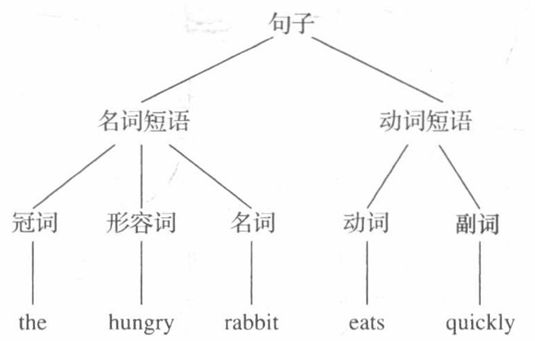
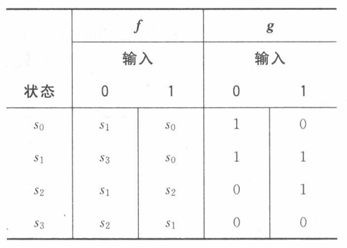
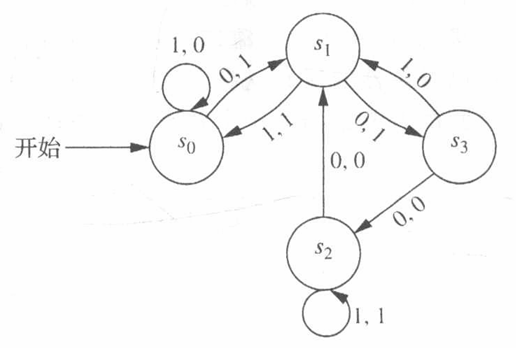
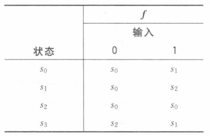
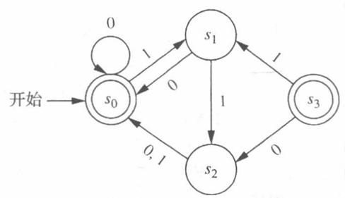
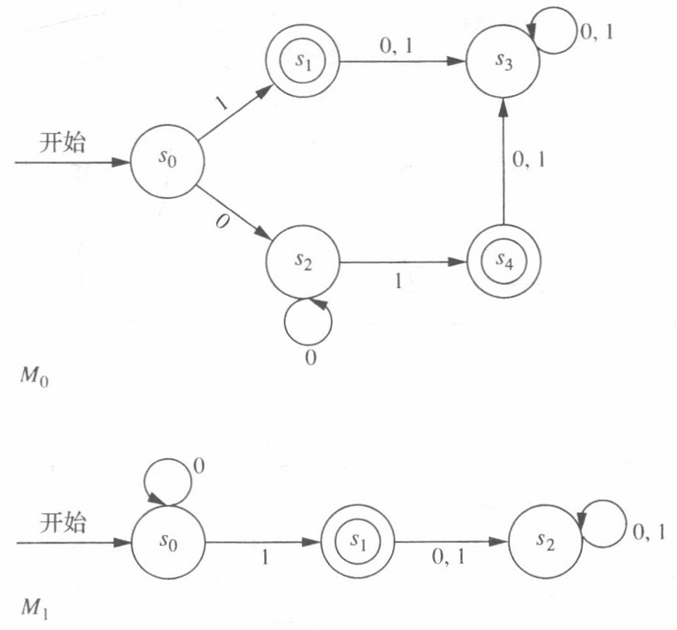

# 离散数学及其应用

## 第一章 基础：逻辑和证明
## 第二章 基本结构：集合、函数、序列、求和与矩阵
## 第三章 算法
## 第四章 数论和密码学
### 4.1 整除性和模算数
#### 除法
**定义1** 

如果$a$和$b$是整数且$a≠0$，我们称$a$整除$b$。如果有整数$c$使得$b=ac$，或者等价地，如果$b/a$是一个整数。当$a$整除$b$时，我们称$a$是$b$的一个因子或除数，而$b$是$a$的一个倍数。用记号$a|b$表示$a$整除$b$。当$a$不能整除$b$时则写成$a \nmid b$。

**定理1**

令$a，b，c$为整数，其中$a≠0$。则

- 如果 $a \mid b$ 且 $a \mid c$，则 $a \mid (b + c)$。
- 如果 $a \mid b$，那么对所有整数 $c$，都有 $a \mid bc$。
- 如果 $a \mid b$ 且 $b \mid c$，则 $a \mid c$。

**推论1**

如果 $a$, $b$, $c$ 是整数，其中 $a \neq 0$，使得$a \mid b$ 和 $a \mid c$，那么当 $m$ 和 $n$是整数时有 $a \mid mb + nc$。

#### 除法算法

**定理2**

除法算法（division algorithm）。令 $a$ 为整数，$d$ 为正整数。则存在唯一的整数 $q$ 和 $r$，满足 $0 \leq r \leq d$，使得 $a = dq + r$。

**定义2**

在除法算法的等式中，$d$ 称为除数，$a$ 称为被除数，$q$ 称为商，$r$ 称为余数。下面的记号用来表示商和余数：
$$
q = a\ \mathbf{div} \ d，\quad r = a\ \mathbf{mod}\ d。
$$
注意余数不能是负数

#### 模算数

**定义3**

如果 $a$ 和 $b$ 为整数，而 $m$ 为正整数，则当 $m$ 整除 $a - b$ 时，称 $a$ 模 $m$ 同余 $b$。用记号$a \equiv b \pmod{m}$表示 $a$ 模 $m$ 同余 $b$。我们称 $a \equiv b \pmod{m}$ 为同余式（congruence），而 $m$ 是它的模（modulus）。如果 $a$ 和 $b$ 不是模 $m$ 同余的，则写成 $a \not\equiv b \pmod{m}$。

**定理3**

令 $a$ 和 $b$ 为整数，并令 $m$ 为正整数。则 $a \equiv b \pmod{m}$ 当且仅当 $a\ \mathbf{mod}\ m = b\ \mathbf{mod}\ m$。

**定理4**

令 $m$ 为正整数。整数 $a$ 和 $b$ 是模 $m$ 同余的，当且仅当存在整数 $k$ 使得 $a = b + km$。

所有和 $a$ 模 $m$ 同余的整数集合称为 $a$ 模 $m$ 的同余类。

**定理5**

令 $m$ 为正整数。如果 $a \equiv b \pmod{m}$，$c \equiv d \pmod{m}$，则$a + c \equiv b + d \pmod{m}$并且$ac≡bd\pmod m$

**推论 2** 

令 $m$ 是正整数，令 $a$ 和 $b$ 是整数。则
$$
(a+b)\ \mathbf{mod} \ m=((a\ \mathbf{mod}\  m)+(b\ \mathbf{mod}\   m))\mathbf{mod}\   m
$$
并且
$$
ab\ \mathbf{mod}\ m = ( (a\ \mathbf{mod}\ m)(b\ \mathbf{mod}\ m))\mathbf{mod}\ m
$$

#### 模$m$算术

我们可以在 $\mathbb{Z}_m$，即小于 $m$ 的非负整数的集合 ${0, 1, \dots, m-1}$ 上定义算术运算。特别是，我们定义这些整数的加法（用 $+_m$ 表示）如下：
$$
a +_m b = (a + b) \mathbf{mod}\ m
$$
这里等式右边的加法是普通的整数加法，我们定义这些整数的乘法（用 $\cdot_m$表示）如下：
$$
a \cdot_m b = (a \cdot b) \mathbf{mod}\ m
$$
这里等式右边的乘法是普通的整数乘法。运算 $+_m$ 和 $\cdot_m$ 称为模 $m$ 加法和乘法，当使用到这些运算时，我们说是在进行模 $m$ 算术。

运算 $+_m$ 和 $\cdot_m$ 满足普通整数加法和乘法的许多同样的性质

- **封闭性**：如果 $a$ 和 $b$ 属于 $\mathbb{Z}_m$，则 $a +_m b$ 和 $a \cdot_m b$ 也属于 $\mathbb{Z}_m$。
- **结合律**：如果 $a$，$b$ 和 $c$ 属于 $\mathbb{Z}_m$，则有$(a +_m b) +_m c = a +_m (b +_m c)$和$(a \cdot_m b) \cdot_m c = a \cdot_m (b \cdot_m c)$
- **交换律**：如果 $a$ 和 $b$ 属于 $\mathbb{Z}_m$，则$a +_m b = b +_m a$和$a \cdot_m b = b \cdot_m a$
- **单位元**：元素 $0$ 和 $1$ 分别是模 $m$ 加法和乘法的单位元。即，如果 $a$ 属于 $\mathbb{Z}_m$，则$a +_m 0 = 0 +_m a = a$和$a \cdot_m 1 = 1 \cdot_m a = a$
- **加法逆元**：如果 $a \neq 0$ 属于 $\mathbb{Z}_m$，则 $m - a$ 是 $a$ 的模 $m$ 加法逆元，而 $0$ 是其自身的加法逆元。即$a +_m (m - a) = 0$且$0 +_m 0 = 0$
- **分配律**：如果 $a$，$b$ 和 $c$ 属于 $\mathbb{Z}_m$，则有$a \cdot_m (b +_m c) = (a \cdot_m b) +_m (a \cdot_m c)$和$(a +_m b) \cdot_m c = (a \cdot_m c) +_m (b \cdot_m c)$

### 4.2 整数表示和算法

#### 整数转变

**定理1**

令 $b$ 是一个大于 1 的整数。则如果 $n$ 是一个正整数，就可以唯一地表示为下面的形式：
$$
n = a_0 b^k + a_1 b^{k-1} + \dots + a_k b + a_0
$$
 其中 $k$ 是非负整数，$a_0, a_1, \dots, a_k$ 是小于 $b$ 的非负整数，且 $a_k \neq 0$。

**进制转换：**

现在介绍一个算法以构造一个整数 $n$ 的 $b$ 进制展开式。首先，用 $b$ 除 $n$ 得到商和余数，即
$$
n = bq_0 + a_0, \quad 0 \leq a_0 < b
$$

余数 $a$ 就是 $n$ 的 $b$ 进制展开式中最右边的数字。下一步用 $b$ 除 $a$ 得到

$$
q_0 = bq_1 + a_1, \quad 0 \leq a_1 < b
$$

可以看出，$a_1$ 是 $n$ 的 $b$ 进制展开式中从右边第二位数字。继续这一过程，连续用商数除以 $b$ 并以余数为新的 $b$ 进制数字。这一过程在商为 0 时终止。该过程从右向左产生 $n$ 的 $b$ 进制数字。

#### 整数运算算法

**加法算法**

要把 $a$ 和 $b$ 相加，首先把最右边的位相加。这样可得

$$
a_0 + b_0 = c_0 \cdot 2 + s_0
$$

其中 $s_0$ 是 $a + b$ 的二进制展开式中最右边的一位数字，而 $c_0$ 是进位，$c_0$ 为 0 或 1。然后把下一对二进制位及进位相加，

$$
a_1 + b_1 + c_0 = c_1 \cdot 2 + s_1
$$

其中 $s_1$ 是 $a + b$ 的二进制展开中的下一位（从右算起）数字，$c_1$ 是进位。继续这一过程，把两个二进制展开式中对应的二进制位及进位相加，给出 $a + b$ 的二进制展开式中从右算起的下一位数字。最后，把 $a_{n-1}$、$b_{n-1}$ 和 $c_{n-2}$ 相加得 $c_{n-1} \cdot 2 + s_{n-1}$。和的首位数字是 $s_{n} = c_{n-1}$。这一过程产生 $a$ 与 $b$ 之和的二进制展开式，即
$$
a + b = (s_n s_{n-1} s_{n-2} \dots s_0)_2
$$
**乘法算法**

下面考虑两个 $n$ 位整数 $\alpha$ 和 $\beta$ 的乘法。传统的算法（用纸笔做乘法）如下。利用分配律，可以看出
$$
\begin{aligned}ab&=a(b_02^0+b_12^1+\cdots+b_{n-1}2^{n-1})\\&=a(b_02^0)+a(b_12^1)+\cdots+a(b_{n-1}2^{n-1})\end{aligned}
$$
可以用这一等式来计算 $a b$。首先注意到当 $b_i = 1$ 时 $a b_i = a$，而当 $b_i = 0$ 时 $a b_i = 0$。每当用 $2$ 乘一项时，可以把该项的二进制展开式向左移一位并在尾部加上一个 $0$。因而，可以通过把 $\alpha b_i$ 的二进制展开式向左移位 $i$ 位，再在尾部加上 $i 个 $0 来获得 $(a b_i) 2^i$。最后，把 $n$ 个整数 $a b_i 2^i, j = 0, 1, 2, \dots, n - 1$ 相加就得到 $a b$。

#### 模指数运算

在$b、n、m$都为大数的条件下计算$b^2\mathrm{~mod~}m$:

为了促成快速模指数算法，我们解释一下其基本思想。我们来解释如何利用 $n$ 的二进制展开式，比如 $n = (a_{k-1} a_{k-2} \dots a_0)_2$，来计算 $b^n$。首先，注意到

$$
b^{a_{k-1}\cdot2^{k-1}+\cdots+a_1\cdot2+a_0}=b^{a_{k-1}\cdot2^{k-1}}\cdots b^{a_1\cdot2}\cdot b^{a_0}
$$

这说明为了计算 $b^n$ 的值，只需要计算 $b, b^2, (b^2)^2 = b^4, (b^4)^2 = b^8, \dots, b^{2^{k-1}}$ 的值。一旦有了这些值，把列表中 $a_i = 1$ 的那些项 $b^{2^i}$ 相乘即可。为了提高效率并减少空间需求，每乘一项后，做一次模 $m$ 运算以缩小结果值。这样就可以得到 $b^n$ 的值。例如，要计算 $31$，由于 $11 = (1011)_2$，因此$3^{11} = 3^8 \cdot 3^2 \cdot 3^1 $。通过连续取平方，可以得到 $3^2 = 9$，$3^4 = 9^2 = 81$，$3^8 = 81^2 = 6561$。因此，$3^{11} = 3^8 \cdot 3^2 \cdot 3^1 = 6561 \cdot 9 \cdot 3 = 177147$。

该算法依次求出 $b\mathrm{~mod~}m,b^2\mathrm{~mod~}m,b^4\mathrm{~mod~}m,\cdots,b^{2^{k-1}}\mathrm{~mod~}m$，并把其中 $a_i = 1$ 的那些项 $b^{2^i} \mod m$ 相乘，在每次乘法后求乘积除以 $m$ 所得的余数。注意我们只需要执行 $O(\log_2 n)$ 次乘法运算。

### 4.3 素数和最大公约数

#### 素数

**定义1**

大于 1 的整数 $p$ 称为素数，如果 $p$ 的正因子只有 1 和 $p$ 。大于 1 但又不是素数的正整数称为合数。

**定理 1（算术基本定理）**  

每个大于 1 的整数要么本身就是素数，要么可以唯一地写成两个或多个素数的乘积，其中素数因子以非递减序排列。

#### 试除法

**定理 2**
如果 $n$ 是一个合数，那么 $n$ 必有一个素因子小于等于 $\sqrt{n}$。

从定理 2 可知，如果一个整数不能被小于或等于其平方根的素数整除，则它就是素数。这一结论导致了称为试除法的蛮力算法。要用试除法，我们把 $n$ 除以所有不超过 $\sqrt{n}$ 的素数，如果不能被其中任意一个素数整除就可以得出结论 $n$ 是素数。

#### 埃拉托斯特尼筛法 

埃拉托斯特尼筛法 (sieve of Eratosthenes) 就是用来寻找不超过一个给定整数的所有素数。
例如，下列过程就是寻找不超过 $100$ 的素数。
首先构造 $1$～$100$ 全部整数的列表。筛法开始过程，除了 $2$ 以外，删除那些能被 $2$ 整除的整数。因为 $3$ 是保留下来的第一个大于 $2$ 的整数，所以除了 $3$ 以外，删除所有那些能被 $3$ 整除的整数。因为 $5$ 是 $3$ 之后保留下来的下一个整数，所以除了 $5$ 以外，删除那些能被 $5$ 整除的整数。保留下来的下一个数是 $7$，所以，除了 $7$ 以外，删除那些能被 $7$ 整除的整数。因为所有不超过 $100$ 的合数能被 $2, 3, 5$ 或 $7$ 整除，所以除了 $1$ 以外，所有保留下来的整数都是素数。

**定理3**

存在无限多个素数

**定理 4（素数定理）**  
当 $x$ 无限增长时，不超过 $x$ 的素数个数与 $\frac{x}{\ln x}$ 之比 $\pi(x)$ 趋近于 1。（这里 $\ln x$ 是 $x$ 的自然对数。）

#### 关于素数的猜想和开放问题

#### 最大公约数和最小公倍数

**定义 2**
令 $a$ 和 $b$ 是两个整数，不全为 0。能使 $d \mid a$ 和 $d \mid b$ 的最大整数 $d$ 称为 $a$ 和 $b$ 的最大公约数。  $a$ 和 $b$ 的最大公约数记作 $\gcd(a, b)$。

**定义 3**

整数 $a$ 和 $b$ 是互素的如果它们的最大公约数是1。

**定义 4**  
整数 $a_1, a_2, \dots, a_n$ 是两两互素的，如果当 $1 \le i < j \le n$ 时有 $\gcd(a_i, a_j) = 1$。

## 第五章 归纳与递归

## 第六章 计数

## 第七章 离散概率

## 第八章 高级计数技术

## 第九章 关系

## 第十章 图

## 第十一章 树

## 第十二章 布尔代数

## 第十三章 计算模型

### 13.1 语言和文法

#### 短语结构文法

**定义 1** 

词汇表（或字母表）$V$ 是由称为符号的元素构成的一个有限的非空集合。  $V$ 上的一个词（或句子）是由 $V$ 中元素组成的有限长度的字符串。空串（或零串）是不包含任何符号的字符串，记为 $\lambda$。 $V$ 上所有词的集合记为 $V^*$。$V$ 上的一个语言是 $V^*$ 的一个子集。

注意，空串 $\lambda$ 是不包含任何符号的串。它不同于空集 $\varnothing$。因此 $\{\lambda\}$ 是仅包含一个字符串的集合，此字符串为空串。

为了产生词，文法提供一个由各种类型符号组成的集合和一个由规则组成的集合。更确切地说，文法有一个**词汇表** $V$，$V$ 是一个由符号组成的集合，语言中的成分就是由这些符号导出的。词汇表中的某些元素**不能**由其他符号替换，这些元素称为**终结符**；词汇表中的其他元素可以用其他符号替换，它们称为**非终结符**。终结符和非终结符集合通常分别记为 $T$ 和 $N$。

词汇表中有一个称为**起始符**的特殊元素，记为 $S$，我们总是从这个特殊元素开始定义其他符号。在言语的例子中，起始符是**句子**。由词汇表 $V$ 中元素构成的所有串的集合记为 $V^*$。指明 $V^*$ 中的字符串能被什么样的字符串替代的规则称为文法的**产生式**，指明 $z_0$ 可以替换为 $z_1$ 的产生式记为 $z_0 \to z_1$。

**定义 2** 

一个短语结构文法 $G=(V, T, S, P)$ 由下列四部分组成：词汇表 $V$，由 $V$ 的所有终结符组成的 $V$ 的子集 $T$，$V$ 的起始符 $S$，以及产生式集合 $P$。集合 $V-T$ 记为 $N$，$N$ 中的元素称为非终结符。$P$ 中的每个产生式的左边必须至少包含一个非终结符。

**定义 3** 

设 $G=(V, T, S, P)$ 是一个短语结构文法，$w_0=lz_0r$（即 $l$、$z_0$ 和 $r$ 的连接）和 $w_1=lz_1r$ 是 $V^*$ 上的字符串。若 $z_0 \to z_1$ 是 $G$ 的一个产生式，则称由 $w_0$ 可直接派生出 $w_1$，记为 $w_0 \Rightarrow w_1$。如果 $V^*$ 上的字符串 $w_0, w_1, \dots, w_n(n \geq 0)$ 满足 $w_0 \Rightarrow w_1, w_1 \Rightarrow w_2, \dots, w_{n-1} \Rightarrow w_n$，  
则称由 $w_0$ 可派生出 $w_n$，记为 $w_0 \Rightarrow^* w_n$。由 $w_0$ 得到 $w_n$ 的序列称为 **派生**。

**定义 4** 

设 $G=(V, T, S, P)$ 是短语结构文法，由 $G$ 生成的语言（或 $G$ 的语言）是起始符 $S$ 能够派生的所有终结符串构成的集合，记为 $L(G)$。
$$
L(G) = \{ w \in T^* \mid S \Rightarrow^* w \}
$$

#### 短语结构文法的类型

0 型文法对其产生式没有限制。

1 型文法有两种形式的产生式：一种是 $w_1 \to w_2$ 形式的产生式，其中 $w_1 = lAr$ 和 $w_2 = lwr$，$A$ 是一个非终结符，$l$ 和 $r$ 是 0 个或多个终结符或非终结符构成的串，$w$ 是终结符或非终结符构成的非空串。它还可以有产生式 $S \to \lambda$，但 $S$ 不能出现在任何其他产生式的右边。

2 型文法只有形如 $w_1 \to w_2$ 的产生式，其中 $w_1$ 是一个单个的非终结符的符号。

3 型文法只有形如 $w_1 \to w_2$ 的产生式，同时满足 $w_1 = A$ 且 $w_2 = aB$ 或 $w_2 = a$，其中 $A$ 和 $B$ 是非终结符，$a$ 是终结符，或者满足 $w_1 = S$，$w_2 = \lambda$

2 型文法又称为**上下文无关文法**，因为出现在一个产生式左侧的非终结符可以被一个字符串替换，而不管此字符串中的符号是什么。2 型文法生成的语言称为**上下文无关语言**。  
当一个文法具有形如 $l w_1 r \to l w_2 r$（而不是形如 $w_1 \to w_2$）的产生式时，这样的文法称为 1 型文法或**上下文有关文法**，因为有当 $w_1$ 被字符串 $l$ 和 $r$ 包围时，才能替换为 $w_2$。1 型文法生成的语言称为**上下文有关语言**。
3 型文法又称为**正则文法**。正则文法生成的语言称为**正则的**。

在已经定义的四种文法中，上下文有关文法的定义最复杂。有时，这些文法可以用一种不同的方式来定义。在形如 $w_1 \to w_2$ 的产生式中，如果 $w_1$ 的长度小于等于 $w_2$，称这个产生式是**非缩约的**。根据所定义的上下文有关文法的特征，每个 1 型文法的产生式（除了产生式 $S \to \lambda$，如果它存在），都是非缩约的。这表明所有上下文有关语言的派生中字符串的长度是非递减的，除非使用了 $S \to \lambda$。这就意味着空串属于某个上下文有关文法生成的语言的唯一途径就是产生式 $S \to \lambda$ 是文法的一部分。上下文有关文法定义的另外一种方式就是确定所有的产生式都是非缩约的。具有这种性质的文法称为是**非缩约的**或者**单调的**。非缩约文法与上下文有关文法是不同的。然而，这两类文法又是紧密相关的。除了非缩约文法不能生成任何包含空串 $\lambda$ 的语言外，它们可以定义相同的语言集合。

#### 派生树

对上下文无关文法生成的语言，其派生可以用有序根树表示成图形，这样的树称为**派生树**或**语法分析树**。树根表示起始符，树的内部结点表示在派生过程中产生的非终结符，树的叶结点表示终结符。

#### 巴克斯-诺尔范式

巴克斯-诺尔范式已用来对许多程序设计语言（包括 $Java$）的语法规则进行规范说明。在 2 型文法中，产生式的左边都是单个非终结符。在巴克斯-诺尔范式中，将左边是同一个非终结符的所有产生式合并成一个式子，而不是将这些产生式都列出来。我们还用符号 $::=$ 代替 $\rightarrow$，将非终结符用 $<>$ 括起来，并在一个式子里列出所有这些产生式的右边，用竖线将这些产生式分开。例如，产生式 $A \rightarrow A a$、$A \rightarrow a$、$A \rightarrow A B$ 可以合并成：

$$
\langle A \rangle ::= \langle A \rangle a \mid a \mid \langle A \rangle \langle B \rangle。
$$
举例，给出带符号十进制整数的产生式的巴克斯-诺尔范式（*带符号整数* 是非负整数前面加上一个加号或减号）。

一个产生带符号整数的文法的巴克斯-诺尔范式为：

$$
\langle 带符号整数 \rangle ::= \langle 符号 \rangle \langle 整数 \rangle
$$

$$
\langle 符号 \rangle ::= + \mid -
$$

$$
\langle 整数 \rangle ::= \langle 数字 \rangle \mid \langle 数字 \rangle \langle 整数 \rangle
$$

$$
\langle 数字 \rangle ::= 0 \mid 1 \mid 2 \mid 3 \mid 4 \mid 5 \mid 6 \mid 7 \mid 8 \mid 9
$$

### 13.2 带输出的有限状态机

#### 带输出的有限状态机

**定义 1** 

有限状态机 $M = (S, I, O, f, g, s_0)$ 由如下部分组成：

- 一个有限的状态集合 $S$；
- 一个有限的输入字母表 $I$；
- 一个有限的输出字母表 $O$；
- 一个转换函数 $f$，$f$ 为每个状态和输入对指派一个新状态；
- 一个输出函数 $g$，$g$ 为每个状态和输入对指派一个输出；
- 还有一个初始状态 $s_0$。

设 $M = (S, I, O, f, g, s_0)$ 是一个有限状态机。可以用**状态表**来表示状态函数 $f$ 和输出函数 $g$ 的值。

表示有限状态机的另一种方法是**状态图**，这是一个边带有标号的有向图。在这个图中，状态由圈表示，转换由带输入和输出对标号的箭头表示。

举例

**定义 2** 

令 $M = (S, I, O, f, g, s_0)$ 是一个有限状态机，并且 $L \subseteq I^*$，那么当输入串 $x \in L$，并且当且仅当 $x$ 作为 $M$ 的输入，$M$ 的最后一个输出位是 1 时，我们说有限状态机 $M$ 能够识别（或接受）$L$。

**有限状态机的类型**  

为了建立计算机的模型，人们开发了许多种不同的有限状态机。本节给出了一类有限状态机的定义，在这种类型的机器中，输出与状态之间的转换相对应，这种类型的机器称为**米兰机**（Mealy machine），因为它是由米兰（G. H. Mealy）在 1955 年首先研究的。  

还有另外一类重要的带输出的有限状态机，其输出仅由状态确定，这种类型的有限状态机称为**摩尔机**（Moore machine），因为它是摩尔（E. F. Moore）在 1956 年提出的。本节结尾有一系列练习讨论摩尔机。

### 13.3 不带输出状态的有限机

#### 串的集合

**定义 1**

设 $V$ 是一个词汇表，$A$、$B$ 是 $V^*$ 的子集。$A$ 和 $B$ 的连接是所有形如 $xy$ 的串构成的集合，记为 $AB$，其中 $x$ 是 $A$ 中的串，$y$ 是 $B$ 中的串。

**定义 2** 

设 $A$ 是 $V^*$ 的一个子集。$A$ 的克莱因闭包是 $A$ 中任意多个串的连接组成的集合，记为 $A^*$，即：
$$
A^* = \bigcup_{k=0}^{\infty} A^k。
$$

#### 有限状态自动机

现在给出不带输出的有限状态机的定义，这样的机器也叫作**有限状态自动机**（finite-state automata）。这些机器与 13.2 节中研究的有限状态机不同，它们不产生输出，但它们有一个终结状态集合。我们将看到，它们识别将初始状态变为终结状态的字符串。

**定义 3** 有限状态自动机 $M = (S, I, f, s_0, F)$ 由下列五部分组成：

- 一个有限的状态集合 $S$；
- 一个有限的输入字母表 $I$；
- 一个转换函数 $f$，$f$ 为每个状态和输入对指派下一个状态（因此有 $f: S \times I \to S$）；
- 一个初始状态或起始状态 $s_0$；
- 一个由终结状态（或可接受状态）构成的 $S$ 的子集 $F$。

有限状态自动机也可用**状态表**或**状态图**来表示。在状态图中，终结状态用双圈表示。

**转移函数的扩展**  

有限状态自动机 $M = (S, I, f, s_0, F)$ 的转移函数可以进行扩展，使其对所有状态与串的对都有值，也就是说，$f$ 可以被扩展成这样一个函数 $f: S \times I^* \to S$。  

设 $x = x_1 x_2 \cdots x_k$ 是 $I^*$ 中的一个串，则状态 $f(s_1, x)$ 是这样得到的：从状态 $s_1$ 开始，从左到右连续地使用 $x$ 中的每个符号。从 $s_1$ 进入状态 $s_2 = f(s_1, x_1)$，然后进入状态 $s_3 = f(s_2, x_2)$，以此类推，直到 $f(s_1, x) = f(s_k, x_k)$。  

形式上，可以通过如下公式递归地为确定性的有限状态机 $M = (S, I, f, s_0, F)$ 定义其扩展状态转移函数 $f$：

1) 对于状态集合 $S$ 中的每一个状态 $s$，有 $f(s, \lambda) = s$；
2) 对于所有的 $s \in S$，$x \in I^*$，$a \in I$，有 $f(s, xa) = f(f(s, x), a)$。

可以使用结构化归纳和递归定义来证明扩展转移函数的这个性质。例如，在练习 15 中要求证明对于状态集合 $S$ 中的每一个状态 $s$，$x$ 和 $y$ 是 $I^*$ 中的字符串，有：

$$
f(s, xy) = f(f(s, x), y)
$$

#### 有限状态机的语言识别

**定义 4**

称串 $x$ 可以被机器 $M = (S, I, f, s_0, F)$ 识别或接受，如果 $x$ 将初始状态变为一个终结状态，即 $f(s_0, x)$ 是 $F$ 中的一个状态。机器 $M$ 识别（或接受）的语言是 $M$ 识别的所有串的集合，记为 $L(M)$。如果两个有限状态自动机识别相同的语言，则称它们是等价的。

**设计有限状态自动机**  

我们经常可以构造一个有限状态自动机。通过仔细添加状态和转移，决定哪些状态是最终状态，使得这个有限状态自动机可以识别给定字符串。当根据需要，包含一些能够记录输入字符串某些性质的状态时，就提供了一个带有有限存储的有限状态自动机。

**等价的有限状态自动机**  

在**定义 4** 中，我们定义当两个有限状态自动机能够识别相同的语言时，它们是**等价的**。

举例

对于可以被 $M_0$ 识别的字符串 $x$，$x$ 必须从状态 $s_0$ 跳转终结状态 $s_1$ 或者终结状态 $s_4$。  唯一能从状态 $s_0$ 跳转到 $s_1$ 的就是字符串 $1$。能从状态 $s_0$ 跳转到 $s_4$ 的是以 $0$ 作为开始的字符串，该字符串首先从 $s_0$ 跳转到 $s_2$，后跟 0 个或者多个 $0$，保持状态 $s_2$ 不变，然后跟一个 $1$，状态从 $s_2$ 跳转到 $s_4$。除了以上这些字符串外，所有其他的字符串都使状态从 $s_0$ 跳转到非终结状态。因此我们可以得出结论，自动机 $M_0$ 所识别的语言 $L(M_0)$ 的形式是 0 个或多个 $0$ 后跟一个 $1$ 的字符串的集合。  

对于可以被 $M_1$ 识别的字符串 $x$，$x$ 必须使状态 $s_0$ 能从 $s_0$ 跳转到终结状态 $s_1$。因此，能被识别的字符串 $x$ 的形式是以若干个 $0$ 作为开始，这样会保持状态 $s_0$ 不变，后接 1 个 $1$，跳转到终结状态 $s_1$。  全是由 $0$ 组成的比特串是不会被识别的，因为它只能使我们保持状态 $s_0$ 不变，但 $s_0$ 是非终结状态。$1$ 后紧接着是一个 $0$ 的比特串也不会被识别，因为它会跳转到一个非终结状态 $s_2$。

因此，结果就是 $L(M_1)$ 与 $L(M_0)$ 相同。可以得出结论 $M_0$ 与 $M_1$ 是等价的。

#### 非确定性的有限状态自动机

到目前为止所讨论的有限状态自动机都是**确定性的**，因为对每对状态和输入值，转移函数只给出唯一的下一个状态。还有一种重要的有限状态自动机，它对每对输入值和状态，有多个可能的下一个状态，这样的机器称为**非确定性的**。非确定性的有限状态自动机在判断哪些语言可以由有限状态自动机识别中非常重要。

**定义 5**  

**非确定性的有限状态自动机** $M = (S, I, f, s_0, F)$ 由下列五部分组成：  

- 一个状态的集合 $S$；  
- 一个输入字母表 $I$；  
- 一个转移函数 $f$，$f$ 为每个状态和输入对指派一个状态集合（因此有 $f: S \times I \to P(S)$）；  
- 一个初始状态 $s_0$；  
- 还有一个由终结状态构成的 $S$ 的子集 $F$。
